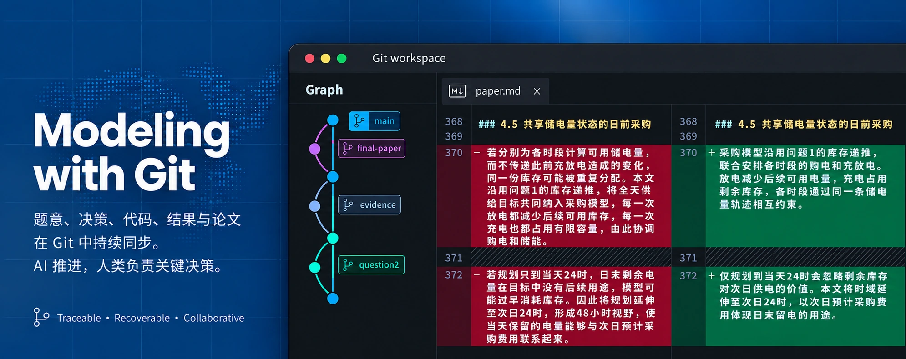
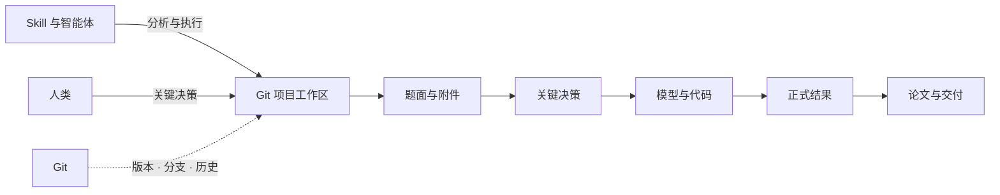

# Mathematical Modeling Guidance

**简体中文** | [English](README_EN.md)



> 面向 AI 辅助数学建模的 Git 项目工作区。

[](https://github.com/Ash-Rise/math-modeling-guidance/actions/workflows/quality.yml)
[](requirements.txt)
[](LICENSE-CODE.md)
[](LICENSE-CONTENT.md)

配合数学建模 Skill 使用的 Git 项目工作区，让 AI 持续推进建模、计算与论文交付，让人类集中处理关键决策。

## 仓库定位

本仓库提供一套可复用的项目组织方式：用治理规则划分人机职责，用文件保存项目事实与当前状态，用 Git 管理变更，再将模型、代码、结果和论文连接起来。它适合需要跨多轮对话、持续计算或多人协作的数学建模任务。

**本仓库是辅助 Skill 使用的工作流工具，不是安装到智能体中的 Skill，也不是一句话生成论文的提示词包。** 两者配合时，Skill 提供建模、编程、检索和文档处理等执行方法；本仓库为这些工作提供明确的项目边界、持久记录和交付结构。

推荐采用“竞赛路由 + 建模执行”的组合：[handsomeZR-netizen/mathmodel-skill](https://github.com/handsomeZR-netizen/mathmodel-skill) 负责 CUMCM、MCM/ICM 与电工杯的竞赛路由、规则边界和阶段衔接，[XiaoMaColtAI/math-modeling-skill](https://github.com/XiaoMaColtAI/math-modeling-skill) 提供建模分析、编程计算和论文交付能力。也可以使用其他能够读取仓库文件、运行命令并遵循 `AGENTS.md` 的数学建模 Skill。

| 组成 | 负责什么 |
|---|---|
| 智能体与外部 Skill | 理解任务，选择并调用方法和工具，执行分析、编码、计算与写作 |
| 本仓库 | 组织任务输入、关键决策、当前状态、实现、证据和论文，规定它们的职责与衔接方式 |
| Git；可选配合 GitHub | 保存版本、比较改动、隔离分支、恢复历史，并支持远端同步和团队协作 |
| 人类 | 决定影响问题含义、重要约束、研究范围或结论解释的关键事项 |

仓库提供规则、方法文档、格式配置、共享工具和实际项目供复用。使用时由能够读写项目文件、执行命令的智能体落实这些约定；Skill、模型服务及项目依赖按自己的环境配置。

## 工作方式



原题、决策、状态、实现、结果和论文分别承载对应信息；Git 负责保存它们的演进。具体文件职责见下方“持续推进与协作”。

## 主要优势

- **跨会话继续工作。** 关键决定和执行前沿写入项目文件，新对话可以从当前状态接续，减少旧推理和已淘汰方案对后续判断的干扰。
- **关键模型含义保持稳定。** 原题负责题目事实，决策记录负责已接受的模型含义；实现和测试围绕这些依据推进，降低跨阶段语义漂移。
- **AI 持续执行，人类聚焦关键决策。** 普通实现、数值技术选择、实验、验证和论文同步由 AI 自主完成，真正影响题意或结论的选择在充分分析后交由人类决定。
- **变更可比较、可隔离、可恢复。** Git 提交保存完整改动，分支承载候选方案，团队可以审阅差异、整合成果或恢复到明确版本。
- **论文结论有据可查。** 决策、计算入口、结果文件和图表连接到论文主张；修改上游模型或结果时，同步检查受影响的正文与交付文件。
- **验证投入与实际风险匹配。** 围绕具体失败方式和受影响部分选择检查，把计算与审查用于能够改变判断的问题。

## 开始使用

准备 Git、能够访问本地文件和终端的 AI 编程环境，以及上述推荐 Skill 或功能相当的数学建模 Skill：

```shell
git clone https://github.com/Ash-Rise/math-modeling-guidance.git
cd math-modeling-guidance
```

希望先观察一条完整而紧凑的计算链，可以运行[食堂备餐教学示例](projects/quickstart-canteen/README.md)。它仅使用 Python 标准库，从合成输入生成候选比较、结果摘要和 Markdown 报告。

1. 在 `projects/` 下建立项目，放入原题、附件、目标和交付要求。
2. 在仓库根目录启动智能体，让它先读取 `AGENTS.md` 并定位项目。
3. 按项目需要建立决策、状态、代码、结果和论文文件，再由 Git 持续记录。

首次启动可以这样说明：

> 请读取根目录 AGENTS.md，定位 projects/my-modeling-project。根据原题、已有 decisions.md 和 state.md 恢复项目，按需读取治理规范与建模手册，结合已配置的数学建模 Skill 推进任务。普通技术工作自主处理；关键语义选择先核对依据并完成分析，再提出决策建议。本次目标是……，交付格式为……。

项目结构、环境准备、`.gitignore` 调整、完整执行顺序和接续指令见 [工作流入门](docs/getting-started.md)。

## 持续推进与协作

**积极开启新对话。** 阶段完成、关键决定确定或正式结果保存后，更新 `state.md` 并切换会话；旧对话积累较多过时分析时及时切换。新会话从仓库权威文件恢复，而非依赖聊天历史。

**用分支管理变更。** 普通工作沿稳定分支推进；集成风险较高或需要独立审阅的候选实现使用临时分支。模型语义变化仍先完成关键决策。

**用 GitHub 支持多人协作。** 成员从共同版本出发，通过分支并行推进，通过提交差异和 Pull Request 审阅整合；合并时同步检查假设、结果版本、图表和论文引用。

| 信息 | 当前依据 |
|---|---|
| 题目事实、数据条件与要求 | 原始题面和附件 |
| 已接受的模型含义与重要假设 | 项目 `decisions.md` |
| 当前执行前沿、未解决事项与下一步 | 项目 `state.md`，长任务按需维护 |
| 实现与正式数值 | 源代码；已接受的结果文件 |
| 论文内容与版式 | `paper.md`；经确认的 Word 版式；格式配置 |
| 版本演进、差异与回退 | Git |

AI 自主推进分析、实现、实验和论文同步；人类负责会改变题意、模型语义、重要约束、实质范围或结论解释的关键决策。完整边界和会话接续方法见 [治理规范](MCM_AI_Governance.md) 与 [工作流入门](docs/getting-started.md)。

## 论文与项目证据

以下两个项目展示工作流形成的论文与支撑材料。论文提供 PDF、Word 和 Markdown，各项目入口连接任务概要、关键决策、代码、结果、脚本与测试。

| 项目 | 论文 | 关键决策与结果 |
|---|---|---|
| [2026 B：无线电干扰源定位与清除](projects/2026-cumcm/solutions/problem-b-radio-interference/README.md) | [PDF](projects/2026-cumcm/solutions/problem-b-radio-interference/paper/paper.pdf) · [Word](projects/2026-cumcm/solutions/problem-b-radio-interference/paper/paper.docx) · [Markdown](projects/2026-cumcm/solutions/problem-b-radio-interference/paper/paper.md) | [决策记录](projects/2026-cumcm/solutions/problem-b-radio-interference/decisions.md) · [几何与离线任务证据](projects/2026-cumcm/solutions/problem-b-radio-interference/results/) |
| [2026 C：微网购电及储能调度](projects/2026-cumcm/solutions/problem-c-microgrid/README.md) | [PDF](projects/2026-cumcm/solutions/problem-c-microgrid/paper/paper.pdf) · [Word](projects/2026-cumcm/solutions/problem-c-microgrid/paper/paper.docx) · [Markdown](projects/2026-cumcm/solutions/problem-c-microgrid/paper/paper.md) | [决策记录](projects/2026-cumcm/solutions/problem-c-microgrid/decisions.md) · [论文结果摘要](projects/2026-cumcm/solutions/problem-c-microgrid/results/paper-summary.json) |

B 题公开几何、局部推进与离线任务的结果和复算脚本；接口运行需要另行启动竞赛模拟器。C 题公开核心调度代码、论文数值摘要和合成输入合同测试，核验脚本检查摘要与正文一致性；全年费用复算还需要原始竞赛附件。这些入口分别呈现实际可检查的证据范围。

想了解决策如何影响论文，可阅读 [从决策到论文主张：波动电价下的信息边界](docs/decision-to-claim-case-study.md)。

## 文档导航

| 入口 | 用途 |
|---|---|
| [AGENTS.md](AGENTS.md) | 智能体进入仓库时读取的工作规则与路由 |
| [工作流入门](docs/getting-started.md) | 项目结构、执行顺序和示例运行准备 |
| [AI 治理规范](MCM_AI_Governance.md) | 权威分层、决策门槛、自主执行、状态恢复和集成规则 |
| [建模与论文方法手册](shared/templates/personal-modeling-playbook.md) | 模型选择、实验设计、证据强度、论文推理与表达 |
| [论文格式配置](shared/templates/personal-paper-profile.yaml) | 可复用的排版参数 |
| [共享工具与测试](shared/) | 论文格式、图表样式和文档链接等公共检查 |
| [2026 项目入口](projects/2026-cumcm/README.md) | B/C 题论文与项目材料 |

## 方法来源

| 来源 | 参考范围 |
|---|---|
| [handsomeZR-netizen/mathmodel-skill](https://github.com/handsomeZR-netizen/mathmodel-skill) | 竞赛任务路由、Agent 工作入口与跨阶段衔接 |
| [XiaoMaColtAI/math-modeling-skill](https://github.com/XiaoMaColtAI/math-modeling-skill) | 建模执行流程、工具组织与论文交付思路 |

在上述方法启发下，本仓库进一步组织了以 Git 项目为中心的权威分层、关键决策边界、状态恢复、结果证据链和多格式论文同步。来源链接说明方法参考关系，具体项目规则以本仓库治理文档为准。

## 版权与使用

代码采用 [MIT License](LICENSE-CODE.md)，文档、论文、图表、结果数据与模板采用 [CC BY 4.0](LICENSE-CONTENT.md)。欢迎按相应许可证复制、修改和再分发，完整适用范围见 [许可证说明](LICENSE.md)。
