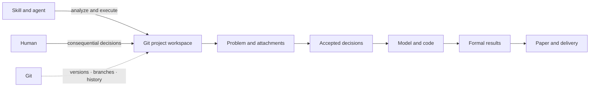

# Mathematical Modeling Guidance

[简体中文](README.md) | **English**


> A Git-based workspace for AI-assisted mathematical modeling.

[](https://github.com/Ash-Rise/math-modeling-guidance/actions/workflows/quality.yml)
[](requirements.txt)
[](LICENSE-CODE.md)
[](LICENSE-CONTENT.md)

A Git project workspace designed to complement mathematical-modeling Skills: AI continuously advances modeling, computation, and paper delivery, while humans focus on consequential decisions.

## Positioning

This repository provides a reusable way to organize a modeling project. Governance rules define human and AI responsibilities, project files preserve facts and current state, Git manages changes, and the model, code, results, and paper remain connected. It is intended for mathematical-modeling work that spans multiple conversations, sustained computation, or team collaboration.

**This repository is a workflow tool that complements a Skill. It is not a Skill installed into an agent or a one-prompt paper generator.** A Skill supplies execution methods for modeling, programming, research, and document production; this repository supplies persistent project boundaries, records, and delivery structure.

The recommended setup combines contest routing with modeling execution: [handsomeZR-netizen/mathmodel-skill](https://github.com/handsomeZR-netizen/mathmodel-skill) handles contest routing, rule boundaries, and phase continuity for CUMCM, MCM/ICM, and the Diangong Cup, while [XiaoMaColtAI/math-modeling-skill](https://github.com/XiaoMaColtAI/math-modeling-skill) supplies modeling analysis, computational implementation, and paper-delivery capabilities. Other mathematical-modeling Skills are also suitable when they can read repository files, run commands, and follow `AGENTS.md`.

| Component | Responsibility |
|---|---|
| Agent and external Skills | Understand the task, select methods and tools, and perform analysis, coding, computation, and writing |
| This repository | Organize task inputs, consequential decisions, current state, implementation, evidence, and papers, and define how they connect |
| Git, optionally with GitHub | Preserve versions, compare changes, isolate branches, recover history, synchronize remotely, and support collaboration |
| Humans | Decide matters that change problem meaning, important constraints, substantive scope, or interpretation of conclusions |

The repository provides rules, method guides, formatting profiles, shared utilities, and real projects for reuse. An agent capable of reading and writing project files and running commands applies these conventions. Skills, model services, and project dependencies are configured in the user's own environment.

## How it works



The problem, decisions, state, implementation, results, and paper each carry a distinct kind of information; Git preserves their evolution. The detailed authority mapping appears below under Continuity and collaboration.

## Advantages

- **Continuity across conversations.** Consequential decisions and the execution frontier live in project files, so a new conversation can resume from the current state without being distracted by obsolete reasoning or rejected approaches.
- **Stable model semantics.** The original problem owns problem facts, while decision records own accepted model meaning. Implementation and tests proceed from those sources, reducing semantic drift across phases.
- **Continuous AI execution with focused human control.** AI handles routine implementation, numerical choices, experiments, validation, and paper synchronization. Humans decide choices that materially affect problem meaning or conclusions after the relevant analysis is ready.
- **Comparable, isolated, recoverable changes.** Git commits preserve concrete changes, branches hold candidate implementations, and teams can review differences, integrate work, or return to a known version.
- **Traceable paper claims.** Decisions, computation entry points, result files, and figures connect to claims in the paper. When an upstream model or result changes, affected text and deliverables can be updated together.
- **Risk-matched validation.** Checks target concrete failure modes and affected surfaces, directing computation and review toward evidence that can change a decision.

## Getting started

Prepare Git, an AI coding environment with file and terminal access, and the recommended Skills above or an equivalent mathematical-modeling Skill:

```shell
git clone https://github.com/Ash-Rise/math-modeling-guidance.git
cd math-modeling-guidance
```

1. Create a project under `projects/` and add the original problem, attachments, objective, and delivery requirements.
2. Start the agent at the repository root and ask it to read `AGENTS.md` before locating the project.
3. Add decision, state, code, result, and paper files as the project needs them, with Git preserving each meaningful change.

A first prompt can be concise:

> Read AGENTS.md at the repository root and locate projects/my-modeling-project. Recover the project from the original problem, decisions.md, and state.md. Read the governance specification and modeling playbook only as needed, and use the configured mathematical-modeling Skill to continue the task. Handle routine technical work autonomously. For consequential semantic choices, first check the relevant authority and complete the analysis, then present a decision recommendation. The current objective is ..., and the required deliverables are ....

See [Getting Started](docs/getting-started.md) for project layout, environment setup, `.gitignore` handling, the full execution sequence, and continuation prompts.

## Continuity and collaboration

**Start new conversations proactively.** After a phase completes, a consequential decision is accepted, or a formal result is saved, update `state.md` and switch conversations. A new conversation recovers from repository authorities instead of relying on chat history.

**Use branches to isolate changes.** Routine work proceeds on the stable branch; candidate implementations with substantial integration risk or a need for independent review use a temporary branch. Semantic changes still follow the consequential-decision process first.

**Use GitHub for team collaboration.** Members start from a common version, develop in parallel branches, and integrate through commit diffs and pull-request review. Merge review includes assumptions, result versions, figures, and paper references.

| Information | Current authority |
|---|---|
| Problem facts, data conditions, and requirements | Original problem and attachments |
| Accepted model meaning and important assumptions | Project `decisions.md` |
| Current execution frontier, unresolved items, and next action | Project `state.md`, maintained when a long task needs it |
| Implementation and formal numerical claims | Source code and accepted result files |
| Paper content and layout | `paper.md`, approved Word layout, and formatting profile |
| Version evolution, differences, and rollback | Git |

AI autonomously advances analysis, implementation, experiments, and paper synchronization. Humans decide choices that change problem meaning, model semantics, important constraints, substantive scope, or interpretation of conclusions. See [AI Governance](MCM_AI_Governance.md) and [Getting Started](docs/getting-started.md) for the full boundary and continuation procedure.

## Papers and project evidence

The following projects show the papers and supporting artifacts produced by the workflow. Papers are available as PDF, Word, and Markdown. Each project entry connects to its task summary, decisions, state, code, scripts, and tests.

| Project | Paper | Decisions and results |
|---|---|---|
| [2026 B: Radio Interference Source Localization and Removal](projects/2026-cumcm/solutions/problem-b-radio-interference/README.md) | [PDF](projects/2026-cumcm/solutions/problem-b-radio-interference/paper/paper.pdf) · [Word](projects/2026-cumcm/solutions/problem-b-radio-interference/paper/paper.docx) · [Markdown](projects/2026-cumcm/solutions/problem-b-radio-interference/paper/paper.md) | [Decision record](projects/2026-cumcm/solutions/problem-b-radio-interference/decisions.md) · [Geometry and offline-mission evidence](projects/2026-cumcm/solutions/problem-b-radio-interference/results/) |
| [2026 C: Microgrid Purchasing and Storage Scheduling](projects/2026-cumcm/solutions/problem-c-microgrid/README.md) | [PDF](projects/2026-cumcm/solutions/problem-c-microgrid/paper/paper.pdf) · [Word](projects/2026-cumcm/solutions/problem-c-microgrid/paper/paper.docx) · [Markdown](projects/2026-cumcm/solutions/problem-c-microgrid/paper/paper.md) | [Decision record](projects/2026-cumcm/solutions/problem-c-microgrid/decisions.md) · [Paper result summary](projects/2026-cumcm/solutions/problem-c-microgrid/results/paper-summary.json) |

Problem B publishes geometry, local-refinement, and offline-mission results with reproduction scripts; interface runs additionally require the competition simulator. Problem C publishes its core scheduling implementation, paper-result summary, and synthetic-input contract tests. Its verification script checks that the summary remains synchronized with the paper; reproducing the full-year costs additionally requires the original competition attachments. These boundaries state what the public evidence can directly support.

For a concrete example of how a decision propagates into a paper claim, read [From Decision to Paper Claim: Information Boundaries under Volatile Electricity Prices](docs/decision-to-claim-case-study.md).

## Documentation

| Entry | Purpose |
|---|---|
| [AGENTS.md](AGENTS.md) | Repository rules and routing read by an agent on entry |
| [Getting Started](docs/getting-started.md) | Project structure, execution sequence, and example setup |
| [AI Governance](MCM_AI_Governance.md) | Authority boundaries, decision gate, autonomous execution, state recovery, and integration rules |
| [Modeling and Paper Playbook](shared/templates/personal-modeling-playbook.md) | Model selection, experiment design, evidence strength, paper reasoning, and expression |
| [Paper Formatting Profile](shared/templates/personal-paper-profile.yaml) | Reusable formatting parameters |
| [Shared Utilities and Tests](shared/) | Common checks for paper formatting, figure style, and document links |
| [2026 Project Index](projects/2026-cumcm/README.md) | Papers and project materials for Problems B and C |

## Method sources

| Source | Referenced scope |
|---|---|
| [handsomeZR-netizen/mathmodel-skill](https://github.com/handsomeZR-netizen/mathmodel-skill) | Contest-task routing, agent entry points, and cross-phase continuity |
| [XiaoMaColtAI/math-modeling-skill](https://github.com/XiaoMaColtAI/math-modeling-skill) | Modeling execution, tool organization, and paper delivery concepts |

Inspired by these methods, this repository further organizes Git-centered authority boundaries, consequential decision control, state recovery, result evidence, and multi-format paper synchronization. The links document methodological provenance; the governance documents in this repository define its actual project rules.

## License

Code is available under the [MIT License](LICENSE-CODE.md). Documentation, papers, figures, result data, and templates are available under [CC BY 4.0](LICENSE-CONTENT.md). Copying, modification, and redistribution are welcome under the applicable license; see the [license overview](LICENSE.md) for the complete scope.
