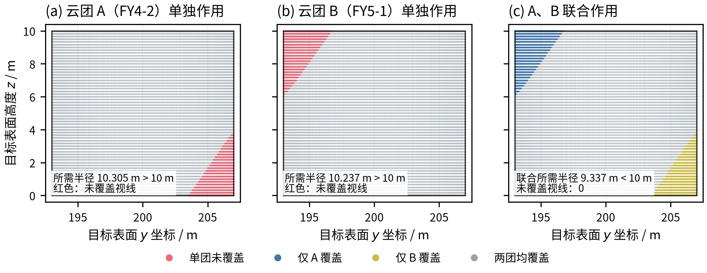
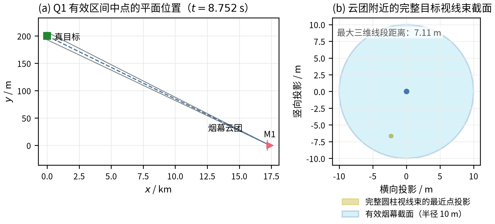
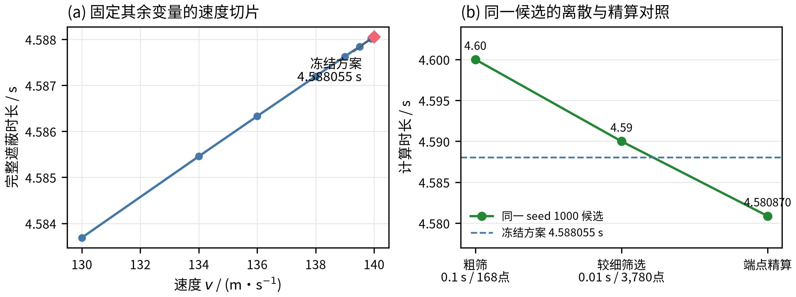
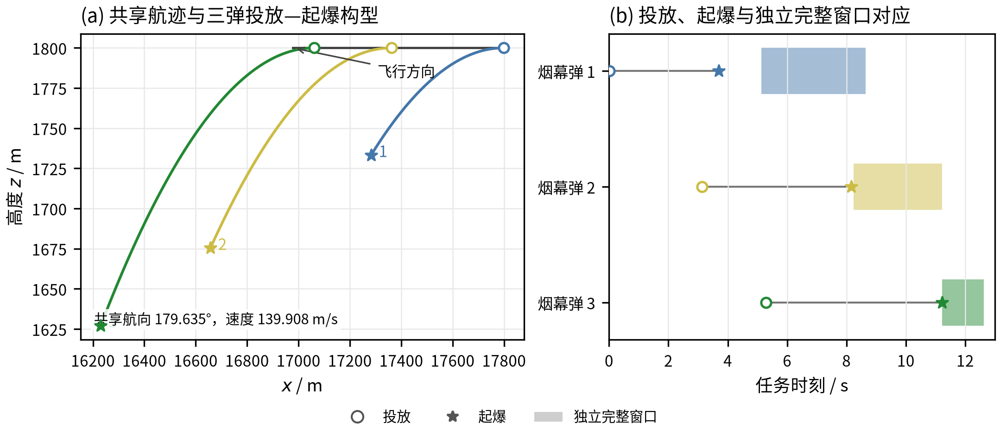
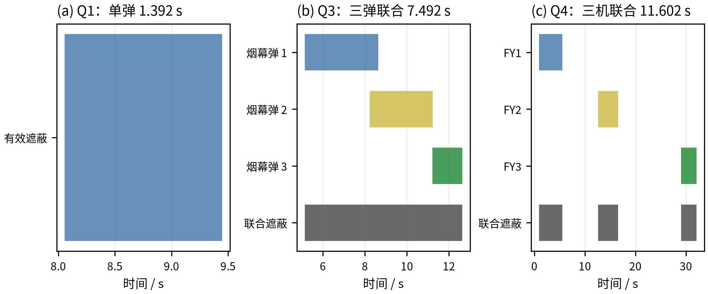
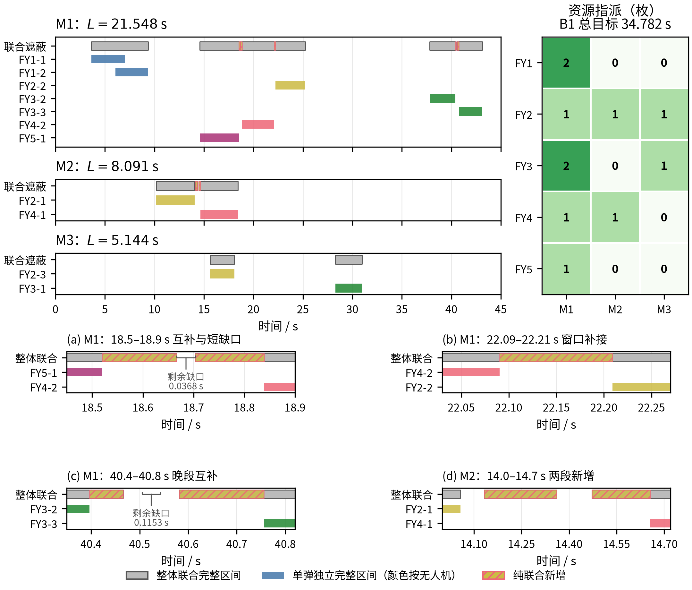

# 烟幕干扰弹的投放策略：基于完整圆柱目标视线遮蔽的时空协同模型

## 摘要

针对来袭导弹、无人机与固定目标之间的烟幕干扰弹投放问题，本文建立“确定性三维运动学—完整目标视线几何—时间区间测度”模型。真目标保留为半径 7 m、高 10 m 的有限圆柱；逐时刻计算每条导弹—目标表面视线到各有效云团中心的最小线段距离，再对全部表面视线取最大值，以不超过 10 m 判定联合完整遮蔽；问题 5 仅使用指派给对应导弹的云团。

问题 1 将给定航迹代入运动方程并求解遮蔽端点，得到区间 $[8.0564,9.4481]$ s，时长 1.3916 s。问题 2 以航向、速度、投放和起爆时序为连续变量，经差分进化搜索和 Nelder--Mead 局部细化，得到航向角 $5.1443^\circ$、速度 140.0000 m/s 的单弹方案，有效时长 4.5881 s。

问题 3 中三弹共享 FY1 的航向和速度，且相邻投放至少间隔 1 s。以云团空间并集是否遮断完整视线束为判据，联合搜索共享航迹与三组时序，得到 7.4923 s。问题 4 使用 FY1、FY2、FY3 各一弹，以联合遮蔽时长为整体目标，同时搜索三机航迹与时序并逐机细化，得到 11.6023 s。

问题 5 保留逐弹单一导弹指派，只在同一指派组内合并云团。从联合遮蔽时长为 31.1752 s 的初始可行方案出发，搜索共享航迹、时序及指派后使用 11 弹，正式目标为 34.7823 s。M1、M2、M3 分别获得 21.5479、8.0909、5.1435 s。表面与时间加密、约束复算用于验证，结果仅为记录设置下的较优可行方案，不作全局最优证明。

**关键词：** 烟幕干扰；无人机协同；视线遮蔽；多云团联合遮蔽；资源指派

## 一、问题重述

### 1.1 任务与坐标系

题目给出一个以假目标为原点的三维直角坐标系，水平面为 $xy$ 平面。真目标为竖直圆柱，其下底面圆心为 $(0,200,0)$，半径为 7 m，高度为 10 m。雷达发现来袭导弹的时刻记为 $t=0$，此后导弹以 300 m/s 沿指向假目标的直线飞行；无人机可以立即选择水平航向和 70～140 m/s 的速度，并在整个任务期间保持该航向、速度和飞行高度不变。题面给出的初始位置如表 1 所示，坐标单位均为 m。^[1]^

**表 1  导弹与无人机初始位置**

| 类别 | 编号 | 初始位置 $(x,y,z)$ |
|:---:|:---:|:---:|
| 导弹 | M1 | $(20000,0,2000)$ |
| 导弹 | M2 | $(19000,600,2100)$ |
| 导弹 | M3 | $(18000,-600,1900)$ |
| 无人机 | FY1 | $(17800,0,1800)$ |
| 无人机 | FY2 | $(12000,1400,1400)$ |
| 无人机 | FY3 | $(6000,-3000,700)$ |
| 无人机 | FY4 | $(11000,2000,1800)$ |
| 无人机 | FY5 | $(13000,-2000,1300)$ |

烟幕弹脱离无人机后做平抛运动，起爆时立即形成半径为 10 m 的球状云团；云团中心以 3 m/s 的速度匀速下沉，起爆后 20 s 内具有有效遮蔽能力。同一架无人机相邻两次投放至少间隔 1 s。需要分别设计单弹、同机多弹、多机协同以及多导弹资源分配策略，使有效遮蔽时间尽可能长。

### 1.2 子问题结构

五个子问题共用导弹、无人机和烟幕运动学、完整目标视线判据及时间集合测度。问题 1 给定 FY1 的全部动作，是公共评价模型的基础检验；问题 2 在单弹场景下新增航向、速度和时序优化。问题 3 与问题 4 从不同方向扩展问题 2：前者增加同一共享航迹上的弹药，需协调三组时序；后者增加三条独立航迹，需协调不同平台的可达窗口。问题 5 同时包含这两种扩展，并增加实际用弹数量和逐弹指派，因而不能把前三题的单弹最优值直接拼接。问题 3～5 的逐弹策略分别对应附件 result1.xlsx、result2.xlsx 和 result3.xlsx；正文另外报告空间联合判据得到的整体时长。

## 二、问题分析

导弹位置和无人机位置均由少量连续变量决定，烟幕弹起爆点又由投放时刻、起爆延时和无人机运动共同确定。因此，问题的核心不是单独寻找一个“离目标最近”的点，而是让运动中的云团在一段时间内持续位于来袭导弹与真目标之间。

有限尺寸目标带来两个直接影响：所有导弹—圆柱表面视线都需被遮断才能计为完整遮蔽，而同一时刻的不同视线可能分别被不同云团截断。因此，应先在空间上合并当前有效云团，再累计完整遮蔽的时长，不能只合并各弹独立完整遮蔽的区间。

问题 2 保留单云团几何引导搜索。问题 3 的三弹共享航迹，问题 4 的三机航迹独立，但空间互补和时间覆盖均可能使效果耦合，故两者均以联合判据搜索。问题 5 再按逐弹单一导弹指派分组计量；未指派跨目标效果只作选后复算。

## 三、模型假设与符号说明

### 3.1 基本假设

1. 导弹发现时刻为 $t=0$，导弹始终沿初始位置指向假目标的直线以 300 m/s 匀速飞行；当导弹到达假目标后，不再计入来袭过程。
2. 无人机在 $t=0$ 瞬时确定水平航向和速度，之后保持等高度、匀速直线飞行；烟幕弹投放后继承无人机的水平速度，竖直初速度为 0。
3. 烟幕云团在起爆瞬间形成半径 10 m 的球体，中心只按题面给出的 3 m/s 竖直下沉；云团寿命不超过 20 s，且云团中心落地后不再计入有效遮蔽。
4. 真目标按完整有限圆柱处理。某一时刻，真目标表面的每条导弹视线至少与一个当前有效云团相交即为完整遮蔽；问题 5 仅使用指派给该导弹的云团，不要求全部视线由同一团遮断。
5. 计算中的目标表面采用确定性网格采样，遮蔽区间端点通过一维求根细化。该离散化用于数值计算，不改变目标、运动和遮蔽判据的连续定义。

### 3.2 符号说明

模型中使用的主要符号见表 2。

**表 2  主要符号**

| 符号 | 含义 | 单位或取值 |
|:---:|:---|:---:|
| $\mathbf m_j^0$ | 导弹 $M_j$ 初始位置 | m |
| $\mathbf f_i^0$ | 无人机 $FY_i$ 初始位置 | m |
| $\theta_i$ | 无人机水平航向角，以 $x$ 轴正向为零、逆时针为正 | $[0,360^\circ]$ |
| $v_i$ | 无人机速度 | $[70,140]$ m/s |
| $\tau_{ik}$ | 无人机 $i$ 第 $k$ 枚烟幕弹投放时刻 | s |
| $\delta_{ik}$ | 第 $k$ 枚烟幕弹起爆延时 | s |
| $b_{ik}$ | 起爆时刻，$b_{ik}=\tau_{ik}+\delta_{ik}$ | s |
| $\mathbf r_{ik}$ | 投放点 | m |
| $\mathbf e_{ik}$ | 起爆点 | m |
| $\mathbf c_{ik}(t)$ | $t$ 时刻云团中心 | m |
| $R$ | 烟幕有效半径 | 10 m |
| $L_j$ | 导弹 $M_j$ 的联合完整遮蔽时间测度 | s |

## 四、基础运动学与遮蔽判据

### 4.1 导弹与无人机运动

令 $O=(0,0,0)$ 为假目标位置。由于每枚导弹的速度方向始终指向 $O$，导弹 $M_j$ 的位置为

$$
\mathbf m_j(t)=\mathbf m_j^0\left(1-\frac{300t}{\lVert\mathbf m_j^0\rVert}\right),
\qquad 0\le t\le T_j,
$$

其中 $T_j=\lVert\mathbf m_j^0\rVert/300$ 为到达假目标的时刻。无人机 $FY_i$ 的水平单位航向向量为

$$
\mathbf u_i=(\cos\theta_i,\sin\theta_i,0),
$$

于是

$$
\mathbf f_i(t)=\mathbf f_i^0+v_it\mathbf u_i,
\qquad 70\le v_i\le140.
$$

### 4.2 烟幕弹与云团运动

烟幕弹在 $\tau_{ik}$ 时刻投放，投放点由无人机轨迹直接确定：

$$
\mathbf r_{ik}=\mathbf f_i^0+v_i\tau_{ik}\mathbf u_i.
$$

烟幕弹的水平速度继承无人机速度，起爆时刻为 $b_{ik}=\tau_{ik}+\delta_{ik}$，起爆点为

$$
\mathbf e_{ik}=\mathbf f_i^0+v_ib_{ik}\mathbf u_i
-\frac12g\delta_{ik}^2(0,0,1),
\qquad g=9.8\ \mathrm{m/s^2}.
$$

起爆后云团中心满足

$$
\mathbf c_{ik}(t)=\mathbf e_{ik}-3(t-b_{ik})(0,0,1),
\qquad b_{ik}\le t\le b_{ik}+20.
$$

除寿命限制外，还需满足 $t\le T_j$，以及 $t\le b_{ik}+e_{ik,z}/3$，其中 $e_{ik,z}$ 是起爆点高度。这样可以排除云团中心已经落地后的虚假遮蔽。

### 4.3 完整圆柱视线遮蔽模型

真目标表示为

$$
\mathcal T=\{(x,y,z):x^2+(y-200)^2\le7^2,\ 0\le z\le10\},
$$

记其表面为 $\mathcal S=\partial\mathcal T$。对目标表面任一点 $\mathbf q$，导弹与该点之间的视线线段记为 $[\mathbf m_j(t),\mathbf q]$。云团中心到该线段的距离可写成

$$
d\bigl(\mathbf c,[\mathbf m,\mathbf q]\bigr)
=\left\lVert\mathbf c-\left(\mathbf m+\lambda^*(\mathbf q-\mathbf m)\right)\right\rVert,
$$

其中

$$
\lambda^*=\operatorname{clip}_{[0,1]}
\left(\frac{(\mathbf c-\mathbf m)\cdot(\mathbf q-\mathbf m)}
{\lVert\mathbf q-\mathbf m\rVert^2}\right).
$$

定义完整目标所需的最大遮蔽半径为

$$
\rho_j(t;\mathbf c)=\max_{\mathbf q\in\mathcal S}
d\bigl(\mathbf c,[\mathbf m_j(t),\mathbf q]\bigr).
$$

若 $\rho_j(t;\mathbf c_{ik}(t))\le R$，则烟幕球同时与导弹到完整目标表面的所有视线线段相交，计为该时刻对 $M_j$ 的有效遮蔽。相反，只遮断目标的一部分视线时不计入完整遮蔽。

上述距离来自对线段参数 $\lambda\in[0,1]$ 的平方距离最小化；截断投影系数使烟幕必须与实际视线线段相交，避免把导弹后方或目标后方延长线附近的云团误计为遮蔽。外层取最大值则要求最难遮断的那条视线也满足半径限制。目标中心一条视线无法表达半径 7 m 和高度 10 m 所决定的视线束宽度，因此只适合引导候选位置，不能替代这里的完整目标判据。

### 4.4 多云团空间联合与时间目标

第 4.3 节给出单团判据。令 $A_j(t)$ 为当前可用于导弹 $M_j$ 的云团集合，其中每团满足

$$
b_{ik}\le t\le\min\left(b_{ik}+20,T_j,b_{ik}+\frac{e_{ik,z}}3\right).
$$

问题 3、4 的所有云团均服务 M1；问题 5 还要求指派编号 $a_{ik}=j$。联合所需半径为

$$
H_j(t)=\max_{\mathbf q\in\mathcal S}\min_{(i,k)\in A_j(t)}
d\bigl(\mathbf c_{ik}(t),[\mathbf m_j(t),\mathbf q]\bigr).
$$

没有有效云团时不遮蔽。内层最小值允许每条视线选取不同云团，外层最大值要求所有视线均被覆盖。因此 $H_j(t)\le10$ 等价于每条视线至少与一团有效烟幕相交，不是将半径或浓度相加。

对任一有效云团，其到每条视线的距离都不小于该视线在全部云团中取得的最小距离，故

$$
H_j(t)\le\min_{(i,k)\in A_j(t)}\rho_j(t;\mathbf c_{ik}(t)).
$$

因此单团独立完整遮蔽必然属于联合完整遮蔽，反向却未必成立。为说明这一差别，考虑服务 M1 的一个可行双云团构型：FY4 云团在 17.457440 s 于 $(12380.504797,19.853045,1249.237627)$ m 起爆，FY5 云团在 15.087720 s 于 $(12894.727032,27.015719,1295.784493)$ m 起爆；二者均按 3 m/s 下沉。该构型仅用于比较判据，不是第九节的最终方案。在 $t=19.05$ s，以 159,840 个表面点计算，两团单独完整遮蔽所需半径分别为 10.304731 m 和 10.237151 m，均超过 10 m；联合所需半径则为 9.336984 m。

{width=100%}

图 1 将上述完整三维点到视线段距离判据的分类结果投影到目标表面的 $y$-$z$ 平面。云团 A、B 单独作用时分别漏掉低位北侧和高位南侧的部分目标表面视线；联合作用时，每条视线至少由一团覆盖，未覆盖数降为 0。该投影只用于显示漏区如何互补，不能替代三维判据；图中单时刻采样也不能替代下述连续时间保守界。

单个采样时刻还不足以证明存在正的连续遮蔽时长。取两团独立完整区间之间的空档 $I=[18.998120870,19.113722246]$ s，两团在其中始终有效。对 $I$ 取 117 个等距时刻、圆柱表面取 720 个方位角、61 个侧面高度层和每底面 51 个半径层，采样最大联合半径记为 $\widehat H_{\max}$，约为 9.374946 m。点到线段距离随目标端点移动的变化不超过该端点位移，取最小、最大后仍保留这一界。因此最近表面采样点的覆盖误差不超过

$$
\epsilon_S=\max\left\{\sqrt{(7\pi/720)^2+(10/120)^2},
\sqrt{(7\pi/720)^2+(7/100)^2}\right\}\approx0.088754\ \mathrm m.
$$

同理，在有效云团集合不变的时间段内，导弹速度 300 m/s 与云团速度 3 m/s 给出距离变化率的保守上界 303 m/s。最近时间点间距不超过 $|I|/(2\times116)$，于是整个连续表面及整个 $I$ 上均有

$$
H_1(t)\le\widehat H_{\max}+\epsilon_S+
303\frac{|I|}{2\times116}\approx9.614679<10\ \mathrm m.
$$

另一方面，单团采样最大值是连续表面最大值的下界。在 $[19.0495,19.0505]$ s 内，即使取两团中较有利的一团，独立完整遮蔽所需半径仍至少为 $10.237151-303\times0.0005=10.085651$ m，大于 10 m。故联合判据至少在这一段正时长内严格优于独立完整区间并集；这说明空间互补不能仅靠逐弹完整时长相加或合并来表达。上述保守界只证明这一构型的局部差异，不是后续全部方案的整体误差认证。

记 $\mathcal J_j=\{t:H_j(t)\le10\}$，则 $L_j=\mu(\mathcal J_j)$。Q2～Q4 最大化 $L_1$，Q5 最大化 $L_1+L_2+L_3$。同一导弹同一时刻只计一次，不同导弹可以分别计时；总和不是三枚导弹同时受遮蔽的持续时间，也不保证防护均衡。

另记单弹独立完整区间为 $\mathcal C_{ik,j}$，其时间并集为 $\mathcal U_j=\bigcup_{a_{ik}=j}\mathcal C_{ik,j}$。有 $\mathcal U_j\subseteq\mathcal J_j$，差集 $\mathcal J_j\setminus\mathcal U_j$ 表示空间互补新增的时段。附件逐行仍报告该弹独立完整时长，联合时段及总时长另列，不人为分摊联合收益。

所有策略满足

$$
70\le v_i\le140,\quad \tau_{ik}\ge0,\quad\delta_{ik}\ge0,\quad e_{ik,z}\ge0,\quad
\tau_{i,k+1}-\tau_{ik}\ge1.
$$

投放间隔按同机投放时刻排序，起爆顺序不必相同。Q3 固定 FY1 三弹，Q4 固定 FY1～FY3 各一弹，Q5 每机实际投弹数为整数 $0\le n_i\le3$，且每枚已使用弹只有一个指派对象。

### 4.5 数值求解方法

联合边界由不同云团与不同视线的接触关系决定，且可在起爆、寿命终止等事件处突变，故采用无梯度搜索。问题 2 采用几何引导的差分进化^[2]^与 Nelder–Mead^[3]^细化。问题 3～5 直接评价联合时长，因为独立有效弹的数量不能反映已有时间覆盖和视线覆盖中的真实边际收益。

搜索阶段采用 312 个表面点和 0.12 s 时间网格，以过零点线性插值近似时长；先在已有可行方案附近产生种群，再扩大航迹扰动，每轮差分进化使用 28 个个体、最多 24 代。候选以 2250 个表面点和端点求根重新比较，粗网格分数不作为正式值。局部阶段用 0.03 s 网格辅助 Nelder–Mead 细化，每机最多 140 次迭代，再复算决定是否接受。

Q3 搜索共享航迹和三弹时序的八个变量；Q4 同时搜索三机的十二个变量，随后逐机细化；Q5 固定其余机组，交替调整当前机共享航迹、时序及有限指派。正式结果采用更密的表面和时间网格，按云团开始、失效事件分段，再用 Brent 求根细化连续段内部端点。差分进化的数值搜索箱取首弹投放时刻不超过 45 s、相邻投放额外间隔不超过 20 s；这不是新增题目硬约束，后续局部细化仅受原物理约束限制。有限初始种群和搜索设置不能保证遍历全部可行域。

一次目标评价先由航迹与投放时序计算各云团的起爆点及有效时间域，按服务导弹分组，再以起爆和失效事件切分时间轴。每个分段内云团集合固定，计算 $H_j(t)-10$ 的符号；符号变化给出遮蔽边界的搜索区间，端点细化后合并相邻遮蔽段并累加长度。分段是必要的：起爆可能使判据发生跳变，不能跨越该时刻套用连续求根。种群搜索用于探索不同位置和时序组合，局部细化用于改善已有可行方案；粗网格降低大量候选评价的成本，加密比较则减少把采样误差当作收益的机会，两者分别承担搜索和数值确认的作用。

## 五、问题 1：给定投放方案的遮蔽时长

FY1 的初始位置为 $(17800,0,1800)$，以 120 m/s 沿假目标方向飞行，因此其水平速度为 $(-120,0,0)$。给定投放时刻 $\tau=1.5$ s、起爆延时 $\delta=3.6$ s，得到

$$
\mathbf r=(17620,0,1800),\qquad b=5.1\ \mathrm{s},
$$

$$
\mathbf e=(17188,0,1736.496).
$$

将导弹轨迹、云团下沉轨迹和完整圆柱表面视线判据代入遮蔽条件，得到有效遮蔽区间

$$
\mathcal C_{1,1,1}=[8.056445,9.448088]\ \mathrm{s}.
$$

因此

$$
L_1=9.448088-8.056445=1.391643\ \mathrm{s}.
$$

起爆后 20 s 是云团可提供遮蔽的寿命上限，并不等于本次有效时长。云团在 $b=5.1$ s 形成后，仍需等到完整视线束进入半径范围；此后导弹继续运动、云团继续下沉，最不利视线再次超出半径时遮蔽结束。因此，给定方案只有上述约 1.39 s 满足完整遮蔽条件。

取该区间中点 $t=8.752$ s，图 2 左图给出了导弹、烟幕云团与真目标的平面关系，右图给出了完整圆柱视线束在云团附近的截面投影。图 5(a) 则直接显示了有效时间区间。

{width=100%}

图 2  左图中的中心视线用于标示空间关系，右图展示完整圆柱视线束最近点投影与半径 10 m 的有效烟幕截面；遮蔽判定使用完整视线束，而非单一中心视线。

## 六、问题 2：单枚烟幕弹的连续优化

### 6.1 几何引导的参数化

问题 2 的四个直接决策变量为 $\theta,v,b,\delta$。为提高连续搜索的有效性，先用三个几何参数描述起爆云团与目标—导弹视线的相对位置：起爆时刻 $b$、云团与导弹对齐时刻相对起爆时刻的延后量 $s$、以及目标中心到导弹位置连线上的比例 $\lambda$。令目标几何中心为 $\mathbf p_T=(0,200,5)$，在 $t=b+s$ 时令云团中心的水平位置接近

$$
\mathbf p_T+\lambda\bigl(\mathbf m_1(b+s)-\mathbf p_T\bigr),
$$

并把云团在这段时间内的下沉量 $3s$ 加回起爆点高度。由该候选起爆点反推出 FY1 所需的航向、速度和起爆延时，再用完整圆柱模型计算目标函数。这样，目标中心线只作为搜索引导，最终遮蔽时长仍由半径 7 m、高 10 m 的完整圆柱表面确定。

具体地，记引导得到的起爆点为 $\widetilde{\mathbf e}$，其水平位移为 $\mathbf h=\widetilde{\mathbf e}_{xy}-\mathbf f^0_{1,xy}$。对 $b>0$，反推公式为

$$
v=\frac{\lVert\mathbf h\rVert}{b},\qquad
\theta=\operatorname{atan2}(h_y,h_x)\pmod{2\pi},\qquad
\delta=\sqrt{\frac{2(f^0_{1,z}-\widetilde e_z)}g},\qquad
\tau=b-\delta.
$$

只有 $70\le v\le140$、$0\le\widetilde e_z\le f^0_{1,z}$、$\delta\le b$ 且 $b+s<T_1$ 时，该几何候选才可由 FY1 实现。引导搜索采用 $b\in[0.3,3.0]$ s、$s\in[0,6]$ s、$\lambda\in[0.85,0.9999]$；它集中考察早期、靠近导弹的云团位置，并非全部可行起爆位置。随后在四个直接变量中作局部细化，解除中心线对齐的构造限制，但仍不能据此声称遍历了整个可行域。

### 6.2 求解结果

在满足速度、起爆高度和来袭时间约束的条件下，得到当前搜索证据下的较优方案如下。

**表 3  问题 2 单弹策略**

| 参数 | 数值 |
|:---|---:|
| 航向角 $\theta$ | $5.144284^\circ$ |
| 速度 $v$ | $139.9999998$ m/s |
| 投放时刻 $\tau$ | $0.805429$ s |
| 起爆延时 $\delta$ | $0.122015$ s |
| 起爆时刻 $b$ | $0.927444$ s |
| 投放点 $\mathbf r$ | $(17912.306,10.111,1800.000)$ |
| 起爆点 $\mathbf e$ | $(17929.319,11.642,1799.927)$ |
| 有效遮蔽区间 | $[0.927531,5.515586]$ s |
| 有效遮蔽时长 | $4.588055$ s |

该方案的速度达到题面允许上界。固定表 3 的其余参数，在 130、134、136、138、139、139.5、139.9、140 m/s 八个速度点复算，时长依次增加，其中两端为 4.583689 s 和 4.588055 s。该切片说明沿当前几何配置提高速度仍有小幅收益，支持选择边界候选；它没有同时重新优化其余变量，不能推出速度越大必然越优，也不能代表每个速度约束下的最优值函数。

另作 5 组多起点搜索和 7 个速度上限情景。它们在 0.1 s 时间网格、168 个表面点下均得到约 4.60 s，粗分数无法区分方案；改用 0.01 s 网格、3,780 个表面点后，其中最有竞争力的对照显示为 4.59 s，进一步细化端点得到 4.580870 s，低于表 3 的 4.588055 s。这一比较说明候选必须在足够细的同一判据下评价，不能把粗网格的 4.60 s 当作对表 3 的改进。400 次可行局部扰动也未发现更长候选，但这些有限检查只支持当前搜索范围内的较优可行性。

{width=100%}

图 3(a) 固定表 3 的航向、投放时刻和起爆延时，仅改变速度，显示当前几何配置下的局部响应，不是各速度下重新优化后的最优值函数。图 3(b) 只连接 seed 1000 同一候选的粗筛、较细筛选与端点精算；虚线所示冻结方案是另一候选，仅作结果参照。粗筛的约 4.60 s 既不是最终解，也不是严格上界。

表 3 方案的端点另经 159,840 个圆柱表面点复核，接触方程残差的最大绝对值为 $6.96\times10^{-13}$ m。小残差说明已定位端点上的方程求解准确，不证明未采样位置均已覆盖，更不是连续可行域上的全局最优证据。

## 七、问题 3：FY1 三枚烟幕弹的投放策略

### 7.1 共享航迹与时序约束

三弹共享 $\theta,v$，以 $\tau_2=\tau_1+1+s_{12}$、$\tau_3=\tau_2+1+s_{23}$ 且 $s_{12},s_{23}\ge0$ 参数化投放间隔，连同三个起爆延时共八个变量。改变共享航迹会同时改变三弹位置，某弹边际效果又取决于其他云团已覆盖的视线，因此目标使用 $L_1=\mu(\mathcal J_1)$，不能拆成三次单弹优化。

### 7.2 投放结果

优化得到的三弹方案见表 4。

**表 4  问题 3 策略（末列为单弹独立完整区间）**

| 烟幕弹 | 共享航迹 θ/v | 时序 (s) | 投放点/起爆点 (m) | 独立区间 (s) |
| :---: | :---: | :---: | :--- | :--- |
| 1 | 179.635275° 139.907978 m/s | τ=0.008269 δ=3.690743 b=3.699012 | (17798.843,0.007,1800.000) (17282.489,3.294,1733.254) | $[5.137208,8.638707]$ |
| 2 | 179.635275° 139.907978 m/s | τ=3.126220 δ=5.041182 b=8.167402 | (17362.626,2.784,1800.000) (16657.338,7.274,1675.474) | $[8.236188,11.220378]$ |
| 3 | 179.635275° 139.907978 m/s | τ=5.279568 δ=5.939876 b=11.219445 | (17061.361,4.702,1800.000) (16230.342,9.992,1627.118) | $[11.219445,12.629484]$ |

同机投放间隔为 3.117950 s 和 2.153349 s，均满足约束。联合时间集合为 $[5.137208,12.629484]$ s，时长 **7.492276 s**；相同动作的单弹独立区间并集为 7.492276 s。

{width=100%}

图 4(a) 在 $x$-$z$ 投影中给出 FY1 的共享水平航迹及三弹从投放点到起爆点的抛体段，空心圆和星号分别表示投放与起爆；图 4(b) 将这些事件与各弹独立完整窗口对应。图只展示冻结动作的空间—时间关系，不把二维投影作为完整遮蔽判据。

如图 4(b) 所示，三段独立区间依次重叠或首尾相接，形成从 5.137208 s 到 12.629484 s 的连续遮蔽链；三弹分别承担前段覆盖、中段接续和末段延伸，去除任意一弹都会缩短当前联合集合。因此，共享航迹与投放时序的作用是共同安排连续接力，而不是分别追求最大的单弹时长。

与问题 2 相比，共享航向由约 $5.144^\circ$ 转为约 $179.635^\circ$，使三枚弹的起爆点横坐标依次由约 17282 m 降至 16657 m、16230 m；逐渐增加的起爆延时又同步降低云团初始高度，以配合导弹向原点逼近。第一弹自身的独立时长为 3.501499 s，低于问题 2 的 4.588055 s，却换来了同一航迹上的中后段接力。这说明当前方案形成于共享航迹下的整体取舍，而不表示该航向具有唯一性。

改进来自在联合目标下重新搜索共享航迹与时序；该方案的联合时段与独立区间并集一致，故不将优化增幅误归因为空间互补。即使该方案没有额外互补时段，搜索中的候选仍须统一按联合判据比较。

## 八、问题 4：三架无人机协同干扰 M1

### 8.1 协同目标

三机航向、速度和各弹时序独立，但整体效果按 $\max_q\min_i d_{i,1}(t,q)$ 评价。即使单弹完整区间互不重叠，部分视线仍可能互补，故不能由区间分离推出全局可分解。本文以原单机方案初始化十二维联合搜索，并逐机局部细化，始终整体复算三团效果。

### 8.2 投放结果

三架无人机的协同投放方案见表 5。

**表 5  问题 4 策略（末列为单弹独立完整区间）**

| 无人机 | 航迹 θ/v | 时序 (s) | 投放点/起爆点 (m) | 独立区间 (s) |
| :---: | :---: | :---: | :--- | :--- |
| FY1 | 5.144284° 140.000000 m/s | τ=0.805429 δ=0.122015 b=0.927444 | (17912.306,10.111,1800.000) (17929.319,11.642,1799.927) | $[0.927531,5.515586]$ |
| FY2 | 307.500362° 136.726939 m/s | τ=8.351365 δ=4.249800 b=12.601165 | (12695.124,494.109,1400.000) (13048.855,33.123,1311.502) | $[12.602348,16.588350]$ |
| FY3 | 74.324206° 114.705704 m/s | τ=26.951871 δ=0.879580 b=27.831451 | (6835.313,-23.453,700.000) (6862.573,73.687,696.209) | $[29.071069,32.099296]$ |

联合时间集合为 $[0.927531,5.515586]\cup[12.602348,16.588350]\cup[29.071069,32.099296]$ s，时长 **11.602284 s**。相同动作的独立完整区间并集为 11.602284 s。两者关系只描述本方案，不意味着其他三机方案均可独立求解。

三个窗口分别覆盖来袭过程的早段、中段和较晚阶段，FY1 提供起始覆盖，FY2 与 FY3 将遮蔽依次向后延伸。当前方案没有空间互补新增时段，结果机制主要是平台间的时间接力；但这一现象是联合搜索后的结果，不是预先把三机问题拆成独立单弹问题的依据。

具体而言，FY2 从目标北侧飞向约 $(13049,33,1312)$ m 的起爆位置形成中段窗口，FY3 则从南侧较低的初始位置进入视线束附近形成晚段窗口；独立航迹使各机不必为共享方向牺牲自身可达时段。问题 4 的累计时长高于问题 3，但三个窗口之间仍有明显空档，因为目标函数累计遮蔽时间而不惩罚间断；因此它改善的是累计覆盖，不是连续防护长度。

{width=100%}

图 5  彩色条为单弹独立完整时段，灰色条为整体联合完整时段；后者由空间联合判据求得。该图用于比较单弹基线、同机连续接力与多机分段接力的整体时间结构，精确端点仍以表 1、表 4 和表 5 为准。

## 九、问题 5：五架无人机对三枚导弹的资源配置

### 9.1 正式计分与联合贡献

附件 `result3.xlsx` 为每枚烟幕弹设置一个“干扰的导弹编号”，本文将其解释为控制中心的单一任务指派。该接口约束并不意味着云团在物理上只能影响一枚导弹，也不能单独决定附带遮蔽是否计分。本文明确采用按指派归属的计量约定：对 $M_j$，只将指派给它且当前有效的云团作空间联合，形成 $\mathcal J_j$，正式目标为 $L_1+L_2+L_3$。这样，任务配置与各导弹的计分对象一一对应；其代价是未指派云团的真实附带效果不进入目标，可能使方案偏好不同于按全部物理效果计分的情形。本文只在方案确定后补算后者，不反向改变候选排序。

总目标累计的是各枚导弹受到完整遮蔽的时长：同一时刻两枚导弹均受遮蔽，可以分别贡献一份时间；同一导弹被多团覆盖，则仍只计一次。因此必须先按导弹构造时间集合再求和，既不能直接累加逐弹时长，也不能把三个导弹时间集合先作并集当作总目标。实际复核还需使用各云团的空间位置和时序，单靠附件中的逐行独立时长不能还原联合收益。

某弹贡献等于加入该云团后整个 $\mathcal J_j$ 测度与原测度之差。独立完整时长为零的单弹仍可能补齐其他云团未遮住的视线，不能据此直接删除。

### 9.2 耦合求解与资源配置

以联合遮蔽时长为 31.175227 s 的一组可行航迹和时序为初始方案。不同候选的空间互补增益不相同，按独立完整区间筛选得到的排序不能保证在联合目标下保持，因此采用联合目标进行逐机连续优化、较大航迹扰动和单弹指派变更。单弹指派变更的每个候选使用 16 个个体、最多 8 代的连续变量重优化，并检查 FY4 未使用第三弹位的三种指派。最终得到 **34.782261 s**，改进来自联合目标下的航迹与时序优化，而不是在初始方案上补计一段时长；最终 11 枚弹的指派与初始方案相同，所检查的指派变更均未被接受。

该问题不能按单弹独立时长排序后拼接：同机多弹共享航向和速度，一次航迹调整会同时改变该机全部投放点与起爆点；投放间隔又使各弹时序存在硬耦合；改变一枚弹的指派会使其从一个导弹组移出并加入另一个导弹组，收益还取决于两组既有的时间覆盖和视线覆盖。因此求解交替处理当前机的连续航迹、时序和有限指派，并在每次更新后对整套方案复算，而没有把逐弹最优当作整体最优，也没有枚举全部连续变量与指派组合。

即使预先固定五机各投三弹，仍有 10 个共享航迹变量和 30 个逐弹时序变量，以及 $3^{15}$ 种指派组合；连续变量又不能通过有限枚举穷尽。因此采用分机交替更新来限制每次搜索规模，其代价是可能错过必须同时改变多个机组才能获得的收益。初始化时也保留独立完整时长为零、但可能补齐视线的动作。优化后仅以独立完整时长为零筛选待检查动作，实际删除要求完整联合正式目标和选后物理目标均无可辨损失（数值容差 $10^{-7}$ s），并在加密时整体加回复核或用全视线距离下界证明不可能相交。最终使用 11 枚；未设最少用弹目标，也不声称剩余额度经其他安排仍无收益。各平台共享航迹与指派见表 6，逐弹投放与起爆信息见表 7。

**表 6  问题 5 共享航迹与指派**

| 无人机 | 航向角 | 速度 (m/s) | 实际使用枚数 | 各弹指派顺序 |
| :---: | ---: | ---: | ---: | :--- |
| FY1 | 179.039104° | 105.333806 | 2 | M1，M1 |
| FY2 | 288.729096° | 122.673473 | 3 | M2，M1，M3 |
| FY3 | 78.155207° | 102.461512 | 3 | M3，M1，M1 |
| FY4 | 304.956919° | 137.227238 | 2 | M2，M1 |
| FY5 | 92.457925° | 139.922378 | 1 | M1 |

**表 7  问题 5 投放与起爆信息**

| 烟幕弹/指派 | 时序 (s) | 投放点/起爆点 (m) | 独立完整区间 (s) |
| :---: | :---: | :--- | :--- |
| FY1-1 / M1 | τ=0.191884 δ=3.433902 b=3.625786 | (17779.791,0.339,1800.000) (17418.136,6.405,1742.221) | $[3.629408,6.997318]$ |
| FY1-2 / M1 | τ=1.926808 δ=3.738980 b=5.665788 | (17597.071,3.404,1800.000) (17203.285,10.008,1731.498) | $[6.067843,9.366490]$ |
| FY2-1 / M2 | τ=6.079436 δ=2.279275 b=8.358711 | (12239.467,693.706,1400.000) (12329.247,428.905,1374.544) | $[10.155935,14.057502]$ |
| FY2-2 / M1 | τ=7.106398 δ=4.902223 b=12.008621 | (12279.919,574.396,1400.000) (12473.016,4.867,1282.244) | $[22.208963,25.241138]$ |
| FY2-3 / M3 | τ=12.048974 δ=3.578718 b=15.627691 | (12474.606,0.179,1400.000) (12615.570,-415.587,1337.245) | $[15.627691,18.087301]$ |
| FY3-1 / M3 | τ=27.941272 δ=0.330444 b=28.271717 | (6587.643,-198.054,700.000) (6594.593,-164.917,699.465) | $[28.273386,30.957306]$ |
| FY3-2 / M1 | τ=29.020259 δ=1.303660 b=30.323919 | (6610.336,-89.854,700.000) (6637.754,40.877,691.672) | $[37.811793,40.396581]$ |
| FY3-3 / M1 | τ=30.094111 δ=0.050412 b=30.144523 | (6632.921,17.832,700.000) (6633.981,22.887,699.988) | $[40.755569,43.124673]$ |
| FY4-1 / M2 | τ=4.514260 δ=9.618486 b=14.132747 | (11354.937,1492.285,1800.000) (12111.198,410.502,1346.675) | $[14.655884,18.433947]$ |
| FY4-2 / M1 | τ=6.979334 δ=10.583994 b=17.563328 | (11548.755,1215.040,1800.000) (12380.930,24.668,1251.097) | $[18.839172,22.090344]$ |
| FY5-1 / M1 | τ=13.817215 δ=0.691333 b=14.508548 | (12917.087,-68.441,1300.000) (12912.939,28.203,1297.658) | $[14.591138,18.520039]$ |

### 9.3 正式结果与解释

各导弹的联合完整遮蔽区间与分项时长见表 8。

**表 8  问题 5 各导弹联合完整遮蔽**

| 导弹 | 联合区间 (s) | $L_j$ (s) |
| :---: | :--- | ---: |
| M1 | $[3.629408,9.366490]\cup[14.591138,18.666576]$ $[18.703351,25.241138]\cup[37.811793,40.466076]$ $[40.581391,43.124673]$ | 21.547872 |
| M2 | $[10.155935,14.057502]\cup[14.132747,14.360610]$ $[14.472520,18.433947]$ | 8.090859 |
| M3 | $[15.627691,18.087301]\cup[28.273386,30.957306]$ | 5.143529 |

表 8 各行列出的区间互不相交，分别求区间长度之和即得 $L_1$、$L_2$、$L_3$，按未舍入端点计算合计，显示数值仅作近似：

$$
L_1+L_2+L_3\approx21.547872+8.090859+5.143529\approx34.782261\ \mathrm{s}.
$$

同一方案的逐弹独立完整时长直接相加为 34.655856 s；先在同一导弹内对独立区间取并集后降为 33.726381 s，说明直接求和重复计入了约 0.929475 s 的时间重叠；再按空间联合判据补入 **1.055879 s**，才得到 34.782261 s。两类误差方向相反且会部分抵消，所以逐弹和即使数值接近正式目标，也不能替代正确计量。三枚导弹同时完整遮蔽的时间为 2.459609 s，它描述同步防护，而正式目标描述累计威胁—时间，两者不能混用。空间互补增量已经包含在 34.782261 s 中，不能再次相加或分摊给某一枚烟幕弹。

互补主要出现在独立窗口的交接处：M1 的 FY5-1 独立窗口在 18.520039 s 结束，FY4-2 到 18.839172 s 才独立完整，但二者联合保留了 $[18.520039,18.666576]$ s 和 $[18.703351,18.839172]$ s；中间仍有约 0.037 s 缺口，不能表述为无缝接力。FY4-2 与 FY2-2 还联合补入 $[22.090344,22.208963]$ s，以上 M1 中段三段新增合计约 0.400977 s；FY3-2 与 FY3-3 在晚段另补入 $[40.396581,40.466076]$ s 和 $[40.581391,40.755569]$ s，贡献约 0.243674 s，故 M1 全部新增约 0.644651 s。M2 的 FY2-1 与 FY4-1 在原独立窗口之间形成两段新增遮蔽，合计约 0.411228 s；M3 无新增，说明空间互补取决于具体云团组合而不是统一修正量。

按第 10.2 节的全视线、全寿命排除界，对所有未指派的“云团—导弹”组合计算距离下界，最小值仍为 156.458106 m，远大于 10 m。因此本方案的选后全物理联合时长恰好也为 34.782261 s，跨目标附加增益为 0；这是当前方案的几何结果，不改变按指派计分的目标定义。

从平台配置看，M1 由 FY1 提供早段覆盖，FY5、FY4 和 FY2 衔接中段，FY3 提供后段；M2 由 FY2 与 FY4 负责，M3 由 FY2 与 FY3 形成两个分离窗口。FY2 沿同一条南向航迹投出三弹，起爆点的 $y$ 坐标依次约为 429、5、$-416$ m，并通过不同延时分别服务 M2、M1、M3，体现了共享航迹与多威胁指派的空间耦合。FY3 第三弹虽然后投放，却因延时更短而早于第二弹起爆，说明 1 s 硬约束作用于投放顺序而非起爆顺序。

总时长较大不等于三枚导弹得到同等保护，各分项时长与空档应分别阅读。当前最紧的同机投放间隔是 FY2 前两弹之间约 1.026961 s，仅比 1 s 下限多约 0.026961 s；它在确定性时序下可行，但现有结果没有给出实际投放误差下仍满足间隔的保证。联合遮蔽时段、资源指派及关键局部交接见图 6。

{width=100%}

图 6 上部保留三枚导弹的全局时间配置和各无人机指派枚数；下部按冻结端点放大 M1 的中段补接、晚段互补及 M2 的两段新增。彩色条为指派单弹独立完整时段，灰条为整体联合完整时段，斜线为纯联合新增；局部窗中未着色的间隔仍是不完整遮蔽，不能由相邻互补段跨越。

## 十、数值检验与搜索稳定性

本文将四类证据分开解释：正确性检查确认运动学、约束、指派和联合判据被一致计算；数值稳定性比较固定动作在表面加密、时间定位与端点细化下的变化；敏感性考察参数或执行条件变化后的响应；最优性证据则来自同一目标下的多起点、候选挑战和局部改进。前两类不能证明搜索遍历了全部可行域，搜索未发现更优解也不能替代扰动条件下的敏感性证据。本文仅在问题 2 给出固定其余变量时的速度切片，未对风、定位或引信误差形成系统敏感性结论。

### 10.1 几何与时间离散化

问题 1、2 使用单云团判据，以 159,840 个表面点复核区间端点，最大方程残差分别为 $2.74\times10^{-12}$ m 和 $6.96\times10^{-13}$ m；该残差不是整体时长误差。

Q3、Q4 中网格为 180 个方位角、21 个侧面高度层和每底面 11 个半径层，共 7,740 点，时间步长 0.01 s；细网格为 360 个方位角、41 个高度层和每底面 21 个半径层，共 29,880 点，时间步长 0.005 s。网格覆盖侧面及上下底面，均使用联合判据和按事件分段的端点求根。Q5 对照值使用上述 29,880 点、0.005 s 网格；最终计算采用 1440 个方位角、161 个高度层和每底面 81 个半径层，共 465,120 点，时间步长 0.0025 s。在该全时域扫描定位区间后，以 1,851,840 点细化单弹与联合区间端点，形成最终报告值；两阶段的表面密度不同。

初始方案的联合目标值与最终方案在不同精度下的计算值见表 9。首列与后两列的动作不同，用于描述搜索改进；后两列固定同一最终方案，只改变计算精度，用于判断离散化影响，不能混为同一种比较。

**表 9  联合判据下的数值复核**

| 子问 | 初始方案联合时长 (s) | 最终方案对照网格 (s) | 最终方案报告值 (s) |
|:---:|---:|---:|---:|
| 3 | 6.689703 | 7.492295 | 7.492276 |
| 4 | 11.397534 | 11.602284 | 11.602284 |
| 5 | 31.175227 | 34.799884 | 34.782261 |

Q5 另以 7,390,080 个表面点对已有区间端点作复核，合计为 34.781389 s，与最终报告值相差 0.000872 s；该检查没有再次扫描全部时间域，不等同于严格整体误差界，结果按毫秒量级理解。

起爆、寿命终止、落地和导弹到达时刻是有效域边界，不要求满足几何接触方程。有限表面采样可能遗漏最不利视线，时间网格可能遗漏很短的区间；加密一致性提供数值证据，但不是连续表面与全时间域的严格误差界，多位小数仅便于核对结果。

### 10.2 搜索与删除检查

删除动作或认定跨目标效果为零，需要排除它参与部分视线互补的可能。令 $d_{0j}(t)$ 为云团中心到导弹—目标中心视线线段的距离。目标表面任一点到几何中心的距离不超过 $r_T=\sqrt{7^2+5^2}=\sqrt{74}$ m；将中心视线端点移到该表面点，整条线段的偏移也不超过 $r_T$，故云团到任一目标视线的距离至少为 $d_{0j}(t)-r_T$。再由第 4.4 节的时间变化界，在完整有效寿命内以最大相邻间距 $\Delta t$ 采样，可得

$$
\inf_{t,\,\mathbf q\in\mathcal S}d\bigl(\mathbf c(t),[\mathbf m_j(t),\mathbf q]\bigr)
\ge\min_\ell d_{0j}(t_\ell)-\sqrt{74}-\frac{303\Delta t}{2}.
$$

采样包括寿命两端，因此每个时刻距最近采样点至多 $\Delta t/2$。只有该下界仍大于 10 m，才能认定云团完全不接触该导弹的任何目标视线，从而既无独立遮蔽，也不可能参与空间互补。最终排除检查取 $\Delta t\le0.001$ s：未指派组合的下界最小值为 156.458106 m，被删动作对全部导弹的下界最小值为 282.852215 m，均满足上述充分条件。界不够大时只能说明该排除方法不能下结论，仍须评价整组联合效果，不能直接把动作删去。

Q3、Q4 分别执行两轮差分进化和局部细化，Q5 执行两轮逐机更新、单弹指派变更、未使用弹位检查和局部细化。这些检验没有穷尽所有航迹和指派组合，不能作为全局最优证明。Q5 删除动作时重新评价整个指派组，并以全部云团作选后物理复核；加密阶段整体加回被删动作；对远离所有视线的动作，另以全寿命距离下界证明不可能参与遮蔽，检查是否遗漏联合贡献。

速度、共享航迹、投放间隔、起爆点运动学和资源约束均由报告方案逐字段复算。局部搜索用于寻找更优可行解，不是执行误差实验，不能据此声称物理鲁棒性。

## 十一、模型评价与适用边界

本文模型直接保留了真目标的半径和高度，能够区分“遮断目标中心附近一条视线”和“遮断完整目标可见轮廓”这两种不同情形；先空间联合再计时的判据统一处理了视线互补、时间重叠、间隔和多导弹分别计时的问题。运动学公式给出了投放点和起爆点的可复算关系，所有最终方案均满足速度、投放时刻与起爆延时非负、起爆高度以及同机投放间隔等约束。

模型的第一项局限是把云团理想化为半径固定、浓度均匀的球体，未考虑风场、扩散、浓度衰减和爆炸形成过程；第二项局限是导弹航迹、无人机航迹和起爆时序均按确定性数据处理，未引入位置和速度误差；第三项局限是优化结果来自有限的几何采样和非凸连续搜索。因而本文结论适用于题目给定初始位置、速度规则、云团参数和完整遮蔽定义下的确定性情景，不能直接推广为存在风扰动或概率识别机制时的防护概率。

如果进一步获得风速、云团浓度场或测量误差数据，可以把固定半径判据改写为随时间和空间变化的浓度阈值，并在当前时间并集框架中加入不确定性传播。若需要保证每枚导弹最低防护时长，还可在问题 5 的目标函数之外增加相应硬约束；本文没有擅自加入题面未给出的最低阈值。

## 十二、结论

本文用完整圆柱视线遮蔽模型计算了五个子问题的烟幕干扰策略，主要结果汇总见表 10。

**表 10  各子问题主要结果**

| 子问题 | 主要策略或结果 | 有效遮蔽时长 |
|:---:|:---|---:|
| 1 | FY1 以 120 m/s 沿假目标方向飞行，$\tau=1.5$ s，$\delta=3.6$ s | 1.391643 s |
| 2 | FY1 航向 $5.144284^\circ$，速度 140.0000 m/s，$\tau=0.805429$ s，$\delta=0.122015$ s | 4.588055 s |
| 3 | FY1 三弹共享航迹，联合遮蔽 | 7.492276 s |
| 4 | FY1～FY3 各一弹，按空间联合判据复算 | 11.602284 s |
| 5 | 五机共使用 11 弹，按指派组联合遮蔽 | M1=21.547872 s，M2=8.090859 s，M3=5.143529 s；合计 34.782261 s |

问题 1、2 保留单云团基线；问题 3 的三弹通过共享航迹和时序形成连续接力，问题 4 用三机把覆盖推向来袭过程的不同阶段，问题 5 再由共享航迹、投放时序和指派共同配置三枚导弹的时间与视线覆盖。问题 3～5 均以多团空间联合完整遮蔽为判据评价与优化，逐弹独立时长不能替代整体目标。上述结果仅为记录搜索设置下的较优可行方案，不提供全局最优保证。

## 参考文献

[1] 全国大学生数学建模竞赛组委会. 2025 年高教社杯全国大学生数学建模竞赛 A 题：烟幕干扰弹的投放策略[竞赛题目]. 2025.

[2] STORN R, PRICE K. Differential Evolution—A Simple and Efficient Heuristic for Global Optimization over Continuous Spaces[J]. Journal of Global Optimization, 1997, 11: 341-359. DOI: 10.1023/A:1008202821328.

[3] NELDER J A, MEAD R. A Simplex Method for Function Minimization[J]. The Computer Journal, 1965, 7(4): 308-313. DOI: 10.1093/comjnl/7.4.308.
