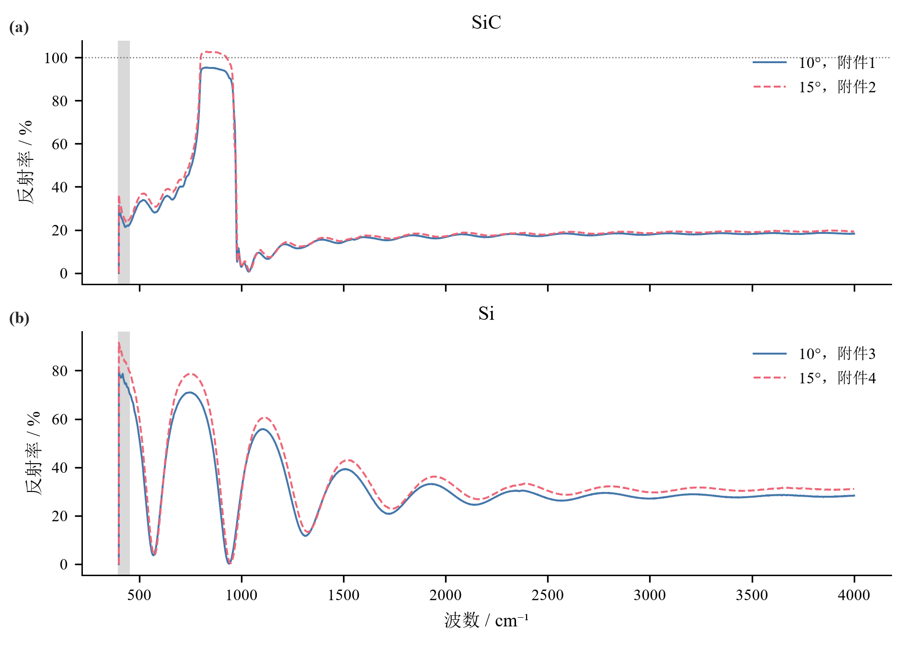
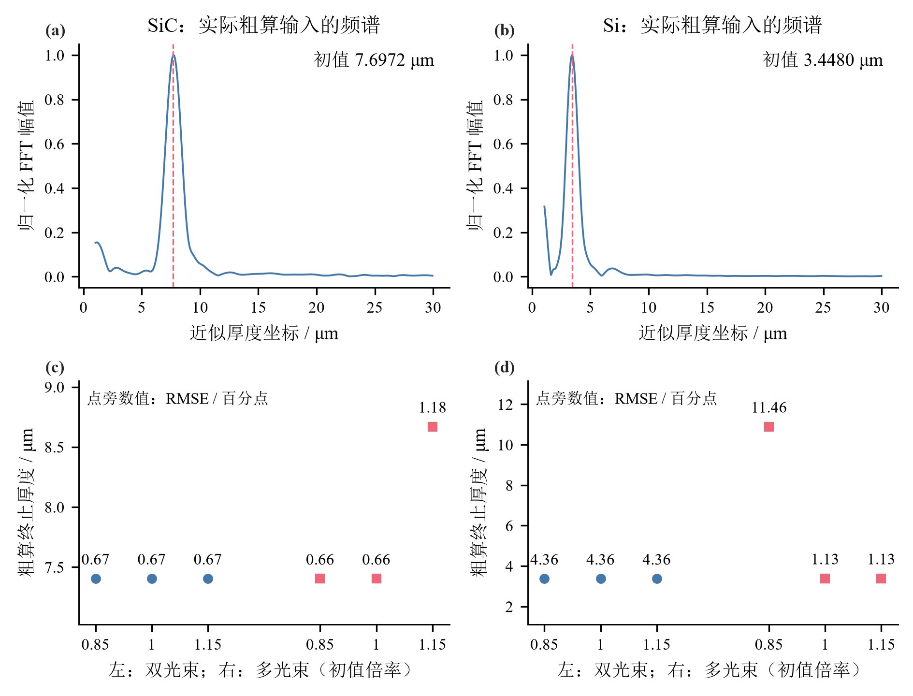
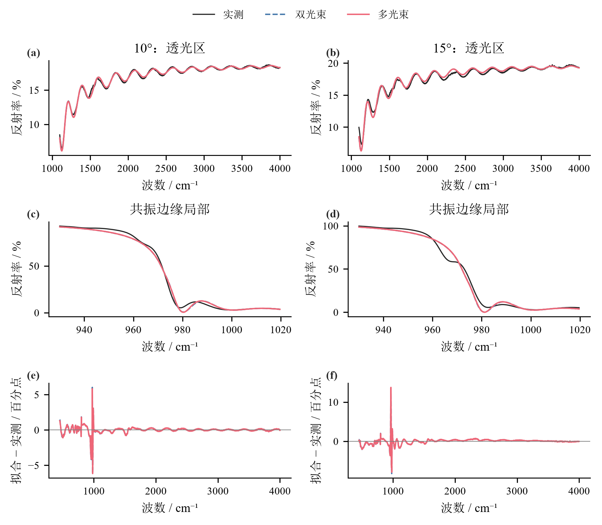
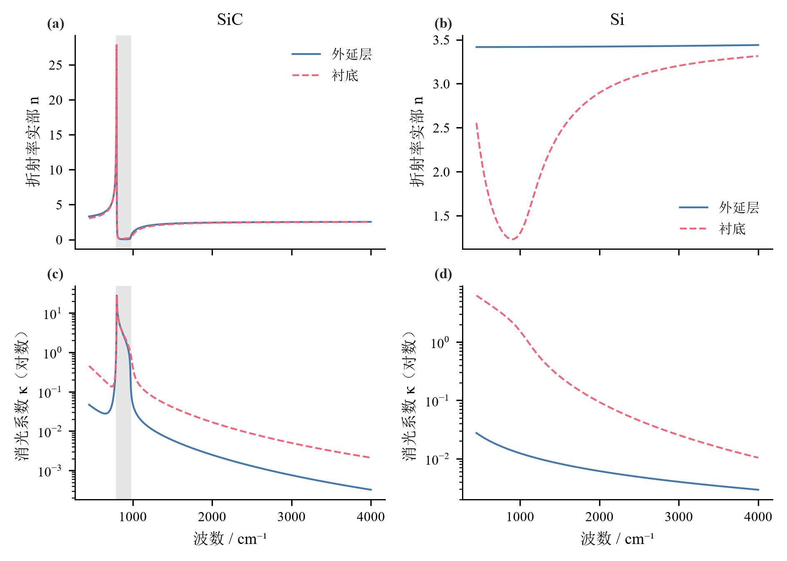
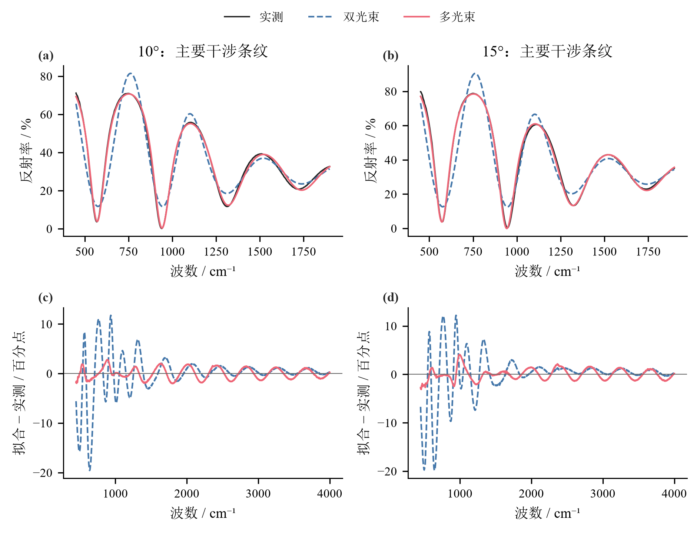
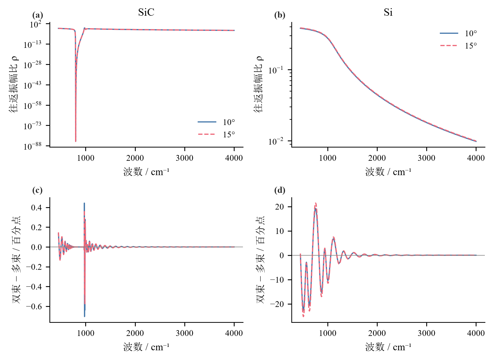
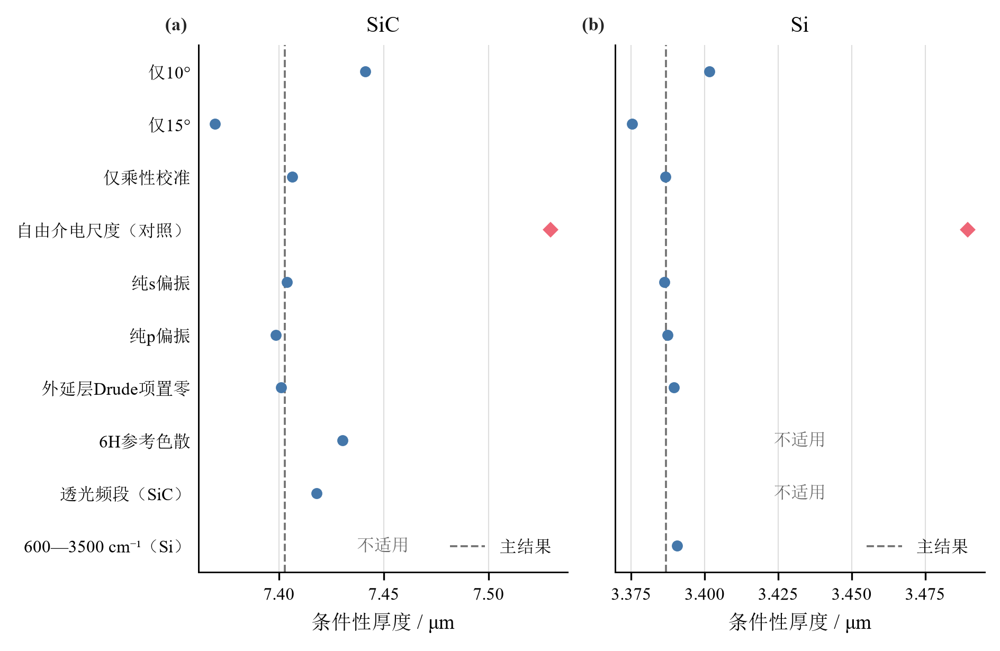
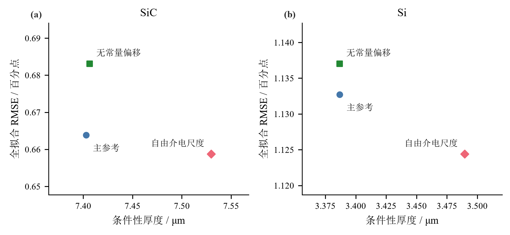

# 摘要

红外反射条纹首先约束光学厚度，折射率色散、测量标定和多次反射共同决定几何厚度的反演。针对两组双角度实测光谱，本文建立空气—外延层—衬底模型，以可追溯的材料色散为参考，联合估计同片厚度和有效载流子响应，并用反射率增益与偏移描述测量幅值差异。

针对问题1，从界面电场连续条件和层内传播相位推导双光束反射率，给出含色散的相邻级次厚度公式，说明峰间距依赖相位光程对波数的导数，不能在强色散区直接使用常折射率公式。针对问题2，以傅里叶分析定位初值，再通过双角度联合非线性最小二乘拟合，得到碳化硅双光束条件性厚度为 **7.403687 μm**，反射率均方根残差为 **0.66794 个百分点**。

针对问题3，对层内往返振幅作几何级数求和，并分别讨论多光束的产生条件与可观测条件。硅数据的多光束厚度为 **3.386838 μm**，残差由双光束的 **4.36318** 降至 **1.13271 个百分点**；基于各自全数据候选初始化后的分块重拟合，同谱留出误差由 **5.00746** 降至 **1.32890 个百分点**。两组证据共同支持当前条件下的多光束描述，证据强度限定为同谱预测比较。碳化硅多光束校正后为 **7.402901 μm**，厚度变化不足 **0.001 μm**，小于分角度与参考尺度变化的影响。

独立传输矩阵和直接往返求和验证了反射公式；原采样与隔点拟合的厚度差均小于 **0.0001 μm**。残差相关结构以及晶型、绝对标定信息的缺失构成主要适用边界。因此，实际结论报告为碳化硅约 **7.40 μm**、硅约 **3.39 μm**；已检验假设变化对应的情景包络分别约为 **7.370—7.530 μm** 和 **3.375—3.489 μm**。

关键词：外延层厚度；红外干涉；色散；多光束干涉；联合反演

# 一、问题分析与数据依据

## 1.1 三个问题之间的关系

同一晶圆片的外延层厚度在两次测量中保持一致，而层内折射角、界面反射系数和传播相位随入射角变化。因此，两条光谱共享厚度与材料参数，并分别使用题面给定的10°和15°入射角。问题1确定首个层内往返产生的双光束模型；问题2将该模型用于碳化硅；问题3加入第二次及以后的层内往返，并保持材料参考与测量模型一致，使模型差异对应于往返次数这一物理因素。

本题的核心是由条纹相位识别几何厚度。折射率随波长和掺杂变化，而附件未给折射率、掺杂浓度、晶型、偏振和仪器校准；这些信息共同决定从光学厚度到几何厚度的尺度转换。本文以公开材料色散构造参考尺度，并用分角度、参考参数和标定模型对照量化这一条件的影响。
求解由相互约束的正向模型与反演组成：正向模型描述给定厚度、材料响应和测量条件产生的光谱，反演则寻找同时解释双角度实测光谱的参数。问题1限定光路，问题2在该光路下估计参数，问题3只改变往返次数并保持其余比较条件，从而把光学机制变化与参考尺度变化分别解释。

全谱拟合作为主求解，峰距推导和傅里叶定位负责解释相位信息并提供初值。随后，同条件光束对照衡量遗漏往返项的影响，参考与标定对照衡量模型闭合方式的影响。两类对照共同确定厚度结论及其适用边界。

## 1.2 原始数据核查

四份附件的首行为表头，每份均有7469条数值记录。波数从399.6747到4000.122 cm⁻¹严格递增，相邻间距约0.482 cm⁻¹，无缺失值。附件1、2来自同一碳化硅片，附件3、4来自同一硅片；各组分别对应10°和15°。表1给出数据核查结果。

表1 原始光谱数据及拟合输入

| 附件 | 材料 | 入射角 | 原始记录数 | 最大反射率 / % | 拟合记录数 |
|---|---|---|---:|---:|---:|
| 1 | SiC | 10° | 7469 | 95.3850 | 7363 |
| 2 | SiC | 15° | 7469 | 102.7394 | 7363 |
| 3 | Si | 10° | 7469 | 79.8020 | 7363 |
| 4 | Si | 15° | 7469 | 91.4894 | 7363 |

四表首个反射率均为0，随后快速上升；附件2还有262个反射率超过100%的记录。被动样品的物理反射率上限为1，而仪器归一化、参考镜误差等测量因素会改变报告幅值。本文保留原始观测，不对峰值截断或强制归一化，并在反演中显式估计增益与常量偏移，使数据异常处理与物理模型保持可追溯。

主拟合频段取450—4000 cm⁻¹，使硅的参考色散位于其研究波段内，并避开数据低端的突跳；对两种材料和两种光束模型均采用同一范围。每条光谱有7363个点进入拟合，其余106个点仍保留在原始数据中。图1展示完整光谱，灰色区标出低端未用于拟合的部分。碳化硅约800—1000 cm⁻¹处的高反射带与高波数段的小振幅条纹性质不同，提示不能用统一峰距直接处理全谱。

{width=95%}

图1 四份原始光谱。曲线直接来自附件，未做平滑、截断或幅度归一化。

## 1.3 模型假设及其适用范围

将外延层看作厚度均匀、界面平行的单层介质，衬底视为半无限介质，不额外引入未知背面反射。用各向同性等效介电函数表示材料响应，主计算使用s、p偏振反射率的等权平均。该近似适合当前小角度反演的基准计算，但不意味着原题已确认晶向或偏振；纯s、纯p和参考晶型变化将在后文检验。

两角度共用材料参数，每条曲线分别设置乘性增益和常量偏移，以吸收可由低维标定项解释的幅值差异；条纹结构仍由物理反射模型承担。粗糙度、厚度空间分布和仪器线形缺少独立观测，故不再增设自由参数，其潜在影响通过残差结构和条件敏感性保留在结论边界中。

# 二、问题1：双光束厚度模型

## 2.1 界面系数与传播相位

令介质0、1、2分别为空气、外延层和衬底，真空波数为$v$，厚度$d$暂以cm计。取时间因子$\exp(-i\omega t)$，复折射率写成$N_j=n_j+i\kappa_j$，其中$\kappa_j\geq0$表示衰减。空气近似$N_0=1$。为统一有吸收和斜入射的计算，定义法向传播量

$$
q_j(v,\theta_0)=\sqrt{N_j(v)^2-\sin^2\theta_0},\qquad
\beta=2\pi vdq_1. \tag{1}
$$

平方根选择正向传播且向介质内部衰减的分支。无吸收时$q_1=n_1\cos\theta_1$，式(1)与折射定律一致。下文涉及复振幅时，不把复折射角强行当作实角代入三角函数。

以切向电场为振幅基准，s、p偏振的无量纲导纳分别为

$$
Y_j^{s}=q_j,\qquad Y_j^{p}=\frac{N_j^2}{q_j}.
\tag{2}
$$

对任一偏振，界面处切向电场和磁场连续，满足$1+r_{ij}=t_{ij}$及$Y_i(1-r_{ij})=Y_jt_{ij}$。联立得到

$$
r_{ij}=\frac{Y_i-Y_j}{Y_i+Y_j},\qquad
t_{ij}=\frac{2Y_i}{Y_i+Y_j}.
\tag{3}
$$

这一定义下$r_{10}=-r_{01}$、$t_{01}t_{10}=1-r_{01}^{\,2}$。不同资料对p偏振反射振幅可能使用不同方向约定；只要界面系数和传播过程保持同一约定，最终反射率一致。

## 2.2 保留一次层内往返

问题1的两束出射光分别是表面反射光$r_{01}$和穿入外延层、在衬底界面反射、再从表面透出的光。沿光的传播顺序，进入膜层乘$t_{01}$，到达下界面反射乘$r_{12}$，向上返回并出射乘$t_{10}$；两段传播各乘$\exp(i\beta)$。因此，首次往返出射振幅中的系数是这些过程的乘积，而不是把两个界面的反射率相加。两束电场先相加、再取模平方，才会保留相位相关的交叉项，即

$$
r^{(2)}=r_{01}+t_{01}t_{10}r_{12}\exp(2i\beta),\qquad
R^{(2)}=\left|r^{(2)}\right|^2.
\tag{4}
$$

式(4)严格保留题目要求的两束光，没有加入第二次层内往返。对未分偏振的基准模型，取$R^{(2)}=(R_s^{(2)}+R_p^{(2)})/2$。由于两束近似截断了完整电场，它在强反馈情况下不必像完整被动系统那样满足能量守恒；这正是问题3需要检验该近似的原因。

记$a=r_{01}$、$b=t_{01}t_{10}r_{12}\exp[-4\pi vd\,\operatorname{Im}q_1]$，则反射率由背景$|a|^2+|b|^2$及干涉项构成：

$$
R^{(2)}
=|a|^2+|b|^2+
2|a||b|\cos\Phi.
\tag{5}
$$

其中$\Phi=4\pi vd\,\operatorname{Re}q_1+\arg b-\arg a$。该式说明厚度主要进入相位，而吸收、界面差异和测量背景同时影响条纹幅度。不能只拟合频率而把这些因素对实测极值位置的作用全部忽略。

## 2.3 厚度公式及色散修正

在弱吸收、界面附加相位近似不变的频段，同类相位极值$v_m,v_{m+k}$相差$k$个完整周期。由式(5)得到

$$
d=\frac{k}
{2\left[v_{m+k}q_1(v_{m+k})-v_mq_1(v_m)\right]}.
\tag{6}
$$

式(6)中$v$以cm⁻¹计，所得$d$以cm计，乘$10^4$转为μm。无色散时退化为$d=1/[2q_1\Delta v]$；有色散时，局部近似为

$$
\Delta v\simeq
\frac{1}{2d\left(q_1+v\,dq_1/dv\right)}.
\tag{7}
$$

因此，条纹间距响应的是$q_1+vq_1'$，而不是仅响应$n_1$。若直接代入常折射率，声子共振附近的快速色散会被错误解释为厚度变化。此外，对式(5)求导可见，背景和振幅的导数也进入$dR/dv=0$；只有它们变化足够缓慢时，实测峰谷才接近相位极值。本文据此使用式(4)拟合曲线，式(6)—(7)用于解释相位、构造初值和检查量纲。

# 三、问题2：碳化硅联合反演与可靠性

## 3.1 参考色散与待估参数

碳化硅红外介电响应同时包含晶格振动和自由载流子作用。采用既有光学研究中的声子—Drude形式^\[1\]^，而不把文献样品的厚度或掺杂量用于本题：

$$
\varepsilon_j(v)=
\varepsilon_\infty\left[
1+\frac{v_L^2-v_T^2}{v_T^2-v^2-i\Gamma v}
-\frac{P_j^2}{v^2+i\gamma_jv}
\right],\qquad N_j=\sqrt{\varepsilon_j}.
\tag{8}
$$

这里$j=1,2$对应外延层与衬底，$\Gamma$为共享的有效声子阻尼，$P_j,\gamma_j$分别为载流子响应的频率尺度和阻尼，均以cm⁻¹计。主参考取$\varepsilon_\infty=6.56$、$v_T=798$ cm⁻¹、$v_L=970$ cm⁻¹，对应文献的4H普通光参考参数。其含义是固定一种有来源的介电尺度，而不是认定本题晶片已经被鉴定为该晶型。后文用6H参考参数和自由尺度对照检验这一条件。

不将$P_j$进一步换算成载流子浓度，因为有效质量、晶向和载流子类型没有独立给定。尤其当$\gamma_j$远大于测量频段时，数据更直接约束$P_j^2/\gamma_j$一类组合，单独报告高精度浓度会超出证据范围。

对第$\theta$条曲线，反射率测量模型为

$$
\widehat y_\theta(v)=g_\theta R^{(2)}(v,\theta;\mathbf p)+b_\theta,
\tag{9}
$$

其中$y$为附件反射率除以100，$g_\theta>0$为增益，$b_\theta$为常量偏移。两角度共有$d,\Gamma,P_1,\gamma_1,P_2,\gamma_2$，各自有$g_\theta,b_\theta$，合计10个自由参数。所求优化问题为

$$
\min_{\mathbf p}\;
S(\mathbf p)=\sum_{\theta\in\{10^\circ,15^\circ\}}
\sum_{v_i\in[450,4000]}
\left[\widehat y_\theta(v_i;\mathbf p)-y_\theta(v_i)\right]^2.
\tag{10}
$$

两角度采样一致，采用等权平方损失。由于未知仪器噪声和模型误差的分布，不将式(10)直接解释为独立高斯观测的似然。

该目标同时利用条纹位置和反射率幅值：厚度主要控制传播相位，介电参数同时影响相位与界面系数，增益和偏移则调整光谱纵向尺度。共享厚度和介电参数使两个角度共同约束同一晶片，分角度标定项则隔离明显的幅值差异。参数能否唯一识别还需结合后续角度与参考尺度对照判断。

正式求解前的相位模型和完整反射模型探索均发现，参考介电尺度与标定形式改变时，厚度可能变化而残差相近；仅取透光段还会使声子阻尼触及数值边界。因此没有以“自由参数最多、残差最小”作为主参考选择原则，也没有将透光段试算当作全部介电参数的独立测量。主模型采用有文献依据的固定色散尺度；自由尺度等替代闭合留作条件敏感性。后文用正式拟合的同域对照量化这一取舍，不把不同探索频段的残差混作模型排名。

## 3.2 求解算法与数值范围

厚度影响相位，目标函数可能出现不同条纹级次对应的局部盆地。先对1400 cm⁻¹以上的曲线减去三次趋势，乘Hann窗并作8倍零填充的傅里叶变换；由主振荡频率与材料高频参考折射率给出厚度初值。零填充只细化频率读数，不增加数据的实际分辨率，常折射率也只用于初始化。

以初值的0.85、1和1.15倍启动三个有界信赖域最小二乘计算，粗算每隔8个点取样，选择平方残差最小的候选，再用全部原始采样点细化。采用解析复反射公式直接计算残差，数值差分构造Jacobian，并按Jacobian尺度调整参数步长。单次残差计算量与采样点数线性相关；参数只有9—10个，完整曲线计算不需要用元启发式替代成熟的局部最小二乘算法。

为防止非物理分支和无意义的极端迭代，厚度搜索范围为0.2—50 μm；$\Gamma$为0.02—100 cm⁻¹，$P_j$为0—5000 cm⁻¹，$\gamma_j$为0.1—50000 cm⁻¹，增益为0.4—1.8，偏移为−0.15—0.15。以上为宽数值搜索界，不是样片的先验置信范围。主结果未触及这些边界；弱识别参数仍不能因此被视作已精确测定。相对函数与参数终止容差均取$2\times10^{-9}$，梯度阈值取$2\times10^{-8}$。

碳化硅的傅里叶初值为7.6972 μm，三个双光束粗算均收敛至约7.4046 μm；全采样细化得到表2。多初值一致支持所选盆地的数值稳定性，但没有构成全局最优证明。

图2给出实际粗算输入的频谱及候选终点。上排来自10°曲线在主频段筛选后每隔8点取样，再取1400 cm⁻¹以上部分并执行既定去趋势、加窗和零填充步骤；横轴使用高频参考折射率换算，所以是近似厚度坐标，不是新的最终厚度测量。高波数段用于减少强声子共振背景对初值的干扰，未因此从正式拟合中删除共振区。

{width=95%}

图2 傅里叶定位与实际搜索候选。上排为按原粗算流程确定性恢复的归一化频谱；下排各点为已保存的粗算终止厚度，点旁为该候选RMSE。横轴是初值倍率分类，不是迭代时间；不同材料的纵轴分别取适当尺度。

下排显示，多初值不是形式上的重复：SiC多光束有一个候选停在约8.6694 μm、RMSE约1.18个百分点，劣于另两个候选；硅多光束也出现明显劣盆地。残差最小的粗算候选才进入原采样细化，因而表2、表3的正式值不等于图中粗算值。三个起点只在当前频谱定位附近探查，不能排除其他未搜索盆地；也没有保存足以展示逐次迭代的轨迹，故不把候选终点画成收敛曲线。

表2 问题2的碳化硅双光束联合结果

| 项目 | 数值 | 含义 |
|---|---:|---|
| 厚度$d$ / μm | 7.403687 | 固定参考色散下的联合拟合值 |
| 联合RMSE / 百分点 | 0.66794 | 两角共14726个拟合点 |
| 10°曲线RMSE / 百分点 | 0.48638 | 同一组联合材料参数 |
| 15°曲线RMSE / 百分点 | 0.80977 | 同一组联合材料参数 |
| $g_{10},g_{15}$ | 0.97523，1.05175 | 候选乘性标定参数 |
| $b_{10},b_{15}$ / 百分点 | 0.03763，−0.41191 | 候选常量偏移 |

这两个角度的反射率幅度差异不能直接解释为不同厚度。式(10)利用同片约束给出一个厚度，而允许界面光学和测量模型共同解释曲线差异。报告六位小数只为精确复现计算，实际测厚结论不能保留同样的有效位数。

图3在相同参考与拟合域下并列双光束和多光束预测。透光段中，两种模型都能描述主要条纹及缓变背景；共振边缘仍存在局部形状失配，15°曲线更明显。两条预测彼此接近而共同偏离局部实测形状，说明增加往返次数只修正光路截断，剩余误差还包含材料响应或测量模型的影响。

{width=95%}

图3 SiC双光束、多光束与实测谱。两列分别为10°、15°，上排展示透光区，中排放大930—1020 cm⁻¹共振边缘，下排保留整个拟合域残差；两模型各用自己的冻结拟合参数，不在制图时重新优化。接近重合的曲线表示校正较小，不能解释为两模型都精确符合实测。

## 3.3 可靠性与双角度信息的限制

理想情况下，若可在同一波数处独立恢复两个角度的相位光程$L_\theta=2d\sqrt{n^2-\sin^2\theta}$，则

$$
L_{10}^2-L_{15}^2
=4d^2\left(\sin^215^\circ-\sin^210^\circ\right).
\tag{11}
$$

式(11)给出双角度分离$d$与$n$的理论来源。由于10°与15°接近，右侧角度差较小，实际分离能力还会受到界面相位、色散、基线和校准误差影响。因此，双角度显著增强了共同厚度约束，但绝对折射率尺度仍需文献参考与敏感性分析共同闭合。

采用基于全数据候选初始化后的分块重拟合/留出预测检查：以50 cm⁻¹为一个连续块，每250 cm⁻¹留出首块，两角度使用相同划分。以各模型在全数据上拟合所得参数作为初值，在剩余约80%的频段重新拟合；留出块不进入该次拟合目标，只用于计算预测误差。但初始化已利用全数据的参数与盆地信息，因此这不是严格blind holdout。双光束碳化硅的留出RMSE为1.48622个百分点，高于全谱拟合残差。该结果与共振边缘难以被当前等效模型完全描述相符，不能把密集采样下的小数值优化误差作为真实测厚精度。

问题3将继续在同样的参考和数据条件下检验多光束。若校正很小但分角度或色散对照仍导致明显厚度差异，说明主要可靠性限制来自其他假设；只有将这两类影响分开，才能判断应该改进光学模型还是增加独立标定。

# 四、问题3：多光束条件、模型与厚度校正

## 4.1 从往返级数到完整反射率

问题1中，首次返回上界面的光只有透射出膜的部分被计入。问题3继续保留其中被上界面反射回膜内的部分：它再到下界面反射、再传播返回，于是相对前一束多乘上界面内反射、下界面反射和一次往返传播三个因子。记第一次层内往返后出射的复振幅为
$B=t_{01}t_{10}r_{12}\exp(2i\beta)$。每增加一次往返，光波在上、下界面各反射一次，并增加传播因子，因此相邻层内出射波的复比为

$$
h=r_{10}r_{12}\exp(2i\beta),\qquad
\rho=|h|
=|r_{10}r_{12}|
\exp[-4\pi vd\,\operatorname{Im}q_1].
\tag{12}
$$

当$\rho<1$时，总反射振幅由收敛几何级数给出：

$$
r^{(\infty)}
=r_{01}+\frac{B}{1-h}
=\frac{r_{01}+r_{12}\exp(2i\beta)}
{1+r_{01}r_{12}\exp(2i\beta)}.
\tag{13}
$$

完整反射率为$R^{(\infty)}=|r^{(\infty)}|^2$。式(13)与式(4)使用相同的材料和界面定义，只增加被截断的往返项，因而两种模型可以作公平对照。完整薄膜反射形式也是红外外延层表征的常用物理基础^\[1\]^。

## 4.2 产生条件与可观测条件

存在两个以上非零出射波，是额外多光束干涉项产生的基本前提；若$r_{10}r_{12}=0$，或吸收已使后续波消失，额外往返便不会起作用。但$\rho\neq0$本身仍不足以保证仪器测得多光束条纹，还需要以下联系。

首先，各束在探测面上必须有非零空间重叠，并具有相同偏振方向上的分量。外延层内每次往返引起约$2d\tan\theta_1$的横向位移；能重叠的往返次数取决于光斑和收集孔径。题面未给这些尺寸，因此不能从附件单独确定最大有效往返次数。

其次，参与叠加的波在测量条件下须保持非零互相干性。将两束互相干度写为$\gamma_{mn}$，其干涉项正比于$2\operatorname{Re}(E_mE_n^*\gamma_{mn})$。若相位在积分时间内完全随机，$\gamma_{mn}=0$，即使两束强度非零也只形成非相干背景。对按波数分辨的测量，仪器线形会对式(13)作谱平均；当一个分辨单元内的相位变化远大于一个周期时，条纹趋于被抹平。局部相位变化约为

$$
\Delta\Phi_{\mathrm{inst}}\simeq
4\pi d\left(q_1+v\frac{dq_1}{dv}\right)\Delta v_{\mathrm{inst}}.
\tag{14}
$$

因此，不能用宽带光源的总带宽直接否定经光谱分辨后的干涉，也不能把附件约0.482 cm⁻¹的采样间距直接等同于仪器分辨率。界面平行性、厚度起伏和粗糙度同样会造成相位平均；其影响需要额外测量才能独立约束。

最后，可观测的多光束影响还要求后续波造成的变化超过噪声和模型误差。不存在不依赖噪声、带宽和几何条件的统一反射率阈值。附件未给相干性及仪器参数，故本文只能结合必要条件的物理可行性、拟合得到的$\rho$和同条件预测对照，判断多光束描述是否受到数据支持；不能宣称从两条强度谱严格证明了所有实验条件。

## 4.3 多光束对厚度精度的作用机制

若仅保留$B$而忽略$Bh+Bh^2+\cdots$，复振幅余项满足

$$
\left|r^{(\infty)}-r^{(2)}\right|
\leq \frac{|B|\rho}{1-\rho}.
\tag{15}
$$

该式为当前复系数下的振幅截断界，不是厚度误差界。厚度误差还取决于反射率对$d$的敏感度，以及其他参数能否吸收被遗漏项。线性化最小二乘时，若模型差异向量为$\delta\mathbf R$、Jacobian为$J$，则参数偏移近似由$(J^\mathsf TJ)^{-1}J^\mathsf T\delta\mathbf R$决定；病态的$J$可放大很小的反射率差异，所以不能用“反射率差很小”直接推出“厚度误差很小”。

在系数为实常数、无吸收和无色散的理想情况下，式(13)是$\cos(2\beta)$的分式函数，共振仍对应固定的相位条件。多光束主要改变峰宽、对比度和峰形，不必改变相邻同类共振的间距。实测中只有在色散、吸收、界面相位变化、幅度趋势或峰序识别等因素共同作用时，简单峰距厚度才会产生相应偏差。本文因此直接比较完整曲线反演结果，而不假设多光束一定使厚度单向增大或减小。

## 4.4 硅的参考模型与计算结果

硅采用Chandler-Horowitz和Amirtharaj的中红外折射率研究作为参考^\[2\]^，数值表达式核对公开光学常数数据库中的对应数据项^\[3\]^：

$$
n_{\mathrm{Si,ref}}^{\,2}(\lambda)
=11.67316+\frac{1}{\lambda^2}
+\frac{0.004482633}{\lambda^2-1.108205^2},
\qquad \lambda=\frac{10^4}{v}\;(\mu\mathrm{m}).
\tag{16}
$$

原作者研究范围为450—4000 cm⁻¹。文献身份与波段由NIST记录核实，公式由数据库条目核对；本次未获得原期刊全文，不把二次数据表达式冒称为已逐页核对的原刊公式。其端点折射率与作者摘要给出的约3.4169和3.4400相符。

在式(16)基础上，对外延层和衬底分别减去$11.67316P_j^2/(v^2+i\gamma_jv)$，并代入式(13)。不向硅模型添加碳化硅的声子极点。该模型用有效载流子响应描述吸收和色散差异，未独立分离硅本征多声子吸收，因此其有效参数不能作载流子测量结论。

两种材料采用不同本征参考，是为了保留各自参考响应的结构，而不是把两种材料预先归为“多光束”或“双光束”。是否需要保留额外往返还取决于外延层与衬底界面系数、膜内传播衰减，以及这种差异能否被两束拟合的其他参数吸收。图4使用两种材料各自冻结的多光束参数展示这一链条的起点。

{width=95%}

图4 冻结多光束模型导出的复折射率谱。上排为实部，下排为消光系数；SiC灰带标示参考TO至LO区间。所有曲线均为条件模型的派生量，不是新增光学常数测量，也不用于替换双光束模型的拟合参数。

SiC参考声子项在灰带附近产生快速变化，外延层的消光系数在此增大，传播相位与衰减均不能按常数近似；高波数段两层实部接近，但虚部仍可不同。硅模型中，外延层实部变化较缓，衬底的有效响应在低波数区与外延层差别明显。后者可以增大界面反馈，却不能只凭实部之差定量判断多光束：还需通过复导纳求界面系数，并与膜内衰减相乘。图6继续展示这个乘积及它造成的反射率差。

除不含$\Gamma$外，拟合流程、标定项与碳化硅相同。硅共有9个自由参数，傅里叶厚度初值为3.4480 μm。多光束的三个粗算中有一个落入厚度约10.8944 μm、残差约11.46个百分点的劣盆地，另外两个到达约3.3868 μm、残差约1.13个百分点的盆地；保留较小残差候选后作全采样细化。该实际搜索结果说明多初值在此有作用，但仍不声称找到了全局唯一解。

表3 相同参考与频段下的双光束、多光束对照

| 材料 | 模型 | 厚度 / μm | 全拟合RMSE / 百分点 | 留出RMSE / 百分点 |
|---|---|---:|---:|---:|
| SiC | 双光束 | 7.403687 | 0.66794 | 1.48622 |
| SiC | 多光束 | 7.402901 | 0.66382 | 1.46585 |
| Si | 双光束 | 3.368877 | 4.36318 | 5.00746 |
| Si | 多光束 | 3.386838 | 1.13271 | 1.32890 |

表3的留出数值来自训练子集重拟合，双光束和多光束分别以各自全数据候选初始化，并采用相同初始化规则。留出块不进入该次拟合目标，但曾参与前序候选形成，因此这是一项同谱分块预测比较，而非外部样片验证。硅的多光束模型在该口径下仍保持明显优势；两模型参数数量相同，改善来自光路结构而非自由度增加。图5显示，主要收益集中在低波数强峰和深谷的恢复，高波数区仍保留有序残差。

{width=95%}

图5 硅的双光束与多光束拟合。上排放大主要条纹，下排展示整个拟合频段的残差；两种模型分别重估参数。

多光束硅模型得到的最大往返振幅比分别为0.3802和0.3846。后续往返并不处处可忽略，与低波数区需要多光束模型的证据一致。若固定多光束拟合的全部参数，仅将正向公式截断为双光束，反射率差的RMS为5.5421个百分点、最大值25.2026个百分点，说明差异确由被遗漏的往返项产生。双光束重新拟合能够吸收一部分差异，却仍留下较大的预测误差。因此，在本文的物理和标定假设下，附件3、4支持采用多光束干涉模型，硅外延层条件性厚度取3.386838 μm，实际报告约3.39 μm。

## 4.5 碳化硅的多光束影响及校正

对附件1、2只将式(4)换为式(13)，保持参考色散、数据范围、参数个数和标定模型不变，重新拟合得到$d=7.402901$ μm。相对双光束结果变化为−0.000786 μm，约为厚度的0.0106%。联合残差仅从0.66794降至0.66382个百分点，上述全数据候选初始化后的分块预测误差变化也很小。

图3中共振边缘仍有尖锐残差，15°曲线最大绝对偏差约13.73个百分点；这种局部失配不能用全谱RMSE的平均效果掩盖。当前等效各向同性模型、共享声子阻尼和简单标定都可能在该处不足，已有数据不能唯一定位原因。仅对1100—4000 cm⁻¹透光段重新拟合时，厚度为7.417986 μm，但声子阻尼触及数值下界，因此只把它作为窗口敏感性对照，不宣称该窗口独立识别了全部介电参数。

从式(12)看，往返反馈包含两个因素：$|r_{10}r_{12}|$描述两界面的反射乘积，$\exp[-4\pi vd\,\operatorname{Im}q_1]$描述外延层内往返的振幅衰减。衬底消光系数影响下界面复反射系数，不能误当作光在外延层中的传播吸收。图4中的材料差异通过这两个因素进入图6；因此仅比较两层折射率实部，或仅看反射谱有没有峰谷，都不足以替代反馈计算。

碳化硅两角度的$\rho$最大约0.0737和0.0727，中位数仅约0.0029。固定多光束参数再截断为双光束时，反射率差的RMS为0.0323个百分点，远小于硅的对应差异。这里先固定多光束参数再截断，回答的是“同一物理参数下遗漏往返项会改变多少光谱”；表3分别重拟合，回答的是“两束模型能通过参数调整吸收多少差异”。两种比较结合起来，才支持厚度校正的解释，而不能把固定参数反射率差直接换算成厚度误差。图6将这一机制直接展示出来：SiC的额外往返普遍较弱，而Si在低波数区反馈较强。

{width=95%}

图6 冻结多光束参数下的往返振幅比和截断影响。每种材料沿同一组参数计算，未重新优化；上排为对数纵轴。

据此可以说碳化硅存在额外往返的物理可能，完整模型已经计入其影响，但现有证据不支持把多光束视为当前厚度不确定性的主要来源。所谓“消除影响”在这里是用完整反射模型校正截断偏差，而不是修改原始测量值或保证所有实验误差均已消除。校正后的实用厚度仍约为7.40 μm。

# 五、数值验证与结论的适用范围

## 5.1 实现与数值精度检查

为避免两个相同公式互相验证，另以单层特征矩阵计算反射率：

$$
M=
\begin{pmatrix}
\cos\beta&-i\sin\beta/Y_1\\
-iY_1\sin\beta&\cos\beta
\end{pmatrix},\quad
Y_{\mathrm{in}}=\frac{M_{21}+M_{22}Y_2}{M_{11}+M_{12}Y_2},\quad
r=\frac{Y_0-Y_{\mathrm{in}}}{Y_0+Y_{\mathrm{in}}}.
\tag{17}
$$

对两种材料、两个角度及450—4000 cm⁻¹的731个检验节点，式(17)与几何级数公式的最大反射率差为$5.56\times10^{-16}$以内；直接累加80次往返也得到同等级差异。这检验了系数方向、复传播相位和求和实现，而不是检验材料假设的真实性。

再用独立矩阵程序生成已知厚度5.2 μm的SiC谱和4.2 μm的Si谱，固定其余参数反演厚度，误差均小于$7\times10^{-11}$ μm。此为无噪声、模型正确条件下的单位和反演检查，不代表实际测量能达到该精度。主结果全部由原始工作簿重新计算残差，并核对完整被动模型的反射率在0—1之间。

隔点拟合与全采样多光束结果相比，SiC厚度变化约0.000083 μm，Si约0.000010 μm。它们远小于下述假设敏感性，表明继续加密数值采样不太可能改变当前实用结论。主参数未碰搜索边界，但Si双光束拟合的外延层$P_1$接近0，其阻尼失去单独解释意义；参数未碰边界不是可辨识性的充分条件。

## 5.2 参考、角度及标定敏感性

表4和图7均以多光束主模型为基准，每次只改变表列的一项条件并重新拟合，其余设置保持一致。它们回答不同物理或测量假设是否会改变厚度，不能把各行当作重复独立样本计算置信区间。

表4 多光束厚度对主要条件的响应，单位：μm

| 条件 | SiC | Si |
|---|---:|---:|
| 双角度主参考 | 7.402901 | 3.386838 |
| 仅10°数据 | 7.441075 | 3.401574 |
| 仅15°数据 | 7.369553 | 3.375257 |
| 不设常量偏移 | 7.406432 | 3.386672 |
| 参考介电尺度自由 | 7.529694 | 3.489468 |
| 纯s偏振 | 7.403849 | 3.386341 |
| 纯p偏振 | 7.398417 | 3.387322 |
| 外延层Drude项置零 | 7.401110 | 3.389471 |
| 6H参考色散 | 7.430293 | 不适用 |
| 改变拟合窗口 | 7.417986 | 3.390658 |

注：最后一行SiC窗口为1100—4000 cm⁻¹，Si窗口为600—3500 cm⁻¹。自由尺度是比较用模型，不取代主参考；SiC窄窗口的声子阻尼碰下界，故只用于敏感性解释。

{width=95%}

图7 条件变化对应的厚度。两面板按相同条件对齐，横轴范围不同；不适用的条件单独标明。虚线为双角度主结果，红色菱形为自由介电尺度对照；每个点均重新拟合，没有把点间差异标成统计误差棒。

两个角度分别拟合得到的厚度不同，并不表示同一晶片真的有两个厚度，而是暴露当前光学与测量模型尚不能同时消除的系统差异。SiC分角度结果相差约0.0715 μm，Si相差约0.0263 μm，均大于原采样与隔点计算的差异。参考介电尺度一旦放开，厚度也随之变化，但残差改善有限；其原因与式(11)所示的尺度相关性一致。

按表4，联合厚度位于两个分角度拟合值之间；这是实际拟合的结果，不是事先取两者平均，也不能由此证明样片厚度已被两次独立测量确认。两角度都来自同一晶片并共享参考模型，分角度差异更适合用于识别当前共同材料参数与候选标定形式未能消除的系统差异。偏振、窗口和标定变化的对照只检查各自那一项，不覆盖厚度非均匀性或未知各向异性的联合影响。

{width=95%}

图8 厚度变化与拟合代价的对应关系。每种材料只比较主参考、无常量偏移和自由介电尺度三个已完成的多光束拟合，均使用450—4000 cm⁻¹两角度全部拟合点。坐标范围为局部比较范围，各点不构成似然剖面或置信区域。

对SiC，放开介电尺度使厚度从7.402901增至7.529694 μm，而RMSE仅从约0.66382降至0.65873个百分点；对Si，厚度从3.386838增至3.489468 μm，RMSE从约1.13271降至1.12439个百分点。自由尺度增加了自由度，残差下降本身并不验证它更接近样片真实折射率。相反，无常量偏移对照主要使残差上升，固定参考下厚度变化较小。这说明数据对“怎样解释幅值”和“怎样确定光学尺度”的响应并不相同，不能以一个拟合优度指标同时代替两类判断。

图8没有纳入单角度或改变窗口的点，因为这些拟合使用的数据基础不同，RMSE数值不能直接作同条件排名。它也没有展示未计算的连续参数扫描，不能将三个场景间的空白补成一条平滑的识别曲线。

在固定材料尺度的已检验变化中，SiC厚度为约7.370—7.441 μm，Si为约3.375—3.402 μm；计入自由尺度对照后，上端分别扩展至约7.530和3.489 μm。该情景包络汇总了已计算的晶型、角度、偏振、标定与窗口变化，用于解释条件敏感性。结合主模型结果，实用厚度报告为SiC约7.40 μm、Si约3.39 μm，并与参考假设一同使用。

## 5.3 尚未被数据消除的不确定性

多光束拟合残差的相邻点相关系数，SiC约0.989和0.993，Si约0.9998。密集采样并没有提供同样数量的独立误差样本，因此用常规独立残差公式得到极窄置信区间是不可靠的。分块重拟合沿用全数据候选初值，留出数据的信息并未从完整求解链中隔离；该检查只支持同谱条件预测比较，不是严格盲留出、外部验证或独立样片验证。

进一步提升绝对测厚可信度，最有价值的新证据是晶型与晶向确认、参考镜校准、仪器线形，以及独立的厚度或折射率测量。这些信息直接约束当前主导的尺度与系统误差；继续收紧优化容差主要改善数值收敛。厚度非均匀性、各向异性和本征吸收可作为后续解释有序残差的候选机制，需要新增观测后再区分。

# 六、结论

本文由单次层内往返推导双光束模型，并通过复导纳统一处理斜入射、吸收和偏振。在参考色散约束下，问题2的SiC联合厚度为7.403687 μm；完整多光束模型给出7.402901 μm。两者差异不足0.001 μm，表明本次SiC厚度的主要限制不是双光束截断。

对硅数据，完整往返模型在相同参数数量、频段和标定条件下显著改善强条纹峰形，并在全数据候选初始化后的分块重拟合中保持同谱预测优势，得到厚度3.386838 μm。因此，给定参考假设下，附件3、4采用多光束模型解释。实验相干性、光斑重叠和仪器分辨率尚无独立测量，相应结论定位为由光谱拟合支持的条件性判断。

最终实用结果为SiC约7.40 μm、Si约3.39 μm。计算复现精度高于现有物理与标定信息所支持的测量精度，二者必须区分。所报告厚度应与色散参考、测量模型及敏感性结果共同使用。

# 参考文献

[1] Yoshida S, Hijikata Y, Yaguchi H. Nondestructive and Contactless Characterization Method for Spatial Mapping of the Thickness and Electrical Properties in Homo-Epitaxially Grown SiC Epilayers Using Infrared Reflectance Spectroscopy[M]//Physics and Technology of Silicon Carbide Devices. IntechOpen, 2012. DOI: 10.5772/50749.

[2] Chandler-Horowitz D, Amirtharaj P M. High-accuracy, midinfrared (450 cm⁻¹ ≤ ω ≤ 4000 cm⁻¹) refractive index values of silicon[J]. Journal of Applied Physics, 2005, 97: 123526. DOI: 10.1063/1.1923612. 文献身份与研究范围核对NIST公开记录。

[3] Polyanskiy M N. Refractiveindex.info database of optical constants[J]. Scientific Data, 2024, 11: 94. DOI: 10.1038/s41597-023-02898-2. 使用Si / Chandler-Horowitz数据项，访问日期：2026-09-09。

# 附录 支撑材料与论文证据的对应关系

原始附件1、2分别给出同一SiC样片在10°、15°下的反射光谱，附件3、4给出同一Si样片的对应光谱。这四份附件支撑第1.2节的数据核查、表1和图1，也构成问题2、问题3反演及残差比较的共同观测依据；超过100%的报告值予以保留，其原因不能由附件单独确定。

双光束与多光束的联合拟合结果支撑表2、表3中的条件性厚度和残差；图3、图5将相应预测与原始光谱对照，展示整体条纹与局部失配。分块重拟合结果支撑表3的同谱留出预测比较，但初始化使用全数据候选，不能作为严格盲留出或独立样片验证。

已记录的粗算候选与原始光谱的傅里叶定位共同支撑图2，说明起点形成及候选筛选的实际作用，不证明全局最优。由多光束拟合参数派生的复折射率、往返振幅比和固定参数截断差分别支撑图4、图6，帮助解释两种材料的多光束响应差异；这些量属于条件模型解释，不是新增材料测量。

独立传输矩阵、直接往返求和及已知厚度合成光谱的检验支撑第5.1节的公式实现与单位一致性结论，不代表实际测厚精度。分角度、参考尺度、偏振、标定和窗口对照支撑表4、图7及第5.2节的条件敏感性分析；其中同域拟合代价由图8补充展示。各项对照限定了结论可被使用的范围，不能将其包络解释为置信区间或全部误差的上界。
