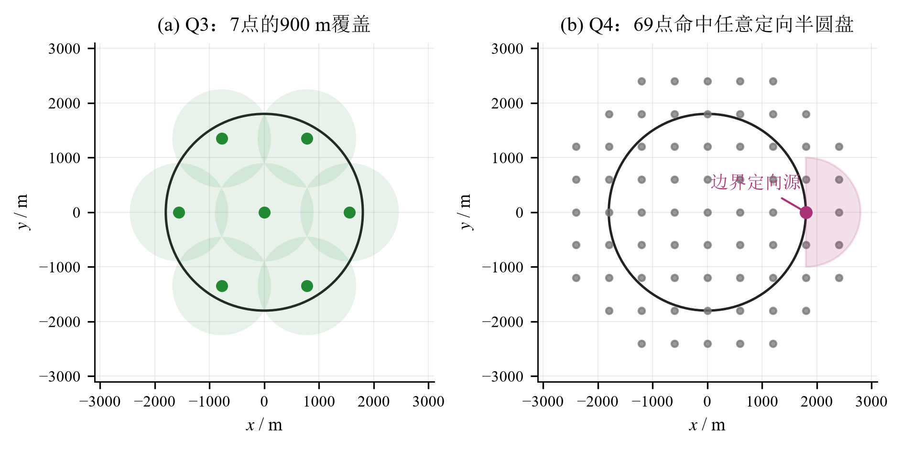
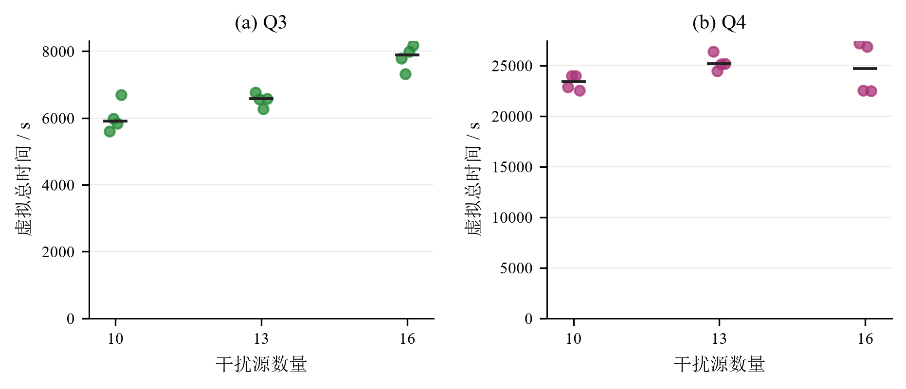

# 基于集合交会与覆盖保证的无线电干扰源自动定位清除

## 摘要

针对示向误差有界、接收半径未知且干扰源数量未知的自动定位清除问题，本文采用集合估计而非点估计，把每次正常示向读数表示为半角 $1^\circ$ 的闭扇形，并与目标圆域、接收圆盘逐次求交。问题一给出由直线交点、直线—圆交点、圆—圆交点和可行圆弧共同组成的解析边界算法，在边界上求支撑点、直径及最小包围圆；等边三角形反例表明，以定位区域直径为直径的圆一般不能覆盖该区域，可靠清除应以最小包围圆半径不超过20 m为证书。

问题二利用首次正常回报同时约束真实距离和未知接收半径这一事实，把“第二点对所有相容全向源均有信号”化为4个半径1000 m圆盘的交。有限候选按移动距离和第二次观测后最坏定位直径组成Pareto集合。在800 m比较预算下，局部坐标 $(550,\pm575)$ m的候选行程为795.69 m，连续返回角直径上界为151.39 m，是后续全局策略的中档基准；该结论不声称连续域全局最优。

问题三在原点和半径 $900\sqrt3$ m圆周上的6个等角点扫描未解决频道，证明7个半径900 m圆盘覆盖整个目标圆。发现目标后先用集合交会和保证接收的局部测点缩小区域，包围圆半径不超过20 m即清除，否则转入有限光学网格兜底。问题四针对定向源构造间距600 m、距原点不超过2800 m的69点网格，证明它能命中任意可能的半径1000 m定向半圆盘；首次阳性示向后，用304个清除点覆盖完整误差扇形，从而不依赖未知辐射方向仍可有限终止。两问均不读取隐藏源数：清除16个时可提前退出，否则必须完成覆盖。

基于题面公开规则构造Q3、Q4各12个确定性压力案例，源数覆盖10、13、16并包含边界朝外定向源，24个案例均全部清除。Q3虚拟总时间中位数为6639.40 s、最大8185.02 s；Q4分别为24227.56 s和27209.86 s，主要代价来自保底网格中的失败清除。上述结果是可复现的离线规则证据，不是官方成功率。官方材料规定2026年9月13日17:30后不能启动新测试，本文完成时已过截止时间，因此不填造正式案例编码、程序运行时间和加密日志。

**关键词：** 集合估计；交会定位；覆盖问题；最小包围圆；鲁棒路径规划

## 一、问题重述与分析

目标区域为半径1800 m的圆盘。每个干扰源独占1—20中的一个频道，有效接收半径 $R\in[1000,1500]$ m。正常示向度与真实方位角之差不超过 $1^\circ$，同一地点重复检测误差固定；机器狗速度为5 m/s，检测耗时5 s，换台耗时1 s，成功清除要求清除点距源不超过20 m。

四问的共同困难不是求一条“最可能”的射线，而是在没有误差分布、没有真实源数、也不知道接收半径时作可靠决策。问题一需要计算全部相容位置的几何范围；问题二要同时考虑信息增益和第二点不能失去信号；问题三、四还必须给出“没有漏掉未知源”的结束证据。定向源的一次无信号可能来自距离或朝向，不能按全向源规则排除附近位置。

因此本文统一维护位置可行集，并分开处理两个逻辑：发现阶段用空间覆盖证明所有源至少产生一次阳性回报，清除阶段用20 m包围证书或有限光学覆盖保证成功。移动、换台、检测和清除时间全部按接口规则累加。

## 二、模型假设与符号

除题面条件外仅作以下技术约定：坐标和角度按双精度计算；角度分箱只用于构造保守上界，不改变题面的 $\pm1^\circ$ 误差；离线案例用于检查算法合同和成本量级，不作为隐藏案例的概率模型。正常回报的5 m近区孔不从凸外包中扣除，因此所得清除判据是安全但可能保守的充分条件。

| 符号 | 含义 | 单位 |
|---|---|---|
| $g$ | 干扰源位置 | m |
| $s_i$ | 第 $i$ 个检测点 | m |
| $\theta_i$ | 第 $i$ 次示向读数 | ° |
| $R$ | 源的有效接收半径 | m |
| $P_k$ | 前 $k$ 次观测后的闭凸位置外包 | m² |
| $D(P)$ | 集合内两点最大距离 | m |
| $r(P)$ | 最小包围圆半径上界 | m |
| $T$ | 任务虚拟总时间 | s |

## 三、问题一：有界误差交会定位

### 3.1 示向度的半平面表达

令 $u(\alpha)=(\cos\alpha,\sin\alpha)^\mathsf T$。一次正常回报 $(s_i,\theta_i)$ 对应前向楔形

$$
W_i=\left\{x:\operatorname{cross}\bigl(u(\theta_i-1^\circ),x-s_i\bigr)\ge0,
\ \operatorname{cross}\bigl(u(\theta_i+1^\circ),x-s_i\bigr)\le0\right\}.
$$

考虑目标圆和正常回报的最大接收距离后，位置外包为

$$
P_k=B(0,1800)\cap\bigcap_{i=1}^{k}\left[W_i\cap B(s_i,1500)\right].
$$

它是半平面与圆盘的闭凸交。若只讨论题目图示的多边形，可去掉圆盘约束；下述算法仍成立并退化为多边形算法。

### 3.2 解析边界、直径和包围圆

边界候选由三类交点和可行圆弧组成：两边界直线交点、直线与圆交点、两圆交点。先删除不满足全部约束的候选点，再把每个圆上的相邻断点之间圆弧用中点判定是否可行。这样保留真实圆弧，不把目标圆或接收圆多边形化。

集合直径定义为

$$
D(P)=\max_{x,y\in P}\|x-y\|_2.
$$

最大点对必出现在边界。程序检查所有边界顶点的最远点、两活动圆弧内点的共线候选，以及同圆反点；圆弧上的最远点由圆心反向径向点解析给出。最小包围圆则采用支撑点交换：先求有限边界见证点的最小圆，再解析求该圆心到整个 $P$ 的最远点；若上下界差超过容差，把最远点加入支撑集继续迭代。

### 3.3 直径圆不能保证覆盖

若以定位区域直径 $D$ 为直径任取圆，其半径为 $D/2$。边长为 $D$ 的等边三角形定位区域，其最小包围圆半径为

$$
r_\triangle=\frac{D}{\sqrt3}>\frac D2.
$$

故直径圆不能覆盖一般定位区域。可靠清除条件应为 $r(P)\le20$ m；仅有 $D(P)\le40$ m仍不充分。

## 四、问题二：保证接收的第二检测点

### 4.1 四圆盘候选域

首次检测点归一为原点，读数方向为局部横轴。真实源可写为 $g=\rho u(\delta)$，其中 $5<\rho\le1500$、$|\delta|\le1^\circ$。由于首次有信号，未知接收半径还满足 $R\ge\max(1000,\rho)$。第二点 $q$ 若对所有相容状态都有信号，需满足

$$
\|q-\rho u(\delta)\|\le\max(1000,\rho),
\quad 5\le\rho\le1500,\ |\delta|\le1^\circ.
$$

沿每条边界射线，$\rho\in[5,1000]$时最严格约束出现在端点，$\rho\in[1000,1500]$的归一距离也是凸函数，最严格约束仍在端点。故无限约束可约化为4个圆盘：

$$
q\in\bigcap_{\rho\in\{5,1000\}}\ \bigcap_{\delta\in\{-1^\circ,1^\circ\}}
B\bigl(\rho u(\delta),1000\bigr).
$$

目标圆裁剪后分别评价左右候选，不能仅凭对称性固定一侧。

### 4.2 信息—移动双指标选择

对有限候选，移动代价为 $\|q-s_1\|/5+5$；信息指标取所有可能第二读数下的定位直径上界。将返回角分箱，并把每箱中央楔形半宽扩为 $1^\circ$加半箱宽，即可覆盖箱内连续返回值。保留移动和最坏直径均不被支配的候选；外部给定预算时，再在预算内选上界最小者。

| 前进/横移（m） | 行程（m） | 移动加检测（s） | 连续读数直径上界（m） | 保接收余量（m） |
|---|---:|---:|---:|---:|
| $325/\pm500$ | 596.34 | 124.27 | 207.96 | 149.60 |
| $550/\pm575$ | 795.69 | 164.14 | 151.39 | 207.69 |
| $850/\pm525$ | 999.06 | 204.81 | 112.12 | 5.14 |
| $750/\pm500$ | 901.39 | 185.28 | 134.23 | 102.72 |

中档点比长档点少走203.37 m，而长档最坏直径上界小39.27 m。本文在后续全局策略中采用中档点作为可逆的平衡选择，不把它解释为连续域唯一最优。

## 五、问题三：全向源搜索定位与清除

### 5.1 七点发现覆盖

取原点和半径 $a=900\sqrt3$ m圆周上的6个等角点。极径不超过900 m的源由原点覆盖；其余源总能找到角差不超过 $30^\circ$ 的环点，距离满足

$$
d^2\le t^2+a^2-2ta\cos30^\circ=t^2+2430000-2700t\le900^2,
\quad t\in[900,1800].
$$

因此7个半径900 m圆盘覆盖目标圆，当然也满足最小接收半径1000 m。图1(a)给出该构造。

图1　Q3七点覆盖与Q4定向覆盖构造

### 5.2 在线策略与终止证书

每到一个覆盖点，先扫描全部未解决频道，再处理本点新发现目标。正常回报后移动到问题二中档点；若两次示向后 $r(P)>20$ m，则在当前最小包围圆周围比较有限后续点，并只接受满足

$$
\max_{x\in P}\|x-q\|\le1000
$$

的候选，从而保证下一次仍有全向信号。包围圆上界不超过20 m时在圆心清除。若有限局部候选连续三轮仍未取得证书，则使用第六节的304点光学网格兜底。完成全部七点覆盖且所有阳性频道已清除即可退出；若已清除16个频道，则由数量上界可提前退出。

### 5.3 离线结果

每个源数档构造4例，图2中圆点为各案例虚拟总时间，黑线为中位数。12例均全部清除，未触发光学兜底或失败清除。测量请求为80—123次，清除请求恰等于真实源数。

图2　Q3和Q4离线压力案例虚拟总时间（每个源数档4例）

| 指标 | 最小值 | 中位数 | 最大值 |
|---|---:|---:|---:|
| 清除比例 | 1.0000 | 1.0000 | 1.0000 |
| 虚拟总时间 / s | 5597.86 | 6639.40 | 8185.02 |
| 平均每源时间 / s | 457.86 | 508.83 | 669.96 |
| 离线程序墙钟 / s | 1.12 | 9.55 | 22.64 |

## 六、问题四：混合全向与定向源

### 6.1 69点定向发现覆盖

定向源的最小接收区域是半圆盘

$$
H(g,n)=\{q:\|q-g\|\le1000,\ n^\mathsf T(q-g)\ge0\}.
$$

它包含以 $g+500n$ 为圆心、半径500 m的圆盘。取间距600 m的正方格点，并保留距原点不超过2800 m的点，共69个。任意点到最近格点的距离不超过 $600/\sqrt2<500$ m；内含圆心距原点不超过2300 m，故最近格点必在保留范围内。于是69点对任意位置、任意方向的定向源都至少命中一次，图1(b)展示了边界向外源的情形。

### 6.2 不依赖方向的光学兜底

首次正常示向后，以检测点为原点、读数方向为横轴，真值满足

$$
0\le x\le1500,\qquad |y|\le1500\sin1^\circ<30.
$$

在 $x=0,20,\ldots,1500$ 和 $y=-30,-10,10,30$ 上布置304个清除点。任意相容真值到最近点的距离不超过 $\sqrt{10^2+10^2}<20$ m，按蛇形顺序尝试必有一次成功。该清除过程不受辐射方向影响，也不需要错误解释阴性检测。

配合69点、20频道和最多16个源，请求数不超过1380次检测、4864次清除以及进入退出，共6246次。保守虚拟时间上界为119699 s，小于100小时限制。该上界不能证明现实20分钟内HTTP请求来得及完成。

### 6.3 离线结果与性能瓶颈

Q4的12例均全部清除，包含1700/1800 m边界、定向朝外构造。虚拟时间中位数24227.56 s、最大27209.86 s；测量请求370—953次，清除请求1009—2207次，失败清除中位数1556.5次。结果证明保底闭环在这些压力场景中可执行，也表明主要瓶颈是光学网格而非计算：离线程序墙钟最大仅0.06 s。若有官方演练条件，应优先用多次阳性观测维护位置—朝向联合集合，减少失败清除，而不是更换全局覆盖证明。

## 七、实现、验证与接口边界

解析几何使用直线/圆弧精确边界和双精度安全余量；覆盖构造除解析证明外，还在密集确定性节点上检查。离线模拟器复现移动、换台、检测、清除、半平面辐射和同地点固定误差规则。HTTP客户端串行发送动作，网络重试复用完全相同的请求体和 `request_id`，`no_signal`检测仍更新接收频道，`clear`不改变频道。

Q1/Q2证据包含180次几何更新、27009次Q2合法角度更新、独立GEOS内外夹逼和连续返回角分箱加密；本轮24个端到端案例全部清除，最大虚拟时间27209.86 s。随机种子只固定构造，不代表目标或误差分布。

题面要求Q3、Q4各进行三次正式测试并提交原始加密日志。官方材料规定2026年9月13日17:30后不能启动新测试，而本项目完成时已经超过截止时间，故下表只标记事实状态，不用离线数据填充正式字段。

| 问题 | 正式测试1 | 正式测试2 | 正式测试3 | 加密日志 |
|---|---|---|---|---|
| Q3 | 未执行：已过官方截止时间 | 未执行 | 未执行 | 无 |
| Q4 | 未执行：已过官方截止时间 | 未执行 | 未执行 | 无 |

因此本文能支持的是解析全清保证、公开规则下的离线可执行性和成本量级，不能声称获得官方案例成功率、正式程序运行时间或比赛成绩。

## 八、模型评价

本文方法的主要优点是每个退出条件都有可检查的几何证书：位置集合不依赖误差分布，Q3、Q4发现阶段分别有连续覆盖证明，局部定位失败仍有有限清除兜底。Q1的解析圆弧边界避免用粗多边形改变直径和包围圆结论；Q2把未知半径下的无限保接收约束约化为4个圆盘，使移动—精度取舍可以直接计算。

局限也很明确。Q2只在有限候选中选择，没有证明连续域全局最优；正常回报没有扣除5 m孔，位置外包偏保守；Q4未利用阴性检测和共享朝向半平面，导致失败清除请求多。最重要的是缺少截止前的官方演练和正式日志，现实HTTP延迟及2 MB日志约束没有实际证据。后续改进应以减少Q4请求数并保持69点发现证书为目标，不能用概率假设替代全清要求。

## 参考文献

[1] Jaulin L, Walter E. Nonlinear bounded-error parameter estimation using interval computation[C]//Interval Computations in Engineering Design. Heidelberg: Springer, 2001: 58-71.

[2] Bishop A N, Fidan B, Anderson B D O, et al. Optimality analysis of sensor-target localization geometries[J]. Automatica, 2010, 46(3): 479-492.

[3] Gärtner B. Fast and robust smallest enclosing balls[C]//Algorithms—ESA'99. Berlin: Springer, 1999: 325-338.

## 附录A　算法与支撑材料说明

核心算法按以下顺序执行：

1. 生成Q3七点或Q4的69点覆盖路线，维护20个频道的覆盖完成状态；
2. 在每个覆盖点批量扫描未解决频道，记录 `near` 或正常示向；
3. Q3更新凸位置外包并优先使用20 m包围圆证书，Q4直接进入光学兜底；
4. 成功清除后删除该频道；达到16个或完成全部覆盖且无未处理阳性目标时退出；
5. 每个HTTP新动作使用新ID，同一动作网络重试时保持请求体和ID不变。

支撑材料中的 `q12_evidence.json`、`local_refinement_evidence.json` 和 `q34_offline_evidence.json` 分别对应问题一/二几何、局部推进和问题三/四离线结果。`run_robot.py`是官方接口入口，但本项目未在截止后调用它生成任何正式结果。
