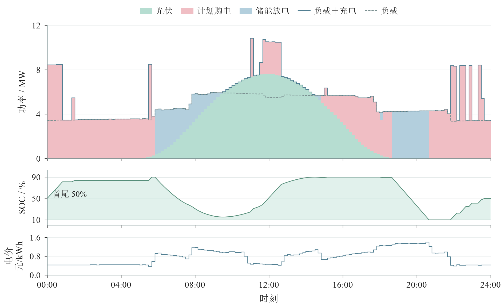
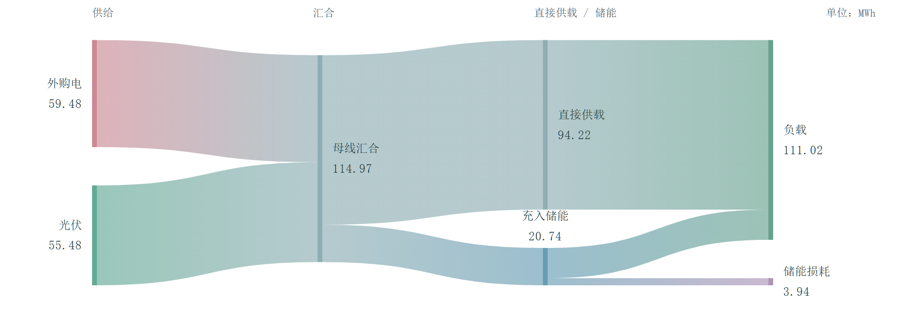
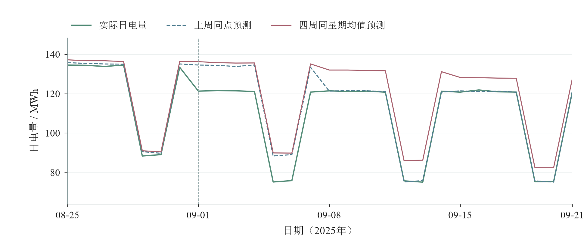
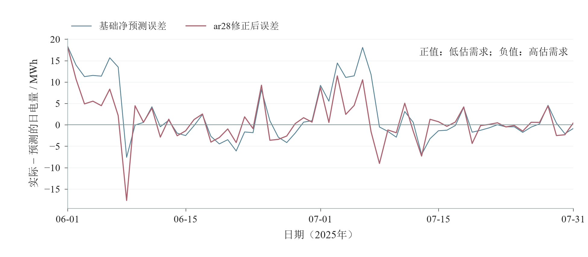
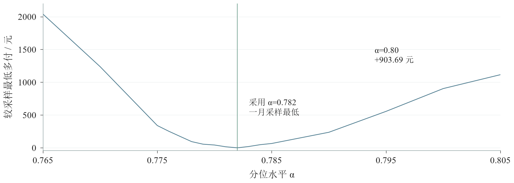
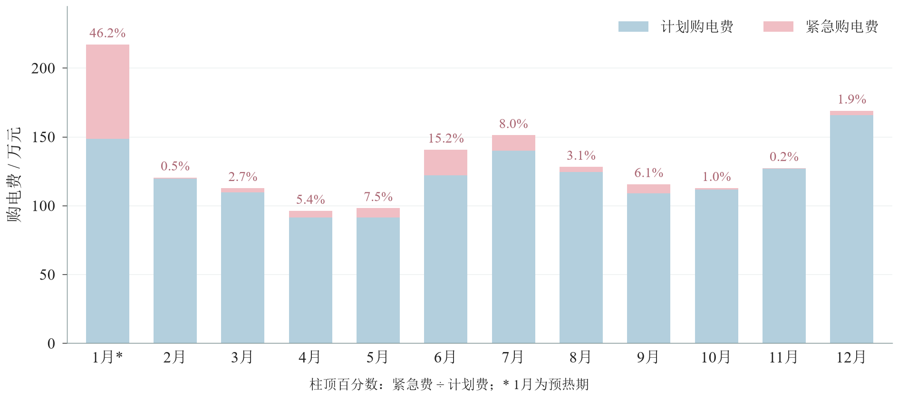
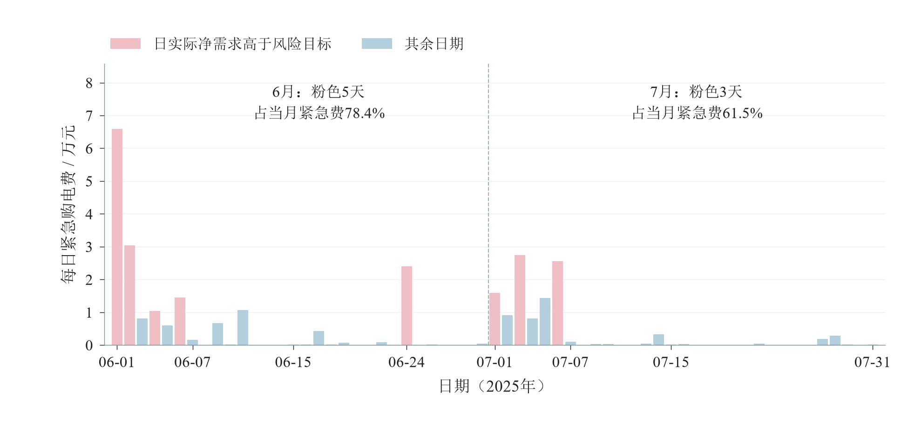
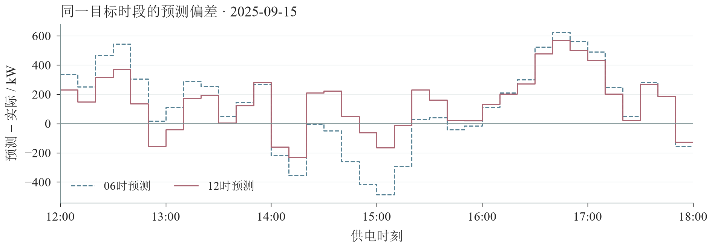
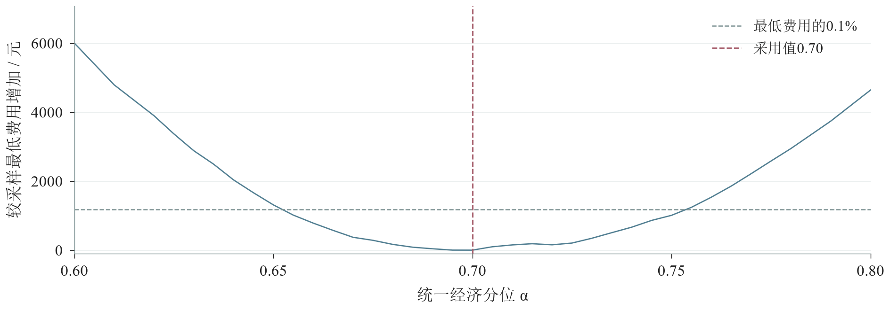

# 考虑预测误差与波动电价的微网购电及储能调度

## 摘要

微网需提前安排外网购电，并利用储能协调光伏波动与负载需求。计划不足会触发5倍价格的紧急补购，日内增购和取消也有费用。本文以10分钟为步长，建立共享储能状态的采购与反馈调度模型，依次研究确定性输入、需求预测误差、日内预报更新和波动电价四种条件。问题2—4均以2025年2—12月为费用评价期。

针对问题一，采用首尾储电量相等的线性规划，全天购电量为59482.70 kWh，费用为35126.95元。调度通过低价补库、光伏余量储存和高价放电，在容量与充放电损耗约束下分配电量。

针对问题二，以28天为历史权重半衰期，用日均偏差的自回归修正（ar28）调整周同点基础预测，再以修正后的历史误差分位安排采购余量。48小时规划协调跨日储能，日内按保留电量的后续节费价值决定放电。采用一月费用校准的分位0.782后，正式期总费1371.30万元，较同预测、同控制的点采购基准降低6.50%。预测方法参考年度回顾性比较选取，跨年度适用性尚待检验。

针对问题三，依据过去同类预报的准确程度，将官方光伏预报与历史预测加权结合，并在每次发布后根据实际储电量和已有订单修订采购。一月含逐次调整费的比较支持统一分位0.70，正式期费用1337.43万元，较问题2降低2.47%。其中，6时预报虽提高预测精度，由此增加的调整费却超过紧急费节省，表明预报更新的价值还取决于交易开销。

针对问题四，两条分支分别继承问题2、3的净负载预测、风险水平和交易权限，采用三周同点平滑预测未来价格，实价仅用于当前执行与对应时段结算。总费分别为1442.32、1407.71万元，后者节省34.61万元，降幅2.40%。结果支持按完整购电费用与库存变化评价预测及调度，结论限定于题给设备、交易规则和历史样本。

**关键词：** 微网购电；储能调度；经验分位修正；滚动优化；波动电价

## 1 问题分析

微网用光伏、储能和外网购电满足逐时段负载，购电方案需同时决定电量与时间^\[1\]^。四问共用供需平衡和储能约束，依次增加需求预测误差、日内调单权限和未来价格不确定性；关键在于每次决策能够获得什么信息，以及已购电量还能否调整。

### 1.1 问题1：确定性需求下的储能跨时段配置

问题1在0:00已给出全天电价、负载和光伏预测，可将净需求作为确定输入。低价购电和午间光伏余量均可存入电池，供稍后的高价时段使用，但转移电量需要付出充放电损耗，并占用有限库容。若只逐段满足当前净需求，就会忽略储能在不同时段的用途。

因此，需要联立全天购电量、充放电量和储电量，以总购电费为目标求解。题目要求0:00与24:00库存相同，电池当天输出的能量必须在当天补回；在给定效率和线性计费下，这一跨时段配置可写成线性规划。

### 1.2 问题2：提前锁单与不对称误差损失

问题2每天0:00锁定当天144段订单，此时附件2中的当天实况尚不可用，采购只能依据历史负载和光伏预测。订单偏大时，未用电量仍按原计划付费；订单偏小时，储能补偿后的缺口需按5倍价格紧急购电。因此，即使预测没有明显的长期高估或低估，直接按预测电量采购也未必费用最低。

电池又使单时段误差转化为跨时段费用：多买的电可能留作后用，少买的电也可能消耗原本留给高价时段的库存。本文由无储能条件下的80%临界分位出发，在含储能反馈的一月费用比较中确定风险修正程度。修正后的需求交给共享库存的采购模型；订单锁定后，再根据实际缺口和后续用电价值分配储能。

### 1.3 问题3：新增预报与有成本的滚动修订

问题3在0、6、12、18时提供未来24小时的光伏预报。新预报需细化到10分钟，并根据历史误差判断其可信程度；能否降低费用，还取决于由此引起的增购、取消和储能动作。每次修改都以上一版有效订单为基准，最终电量相同的两条调整路径可能具有不同费用。

本文在每次预报发布后，以实际储电量和已有订单为起点，优化剩余时段的采购及调整费用；两次发布之间按实时供需分配储能。这一经济模型预测控制（Economic Model Predictive Control，Economic MPC）过程将新预报用于尚未执行的采购^\[2\]^。分别比较预报更新和调单权限的作用，可为发布时间安排提供依据。

### 1.4 问题4：波动电价下的预测、执行与结算分离

问题4用附件4的波动价格重新计算问题2、问题3。未来电价同时影响采购时序和库存价值，却不能在决策时提前获知。因此，上层订单和下层后续库存价值均须使用因果价格预测；当前执行及最终账单则使用对应供电时段的实价。两条分支继续保留各自的信息和交易权限。

价格预测即使平均误差较小，也可能误判最值得充放电的时段。价格模型的取舍因而需要结合实际费用和库存变化，而不能只比较预测精度。求得两条策略后，再将固定电价下的原动作按同一实价重计账，区分价格环境变化与动作、起始库存差异对费用的影响。

## 2 模型假设与符号说明

### 2.1 模型假设与计量约定

题给设备参数、信息范围及本文采用的模型假设如下。

1. 以10分钟为调度步长，同一区间内按附件对应功率计算供需电量。模型不描述区间内部的瞬时波动，也不单独考虑线路损耗、潮流和电压约束。
2. 储能充电、放电效率均为常数0.9；除充放电损耗外，不另计自放电和电池退化费用。最大充、放电功率均作用于设备外部电量。
3. 微网不向外网售电，无法利用的供给不产生收入。外网按计划供电，紧急购电可补足当期剩余负载缺口；题目未给出外网购电功率上限，故不另设该限制。
4. 问题1将给定光伏预测作为确定输入。问题2的日初采购只使用此前已完成日期的负载、光伏实况、已知的重复电价和当前储电量；实际供需在对应区间进入日内反馈，不提前使用未来实况或问题3的光伏预报。
5. 问题3仅在对应发布时间读取附件3预报，已执行订单不再修改，每次调整相对上一版有效订单结算。问题4继承相应分支的信息和交易权限，仅用已发生价格预测未来价格，按实际供电时段价格结算。

将每日划分为144个10分钟区间，记区间长度为$\Delta=1/6\ \mathrm{h}$。附件中00:10、00:20、……、0:00+1各列的电价、负载和光伏共同对应前一个10分钟区间。例如，00:00—00:10使用00:10列的全部数据。功率乘以$\Delta$转化为区间电量，电价不作循环移位。

充电效率与放电效率分别取$\eta_c=\eta_r=0.9$，完整充放电的往返效率为0.81。充、放电量均以储能设备外部电量计，储电量$E$以电池内部电量计。设备额定容量为12000 kWh，运行区间为$E_{\min}=1200$至$E_{\max}=10800\ \mathrm{kWh}$，最大充、放电功率均为5000 kW，故单区间外部充、放电量上限为$B=5000/6\ \mathrm{kWh}$。

供给超过负载且无法继续储存的部分记为未利用供给；它可能包含已购电量。问题2中即使部分计划电量未被利用，其计划购电费仍须全额支付。本文以内部储电量$E$表示库存状态，对应荷电状态为$\mathrm{SOC}=E/12000$，其允许范围为10%—90%；后文所称共享SOC调度，均指不同区间共用同一条储电量轨迹。

### 2.2 主要符号

表1统一列出四问共用的物理量、订单状态和预测变量；仅用于局部推导的符号在相应公式前后定义。

表1 主要符号及单位

|符号|含义|单位|
|---|---|---|
|$d,t$|日期及当日区间编号，$t=1,\ldots,144$|—|
|$p_t$|问题1—3重复使用的第$t$个区间正常购电价|元/kWh|
|$p_{d,t},\widehat p_{d,t\mid j}$|问题4实际结算价、第$j$次发布时可得的预测价|元/kWh|
|$L_{d,t},P_{d,t}$|负载功率、光伏发电功率|kW|
|$N_{d,t}$|净负载电量，$N_{d,t}=\Delta(L_{d,t}-P_{d,t})$|kWh|
|$q_{d,t},e_{d,t}$|日初计划购电量、实际紧急购电量|kWh|
|$a^{(j)}_{d,t},\Delta a^{(j)}_{d,t}$|第$j$版有效订单、相对上一版的调整增量；$a^{(0)}=q$|kWh|
|$j,h_j,s_j$|发布序号0—3、发布时间$h_j=6j$、当日已完成区间数$s_j=36j$|—、h、—|
|$u_k,v_k$|当前修订的增购量、取消量|kWh|
|$c_{d,t},r_{d,t}$|外部充电量、外部放电量|kWh|
|$E_{d,t}$|第$t$个区间末内部储电量，$E_{d,0}$为0点库存|kWh|
|$\eta_c,\eta_r$|充电效率、放电效率，均为0.9|—|
|$E_{\min},E_{\max},B$|储电量下限、上限及单区间外部充放电量上限|kWh|
|$w_{d,t}$|区间未利用供给电量|kWh|
|$\widehat N_{d,t},\varepsilon_{d,t}$|净负载预测、实际减预测的净负载残差|kWh|
|$\alpha,T_{d,t}$|经济分位参数、风险修正后的净需求目标|—、kWh|
|$\mathcal R_{d,t},Q_\alpha$|预测日之前的同点残差集合及其线性插值经验分位|集合元素及分位值均为kWh|
|$H^{(d)}_k,F^{(d,j)}_k,\beta_{d,j,b}$|历史光伏预测、附件3细化预报及其融合权重|kW、kW、—|
|$V_{d,k}(E)$|给定当前预测与固定有效、辅助订单，从区间$k$起的最小后续紧急购电费|元|
|$v$|仅用于敏感性评分的内部库存单位估值，与取消量$v_k$区分|元/内部kWh|

下文问题1省略日期下标。问题2中带波浪号的变量表示0时辅助规划量，横线变量表示库存价值评估中的辅助量；问题3发布版本以上标$(d,j)$区分，实际充放电和库存仍用$c,r,E$表示。局部48小时规划编号为$k=1,\ldots,288$；问题4价格滞后公式使用的全局编号另行说明。文中Q1—Q4分别指问题1—4，Q4-2、Q4-3分别指波动电价下继承问题2、问题3结构的分支。各策略2—12月费用均指334天正式期，不含一月预热费用；Q1为题给单日结果。

## 3 问题1：确定性储能采购线性规划

### 3.1 能量平衡与库存约束

记附件1的确定净负载电量为$N_t=\Delta(L_t-P_t)$。每一时段购电、光伏和储能放电共同供给负载、储能充电及剩余供给，故有

$$
q_t+\Delta P_t+r_t=\Delta L_t+c_t+w_t,
\qquad w_t\geq0.
\tag{1}
$$

式（1）等价于$q_t+r_t-c_t\geq N_t$，因此允许供给富余，但不允许负载缺供。外部充电$c_t$只有$0.9c_t$进入电池，而对外放电$r_t$需消耗$r_t/0.9$的内部库存，储电量递推为

$$
E_t=E_{t-1}+\eta_c c_t-\frac{r_t}{\eta_r}.
\tag{2}
$$

设备容量、功率和非负性约束为

$$
\begin{aligned}
E_{\min}&\leq E_t\leq E_{\max},\qquad t=0,\ldots,144,\\
0&\leq c_t\leq B,\quad 0\leq r_t\leq B,\quad q_t\geq0,
\qquad t=1,\ldots,144.
\end{aligned}
\tag{3}
$$

采用题给初始储电量6000 kWh，并落实每日首尾相等要求：

$$
E_0=E_{144}=6000\ \mathrm{kWh}.
\tag{4}
$$

该约束使日内调度能够在相同输入下重复实施；当天输出的电池能量需要由当天输入补足。

### 3.2 费用目标与线性规划求解

供需约束、库存递推和费用均为线性形式，可按线性规划求解^\[3\]^。本问没有计划外紧急购电，目标为

$$
\min_{q,c,r,E,w}\ C_1=\sum_{t=1}^{144}p_tq_t,
\qquad\text{满足式（1）—（4）}.
\tag{5}
$$

不必为禁止同时充放电额外引入整数变量。若某区间$c_t,r_t$均为正，令

$$
\delta_t=\min\left(c_t,\frac{r_t}{\eta_c\eta_r}\right),\qquad
c'_t=c_t-\delta_t,\qquad r'_t=r_t-\eta_c\eta_r\delta_t.
\tag{6}
$$

该变换保持式（2）的库存增量不变，并使$c'_t,r'_t$至少一个为零。净供给增加$(1-\eta_c\eta_r)\delta_t\geq0$，可由$w_t$吸收，或在可行时减少购电量，费用不会增加。因此，在允许无收益剩余供给的本模型中，连续线性规划存在不同时充放电的最优解。

储能为何能降低购电费用，可由一个未触及功率与容量限制的两时段例子说明：在时段$i$以$p_i$购入1 kWh并完整储放后，时段$j$只能得到0.81 kWh。只有当

$$
p_j>\frac{p_i}{\eta_c\eta_r}=\frac{p_i}{0.81}
\tag{7}
$$

时，该次电网充放电转移才有直接节费空间。若充电来自原本无法利用的光伏余量，则还可增加光伏消纳。式（7）解释了套利方向，但多时段库容竞争仍需由式（5）统一求解。

表2汇总问题1从输入整理到调度输出的计算步骤。

表2 问题1算法步骤

|步骤|具体内容|
|---|---|
|Step 1：统一输入时段|读取附件1，将同列电价、负载和光伏对应到前一个10分钟区间；功率乘1/6小时，得到区间净需求电量。|
|Step 2：建立储能约束|设置初末内部储电量均为6000 kWh，运行范围1200—10800 kWh，充、放电效率各0.9，外部充、放电功率各不超过5000 kW。|
|Step 3：联合优化全天购电|以144段总购电费最小为目标，联立供需平衡及库存递推，求解购电量、充放电量和内部储电量的线性规划。|
|Step 4：复核并整理结果|独立重算供需平衡、储能损耗和同列购电费，检查功率、容量及首尾库存；汇总指定时段与四小时充放电量，输出result1.xlsx。|

### 3.3 调度结果及解释

采用HiGHS求解该稀疏线性规划^\[4\]^，得到全天计划购电量59482.70 kWh、购电费35126.95元，原始目标值与对偶下界一致。表3、表4按题目要求列出指定时段结果；完整144段计划见result1.xlsx。

表3 问题1指定时段购电量及全天结果（电量kWh，费用元）

|日期/分支|时间段/指标|数值|时间段/指标|数值|时间段/指标|数值|
|---|---|---|---|---|---|---|
|题给单日|10:00—10:10|0.000000|12:00—12:10|480.412450|14:00—14:10|0.000000|
||16:00—16:10|445.431650|18:00—18:10|531.894050|20:00—20:10|0.000000|
||全天购电量|59482.698998|全天购电费|35126.948589|—|—|

表4 问题1指定时段充放电量及首尾储电量（kWh）

|日期/分支|时间段|充电量|放电量|时间段|充电量|放电量|
|---|---|---|---|---|---|---|
|题给单日|0:00—4:00|4500.000000|0.000000|4:00—8:00|833.333333|6365.841200|
||8:00—12:00|4787.964288|1702.996983|12:00—16:00|5286.035177|91.101383|
||16:00—20:00|0.000000|5780.131883|20:00—24:00|5333.333333|2859.868117|
||0:00储电量|6000.000000|—|24:00储电量|6000.000000|—|

0:00和24:00内部储电量均为6000 kWh。四小时充放电汇总反映块内不同时段的动作，同一10分钟区间没有同时充放电。

全天外部充电量与放电量分别为20740.67 kWh和16799.94 kWh，满足$\sum_t r_t=0.81\sum_t c_t$。由于首尾内部库存相同，两者之差3940.73 kWh即为全天充放电损耗。将式（1）求和，可得全天购电量等于净负载电量、储能损耗及未利用供给之和；本方案未利用供给在数值精度内为零，因而59482.70 kWh的购电量同时承担负载净需求与储能损耗。储电量轨迹达到1200 kWh下限和10800 kWh上限，说明可用容量在调度中形成了实际约束。

图1将式（1）的供需平衡与库存、电价对齐。低价时段外购电除满足负载外还用于充电；午间光伏余量进入电池，SOC达到90%上限；晚间较高电价时段由储能承担部分负载，SOC降至10%下限，之后补库使日末回到50%。该路径将式（7）的转移方向与容量、首尾约束联系起来。

{width=100%}

图1 问题1典型日的供用电组成、库存与价格。上部将10分钟区间电量除以$\Delta$并换算为MW，光伏、计划购电与放电的堆叠顶端和“负载＋充电”细实线重合；与负载虚线之差为充电功率。中部SOC连接区间边界状态，水平线为10%和90%运行边界，首尾均为50%；下部为同一供电区间的原始电价。三层共用时间轴。

图2从全日电量账目补充图1的时序解释：汇合后的供给分为直接供载与储能两条路径，储能输出重新并入负载，充放电损耗单独列出。由于首尾内部库存相等，充入与输出电量之差可按式（2）归入全天储能损耗；母线汇合不区分光伏与外购电各自的充电份额。

{width=100%}

图2 问题1典型日能量流。节点数值与流带宽度均按MWh计，由正式10分钟轨迹汇总；外购电与光伏汇入母线后，直接供载与经储能输出共同满足负载。储能节点数值为充入电量，损耗为充入与输出之差；该汇总成立于首尾库存相等、未利用供给约为零的本例。流带不表达具体供电时刻或来源电量的身份，颜色过渡仅用于辨认连接关系。

光伏实际偏离给定曲线时，调度需由问题2的反馈机制补偿。结果表保留高精度值，正文按所述量的尺度取适当精度；差额由未舍入结果计算。表中“—”表示不适用项，“无”表示该日未发生紧急购电。

## 4 问题2：预测误差下的采购与储能闭环调度

### 4.1 日前预测及信息边界

问题2每天0时制定订单，日内由储能和紧急购电应对实际需求与预测的偏差。评价目标为$C_2=\sum_{d\in\mathcal D}\sum_t(p_tq_{d,t}+5p_te_{d,t})$，其中$\mathcal D$为正式期日期集合。本文用预测需求下的线性规划制定订单，以实际运行费用评价策略。预测与校准按日期推进，仅使用各决策时刻已经发生的数据^\[5\]^。

负载采用上周相同时段的记录，保留星期差异及日内用电规律；光伏采用最近7日的加权平均，反映近期发电水平。记预测日$d$的0:00可用历史为$\mathcal H_d=\{h:h<d\}$，基础净负载预测为

$$
\widehat L_{d,t}=L_{d-7,t},\qquad
\widehat P_{d,t}=\frac{1}{28}\sum_{i=1}^{7}(8-i)P_{d-i,t},\qquad
F_{d,t}=\Delta\bigl(\widehat L_{d,t}-\widehat P_{d,t}\bigr).
\tag{8}
$$

需求水平突变后，式（8）仍引用变化前的上周记录，可能连续数日高估或低估负载。历史误差样本较多时，新增偏差在全部记录中的占比较小，仅用历史分位增加采购量也难以及时反映变化。

ar28用前一天的平均净负载误差修正次日预测，修正幅度由历史相邻两天的误差关系估计。估计比例表示昨日偏差在次日预计保留的程度。该方法调整整日需求水平，保留原预测的日内形状。

以式（8）为基准，记日均基础预测误差为$\bar\varepsilon_h=144^{-1}\sum_t(N_{h,t}-F_{h,t})$，正值表示低估，负值表示高估。采用无常数项的一阶自回归（AR），估计延续比例$\rho_d=\operatorname{clip}\{\sum_{h<d}w_h\bar\varepsilon_{h-1}\bar\varepsilon_h/\sum_{h<d}w_h\bar\varepsilon_{h-1}^2,0,0.95\}$，仅纳入自1月8日起相邻且已完成的误差日对。系数限制在0至0.95，表示偏差的同向延续与衰减；不足两个误差日或分母为零时不修正。

估计时给予近期记录较高权重，采用预先固定的“四周半衰期”：每向前相隔28天，历史权重减半，即$w_h=2^{-(d-1-h)/28}$。这一设定保留较早样本，同时侧重近期的偏差关系；28天并非历史截断长度，也不是搜索相邻天数得到的最优值。

第一天净负载预测为$\widehat N_{d,t}=F_{d,t}+\rho_d\bar\varepsilon_{d-1}$，第二天辅助预测在对应历史基线上增加$\rho_d^2\bar\varepsilon_{d-1}$。例如，昨日每段平均低估10 kWh、估计延续比例为0.8时，两天分别上调8 kWh和6.4 kWh。修正从观测到偏差后的次日生效，无法预知首次突变。

用于采购余量的误差应以ar28预测为基准，避免再次计入已经修正的偏差。每个历史日保存当时的ar28预测，以实际值减去该预测形成自身残差池。残差随已完成日期积累，不用当前系数重算历史预测，也不作28天截断。

式（8）分别描述负载的星期形状与光伏的近期水平。两者构成净预测的基础分量，日均净偏差再由上述一阶自回归修正；分量误差与最终净预测误差不可混称。先以2025年2—12月334天的逐日起点回放检查这两个基础分量，用逐10分钟平均绝对功率误差MAE衡量通常偏差，以RMSE反映较大偏差，并以日电量误差考察日内偏差累积的后果。对于功率序列$X$，相应定义为

$$
\begin{aligned}
\operatorname{MAE}_X&=\frac{1}{144D}\sum_{d,t}|\widehat X_{d,t}-X_{d,t}|,\\
\operatorname{RMSE}_X&=\left[\frac{1}{144D}\sum_{d,t}(\widehat X_{d,t}-X_{d,t})^2\right]^{1/2},\\
\operatorname{MAE}_{E,X}&=\frac{1}{D}\sum_d\left|\Delta\sum_t(\widehat X_{d,t}-X_{d,t})\right|,
\qquad D=334,\\
\operatorname{RMSE}_{E,X}&=\left[\frac{1}{D}\sum_d\left(\Delta\sum_t(\widehat X_{d,t}-X_{d,t})\right)^2\right]^{1/2}.
\end{aligned}
\tag{9}
$$

表5给出相同评价区间内的预测误差。逐段MAE与RMSE的单位为kW，日电量误差的单位为kWh。光伏误差统计包含全部日夜区间，避免使用在零发电时无定义的相对百分比误差。

表5 负载与光伏预测方法在2—12月的滚动误差

|对象|方法|MAE/kW|RMSE/kW|日电量MAE/kWh|日电量RMSE/kWh|
|---|---|---:|---:|---:|---:|
|负载|上周同点|176.796|244.287|1635.334|3505.487|
|负载|最近4个同星期日均值|188.880|262.061|3186.616|4680.294|
|PV|近7日均值|153.400|303.858|2227.379|2986.477|
|PV|近7日线性加权|149.676|300.553|2074.083|2813.250|

上周同点负载预测相对四周均值的MAE降低6.40%，日电量MAE降低48.68%。这一优势与负载水平变化有关：8月25日起一周的日均用电量为121133.08 kWh，9月1日起一周降至108147.39 kWh，此后两周仍接近后一水平。上周同点很快采用较低的新水平，四周均值则继续混入此前较高的负载，因而在9月上旬产生较大偏差。剔除9月后，两者MAE差由12.084 kW收窄至1.080 kW；表5的综合优势主要受这一变化影响，并非每个月都有同样改善。

光伏日电量的滞后1日相关系数约为0.964，表现出近期连续性。相较七日等权均值，线性加权给予近期观测更高权重，逐段MAE降低2.43%，RMSE和日电量误差也较低（表5），因此采用七日线性加权预测。

逐月比较中，负载两种方法各有优劣，七日加权光伏相对七日均值则除4月外均有较低MAE。预测器参考上述全年回顾性误差选择，分位参数的经济校准限定在一月。

图3将上述水平变化与两种预测对齐。9月初两种方法仍包含此前较高水平，随后上周同点预测较快贴近新的实际日电量，四周同星期均值下降较慢。该窗口用于解释表5中误差差异的一项来源，不替代全年逐时段评价。

{width=100%}

图3 8月25日至9月21日的实际日电量与日前预测。原始功率按10分钟区间换算并逐日汇总为MWh；上周同点使用此前第7日，四周同星期均值使用此前第7、14、21、28日。竖线标出9月1日，不平滑实际值；展示窗口沿用正文讨论的水平变化阶段，不代表全年各月均有相同优势。

相对未加AR修正、分位为0.78的方案，ar28及其一月校准分位在2—12月节省18.08万元，按式（16）的最高库存估值调整后仍节省17.95万元。一月费用增加约1.16万元，正式期仅5个月节费，收益主要集中于6、7、12月。ar28的选择参考了这些年度回顾性结果，一月仅用于校准其分位参数；每日预测仍只使用此前已完成的数据。

作为更灵活修正的代表，带遗忘因子的回归在相同采购、控制及起始库存下，一月锁参后总费为1375.57万元，高于ar28的1371.30万元。其紧急费少8.29万元，计划费多12.56万元；补偿较高期末库存后仍多付至少4.14万元。ar28仅估计日均偏差的延续比例，结构较简单，总费也较低，故予以保留。

图4沿用6—7月完整窗口，比较基础净预测与ar28修正后的每日累计误差。修正减小了部分连续低估，但并非每天都更接近零；该图用于观察日均偏差修正的作用与失配，不把这段误差比较解释为全年最优，也不将误差缩小直接等同于费用下降。

{width=100%}

图4 6月1日至7月31日的实际减预测日电量。蓝线为未加AR修正的基础净预测，玫红线为当前冻结ar28预测；两者均只使用预测日前已完成的数据。逐日汇总10分钟电量后换算为MWh，正值表示低估需求，负值表示高估需求。全窗口连续展示，不按误差改善程度筛选日期。

### 4.2 不对称购电费用与80%理论基准

未利用的计划电量仍需付费，计划不足则可能触发5倍价格的紧急补购。先考虑无储能的单时段情形：设随机净需求为$N$，正常电价为$p>0$，提前购电$q\geq0$，缺口$(N-q)^+$按$5p$补购，其中$x^+=\max(x,0)$。期望总费用为

$$
G(q)=pq+5p\,\mathbb E[(N-q)^+].
\tag{10}
$$

在连续分布且最优点位于$q>0$内部时，

$$
G'(q)=p-5p\Pr(N>q)=0
\quad\Longrightarrow\quad F_N(q)=0.8.
\tag{11}
$$

也可相对于事后恰好按正常价格采购的情形理解：多买1 kWh损失$p$；少买1 kWh虽少支付$p$计划费，却增加$5p$紧急费，净额外损失为$4p$，故经济临界分位为$4/(4+1)=0.8$。若最优点落在非负边界或分布离散，应按式（10）的实际目标处理。

加入共享电池后，少买的电量可能由库存补足，多买的余量也可能替代后续高价采购。功率、库容与效率使两类误差的代价随时间和库存改变，因此将无储能的80%作为理论参照，再按含储能的闭环费用校准经济分位。

### 4.3 同时段残差分位与净需求修正

为应对ar28修正后剩余的预测误差，采购模型在净负载预测上叠加历史同一时段的误差分位。较高分位安排更多供给，可减少采购不足，也可能增加未利用电量；分位水平按实际购电费用校准。

对每一个已完成日期$h$，使用第4.1节在当时信息下得到的预测，记净负载残差及其历史集合为

$$
\varepsilon_{h,t}=N_{h,t}-\widehat N_{h,t},\qquad
\mathcal R_{d,t}=\{\varepsilon_{h,t}:h_0\leq h<d\},
\quad h_0=\text{2025年1月8日}.
\tag{12}
$$

1月8日首次具备完整七日历史，其预测误差到1月9日0:00才可使用。后续误差按每日相同时段积累，保留日内差异，不预设分布形式。为保留样本量，不再按星期或季节细分；较早记录对当前估计的影响是这一处理的局限。

分位参数$\alpha$确定误差排序中的取值位置，相邻样本间采用线性插值。设共有$m$个残差，排序为$\varepsilon_{(1),t}\leq\cdots\leq\varepsilon_{(m),t}$，令$\xi=(m-1)\alpha$、$\ell=\lfloor\xi\rfloor$、$\theta=\xi-\ell$，则

$$
Q_\alpha(\mathcal R_{d,t})=
(1-\theta)\varepsilon_{(\ell+1),t}
+\theta\varepsilon_{(\min(\ell+2,m)),t},
\qquad 0\leq\alpha\leq1.
\tag{13}
$$

由此构造风险修正后的净需求目标

$$
T_{d,t}=\widehat N_{d,t}+Q_\alpha(\mathcal R_{d,t}).
\tag{14}
$$

式（14）将历史误差修正量加到ar28的净负载预测上，作为采购模型需要安排的供给目标，二者单位均为每10分钟区间的kWh。分位0.782表示在历史误差排序中的取值位置，不代表全天有78.2%的保供概率。目标$T_{d,t}$也不等于该时段订单：电池允许跨时段转移电量，采购量$q_{d,t}$仍由优化决定。修正量可以为负，用以降低偏高的原预测；目标为负则表示预计存在可用于充电的光伏余量，均不强制截为零。

### 4.4 储能条件下的闭环经济校准

储能可补偿采购不足，也可储存多购电量，其作用需纳入分位校准。对每个候选$\alpha$，按第4.5节采购模型和第4.6节控制方法连续模拟，将实际日末储电量传入次日。校准费用为

$$
C_{\mathcal J}(\alpha)=
\sum_{d\in\mathcal J}\sum_{t=1}^{144}
\left[p_tq_{d,t}(\alpha)+5p_te_{d,t}(\alpha)\right],
\qquad\mathcal J=\{\text{1月9日至1月31日}\}.
\tag{15}
$$

各候选共用1月1—8日点预测与贪心储能形成的初始运行轨迹，1月9日初始库存为8746.34 kWh，随后各自连续运行。正常采购、储能补偿与5倍价格的紧急补购共同决定实际费用；每个日起点只使用此前已完成日期的残差。这些校准轨迹仅用于比较参数；正式一月仍按第4.7节的点预测与贪心控制运行，2月初库存不取自任一校准候选。

在$[0,1]$上以0.05步长扫描，并包含原参考值0.78；围绕最低费点依次加密到0.005与0.001。仅以一月实际总费用锁定$\alpha=0.782$，图5展示附近采样响应。连线不构成连续域最优性证明。

{width=100%}

图5 分位参数校准。一月既有候选相对采样最低费用的差额，竖线为采用值0.782；标注同时给出0.80的费用差。连线仅连接既有采样点，不表示已证明连续域最优。

一月采样最低点为0.782，费用1187480.77元。0.780仅多付42.81元，0.783多付20.07元；因此千分位的精确排序不应被解释为稳定物理常数。

较低费用可能伴随较少的期末库存。对评价窗口$\mathcal W$，按单位库存价值$v$计入首末储电量差异，作敏感性评分：

$$
S_{\mathcal W,v}(\alpha)=C_{\mathcal W}(\alpha)
+v\left[E_{\mathcal W,\mathrm{start}}(\alpha)-E_{\mathcal W,\mathrm{end}}(\alpha)\right].
\tag{16}
$$

其中$v$的单位为元/内部kWh；库存净减少意味着消耗已有资源。考察$v\in[0,6.2784]$，上限为$5\max_t p_t\eta_r$，对应内部库存可替代的最高紧急购电价值。这只是评分敏感性，不作为实际收入。最高估值下采样最优变为0.783，但0.782并非靠清空库存获胜；按实际费用准则锁定0.782，不再据年度费用改选。

锁定$\alpha=0.782$后，正式期只逐日更新因果预测和历史残差，不重新优化该分位参数。该值表示当前预测、采购与储能控制共同作用下的一月经济风险权衡。

### 4.5 共享储电量状态的日前采购

采购模型沿用问题1的库存递推，联合安排各时段的购电和充放电。放电减少后续可用电量，充电占用剩余库容，各时段通过同一条储电量轨迹相互约束。

仅规划到当天24时会忽略剩余库存对次日供电的价值。本文将时域延伸至次日24时，以次日预计采购费用体现日末留电的用途。

在预测日$d$的0:00，记两日区间为$k=1,\ldots,288$。前144段预测$\widehat N^{(d)}_k$及供给目标$T^{(d)}_k$按第4.1节和式（14）计算；第二天负载采用当时已知的上周对应日$L_{d-6,t}$，光伏沿用七日加权曲线，日均偏差修正为$\rho_d^2\bar\varepsilon_{d-1}$，各时段的误差分位沿用当日历史分布。第二天全部输入也只依据日初信息，不包含次日实况。

每日采购规划为

$$
\begin{aligned}
\min_{\widetilde q,\widetilde c,\widetilde r,\widetilde E}\quad
&\sum_{k=1}^{288}p_{\tau(k)}\widetilde q_{d,k},\\
\text{s.t.}\quad
&\widetilde q_{d,k}+\widetilde r_{d,k}-\widetilde c_{d,k}\geq T^{(d)}_k,\\
&\widetilde E_{d,k}=\widetilde E_{d,k-1}
+\eta_c\widetilde c_{d,k}-\widetilde r_{d,k}/\eta_r,\\
&E_{\min}\leq\widetilde E_{d,k}\leq E_{\max},\quad
0\leq\widetilde c_{d,k},\widetilde r_{d,k}\leq B,\quad\widetilde q_{d,k}\geq0,\\
&\widetilde E_{d,0}=E_{d,0},\qquad
\tau(k)=1+((k-1)\bmod144).
\end{aligned}
\tag{17}
$$

问题2没有每日首尾库存相等要求，48小时末端仅受容量上下限约束。第二天的辅助需求用于评价日末库存的用途，末端之后的供电价值仍未计入。

早期一月15—31日对照采用七日均值光伏和0.65分位：24小时规划费用为860943.54元，期末库存1734.38 kWh；48小时为864221.96元和8886.61 kWh；继续延伸至72小时，费用与期末库存均未变化。48小时以较小费用增量保留了较多库存，支持两日辅助规划的初始取舍。这组证据来自早期预测与风险配置，不能据此断言48小时在当前ar28配置下优于所有其他时域。

求解后只锁定当天订单：

$$
q_{d,t}=\widetilde q_{d,t}^{\ast},\qquad t=1,\ldots,144.
\tag{18}
$$

第二天的144段辅助订单用于估计保留库存能够替代的后续采购，当前并未成交。次日0:00再用新增历史和实际储电量求解式（17），确定该日订单。因此，式（17）的最小采购费以当前预测及供给目标为条件，并非对未来实际费用的保证。

3月20日的订单在部分区间集中、另一些区间为零，表明风险目标还需经过储能跨时段配置才能成为采购计划。以ar28净负载预测为共同基准，比较同点分位修正$T_{d,t}-\widehat N_{d,t}$与事后误差$N_{d,t}-\widehat N_{d,t}$。实际误差仍可超过修正量，风险目标并非需求上界；这部分偏差要由下节的实时储能和紧急购电共同处理。

### 4.6 固定订单下的日内库存价值控制

计划订单锁定后，真实净负载逐段显现。直接执行日前充放电量可能不满足实际平衡；遇到缺口便尽量放电，又可能耗尽稍后高价时段需要的库存。因此，采用日内库存价值控制，在固定订单下比较当前紧急费与保留库存带来的后续费用节约。

每天0:00依据式（17）的48小时辅助订单及净负载预测$\widehat N^{(d)}_k$计算库存价值。定义$V_{d,k}(E)$为从第$k$段开始、给定内部库存$E$时，在这些固定预测和辅助订单下的最小后续紧急购电费：

$$
V_{d,k}(E)=\min\sum_{j=k}^{288}5p_{\tau(j)}\bar e_j,
\qquad V_{d,289}(E)=0.
\tag{19}
$$

式（19）按未加分位余量的预测值估计未来需求；应对误差所需的供给已经安排在订单中，无须再向需求重复加入同一修正。以横线标记价值评估中的辅助变量，对$j=k,\ldots,288$，其约束为

$$
\begin{aligned}
\widetilde q^{\ast}_{d,j}+\bar e_j+\bar r_j-\bar c_j-\bar w_j&=\widehat N^{(d)}_j,\\
0\leq\bar c_j&\leq\min\{B,(\widetilde q^{\ast}_{d,j}-\widehat N^{(d)}_j)^+\},\\
0\leq\bar r_j&\leq\min\{B,(\widehat N^{(d)}_j-\widetilde q^{\ast}_{d,j})^+\},\qquad \bar e_j,\bar w_j\geq0,
\end{aligned}
\tag{20}
$$

辅助库存满足式（2）、（3），初始值为$E$。式（20）将充电限于预计余量、放电限于预计缺口，紧急电量只用于供给负载。固定订单的正常费用已确定，库存分配只影响后续紧急费，末端价值取零。

式（19）可以逐段拆成“当前紧急费＋下一段起的最小后续费用”。给定区间初始库存$E$，当前充放电决定下一状态$E'=E+\eta_c\bar c_k-\bar r_k/\eta_r$，于是有$V_{d,k}(E)=\min\{5p_{\tau(k)}\bar e_k+V_{d,k+1}(E')\}$，其中当前动作满足式（20）及库存约束。已知$V_{d,k+1}$后，就能比较当前各种可行动作的完整后果；以$V_{d,289}=0$为边界，从第288段倒推至第1段，可依次得到各区间的库存价值^\[2\]^。

当固定订单超过预测净需求时，余量充电没有新增购电支出，多保留库存也不会增加后续最小费用，因此在功率和容量允许范围内充入余量。对不同初始库存$E$而言，这相当于用充电后的库存查询$V_{d,k+1}$：价值曲线向较小初始库存方向平移，到达容量上限后的部分接为水平段。预计余量由此减少了满足后续需求所需的期初库存。

当预测出现缺口时，需要在当前放电与保留电量之间分配库存。每增加1内部kWh并用于当前放电，可对外供给$\eta_r$ kWh，减少$5p_{\tau(k)}\eta_r$元紧急费。因此，当前放电机会对应一段斜率为$-5p_{\tau(k)}\eta_r$的价值曲线；其长度最多为$\min\{(\widehat N^{(d)}_k-\widetilde q^{\ast}_{d,k})^+,B\}/\eta_r$，由当前缺口和放电功率共同限制。将这段机会与后续价值比较，优先把有限库存分配给边际节费更高的用途，就得到当前时段的最小费用。

上述递推得到凸分段线性的费用曲线，折点对应供电需求得到满足或功率、容量约束生效的位置。式（22）在相邻折点间为线性，比较可行端点和内部折点即可求得最小值。该最优性以给定预测、固定订单及有限时域为条件。

在真实区间$t$，令$E=E_{d,t-1}$。若$q_{d,t}\geq N_{d,t}$，则有供给余量。由于计划费已支付、储存余量不增加购电费且保留了后续用电机会，在功率与容量允许范围内先充电：

$$
\begin{aligned}
c_{d,t}&=\min\left(q_{d,t}-N_{d,t},B,\frac{E_{\max}-E}{\eta_c}\right),\\
r_{d,t}&=e_{d,t}=0,\qquad
w_{d,t}=q_{d,t}-N_{d,t}-c_{d,t}.
\end{aligned}
\tag{21}
$$

若出现缺口$z=N_{d,t}-q_{d,t}>0$，则在可行放电范围内求解

$$
\begin{aligned}
r_{d,t}\in\arg\min_{0\leq r\leq\min\{z,B,\eta_r(E-E_{\min})\}}
\left\{5p_t(z-r)+V_{d,t+1}\left(E-\frac r{\eta_r}\right)\right\},\\
e_{d,t}=z-r_{d,t},\qquad c_{d,t}=w_{d,t}=0.
\end{aligned}
\tag{22}
$$

式（22）将当前紧急费与放电后的后续费用相加。当前多放1 kWh可少支付$5p_t$，但消耗$1/\eta_r$内部kWh，可能使稍后的高价缺口失去库存支持；保留电量还是立即放电，取决于两者的费用比较。令放电后库存为$E'=E-r/\eta_r$，在价值函数可微处，$-V'_{d,t+1}(E')/\eta_r$可解释为对外释放1 kWh电量的边际机会成本。即使库存尚未耗尽，当保留库存更经济时，也可能发生当期紧急购电；费用并列时取较大放电量。

式（21）、（22）均使用当期实况作反馈，后续费用只依据日初预测评估。当天未来实况不进入当前动作，紧急电量仅补实际负载缺口。实际库存按式（2）递推，并满足

$$
q_{d,t}+e_{d,t}+r_{d,t}-c_{d,t}-w_{d,t}=N_{d,t},\qquad
E_{d+1,0}=E_{d,144}.
\tag{23}
$$

日末记录当天预测与实际需求的差额，并将实际期末储电量作为次日采购的初始条件。这样，提前采购决定日内可用供给，实际充放电又决定次日可用库存，采购与执行通过式（23）连续衔接。

3月20日16:30—16:40开始时库存为10378.43 kWh，实际放电26.63 kWh。在新预测和订单下，该动作达到当期缺口允许的上限。库存价值反馈并不总是保留电量；式（22）也允许在当前节费更大时充分放电。

控制器的早期成对试验采用一月15—31日、七日均值光伏、0.65分位及相同48小时采购规则，两方案从同一库存出发。贪心执行与库存价值控制的费用分别为866937.36元、864221.96元，期末库存同为8886.61 kWh。库存价值控制的紧急电量从3940.91 kWh增至4646.83 kWh，紧急费却从25597.80元降至23121.79元，反映了低价补购与保留电量应对高价缺口的取舍。该试验支持控制机制的初始选择，费用差同时包含库存反馈对后续采购的影响。表7则固定当前预测和控制方式，只比较是否加入风险修正。

表6汇总问题2的执行流程。一月用于积累历史和校准参数，2—12月保持分位与算法结构不变，仅随已完成数据更新预测及误差记录。

表6 问题2算法步骤

|步骤|具体内容|
|---|---|
|Step 1：准备历史与初始状态|从1月1日6000 kWh开始，按原基础点预测与贪心充放电连续预热；日初只读取此前已完成的负载、光伏及实际期末库存。|
|Step 2：确定经济分位|另从1月9日共同预热库存比较一月闭环费用，锁定alpha=0.782；保留28天半衰期、48小时规划和库存价值控制，不将校准结果倒用于一月物理预热。|
|Step 3：逐日形成ar28预测|正式期每天0时，以上周同点负载和七日加权PV构造两日预测；由已完成日的平均偏差估计AR系数，分别修正第一天及辅助第二天的净需求。|
|Step 4：加入历史误差修正|取各历史日当时ar28预测的自身同点残差，按已锁定的0.782分位形成供给目标；不使用当天尚未发生的实际需求。|
|Step 5：求解并锁定当天订单|以实际库存初始化48小时采购LP，协调购电和储能；仅锁定前144段订单，第二天订单用于评估后续库存用途。|
|Step 6：按实际供需分配储能|依据预测与固定订单计算库存价值，逐10分钟比较当前紧急费和保留电量的后续价值；更新充放电、紧急购电及实际库存。|
|Step 7：跨日传递与输出|日末记录新残差并传递实际库存，重复Step 3—6至年末；核对物理约束和同列费用，汇总2—12月及指定日期结果，输出result2.xlsx。|

### 4.7 连续运行设置与评价期经济结果

以2025年1月1日0:00的6000 kWh为初始库存。一月作为历史积累与参数校准期，实际状态链连续采用未加AR修正的基础点预测采购与贪心储能运行：供给有余时尽量充电，有缺口时在可行范围内尽量放电。首日无历史，计划订单为零，由已有库存和紧急购电保供；不足七日时，负载采用昨日同点，光伏对可用最近日期按由旧到新$1,\ldots,n$归一化加权，$n\leq7$，这些不完整历史残差不进入式（12）。

从2月1日起启用第4.1节ar28预测、一月校准的$\alpha=0.782$与库存价值控制，期初内部库存为8618.61 kWh，承接一月预热。正式期固定预测结构、28天半衰期、分位水平及控制规则；AR系数按新增历史每日估计，残差池随日期扩展，实际库存逐日传递。

评价区间为2月1日至12月31日，共334天。点预测基准采用相同预测、48小时辅助时域、日内控制与一月状态链，仅令$T_{d,t}=\widehat N_{d,t}$，不加入残差分位修正。它与取$\alpha=0$不同，后者仍会加入最小历史残差。两种策略按同一价格规则结算，不用评价期费用重新选择参数。

表7 问题2在2月1日至12月31日的费用与能量对照

|指标|点预测基准|经验分位修正方案|
|---|---:|---:|
|计划购电量/kWh|20130817.106943|21427648.962977|
|紧急购电量/kWh|540545.898647|110460.261602|
|计划购电费/元|12203397.761948|13110836.509307|
|紧急购电费/元|2463389.613914|602123.802316|
|总购电费/元|14666787.375862|13712960.311623|
|未利用供给/kWh|1513608.894643|2385295.604347|
|期初内部库存/kWh|8618.612019|8618.612019|
|期末内部库存/kWh|8414.031194|8696.503976|

采用风险修正后，总购电费由1466.68万元降至1371.30万元，节省95.38万元，降幅为**6.50%**。费用变化满足

$$
\begin{aligned}
\Delta C_{\mathrm{plan}}&=+907438.75\ \mathrm{元},\\
\Delta C_{\mathrm{emg}}&=-1861265.81\ \mathrm{元},\\
\Delta C_{\mathrm{total}}&=-953827.06\ \mathrm{元}.
\end{aligned}
\tag{24}
$$

正常购电支出增加7.44%，紧急费下降75.56%、紧急电量下降79.57%；高价补购减少超过新增计划费。未利用供给增加871686.71 kWh，即57.59%，体现正常采购余量与缺口风险之间的经济取舍。

图6按自然月堆叠计划费与紧急费。6月、7月紧急费分别为计划费的15.2%和8.0%；12月总购电量为2.65 GWh，紧急费与计划费之比为1.9%。费用构成用于定位补购压力，不单独解释其成因。

{width=100%}

图6 问题2的1—12月购电费用构成。横轴按月份排序，各柱下方为计划购电费，上方为紧急购电费，柱高为两者之和。柱顶百分数为紧急费除以计划费，不是紧急费占总费用的比例。1月为正式轨迹中的预热状态链，以星号标识；2—12月为固定参数运行。各项由冻结轨迹按自然月汇总，紧急费用已包含5倍价格，不再重复加罚。

两种策略期初库存相同，正式风险修正方案期末库存8696.50 kWh，点预测基准为8414.03 kWh。11/11个月费用下降，月度降幅范围2.15%—9.29%；6.50%的年度降幅对应同一自适应预测下加入分位修正的闭环效果，不是与旧预测方案的比较。

图7进一步展开6—7月每日紧急费。日总实际净需求高于风险目标的日期，6月有5天、7月有3天，分别承担当月78.4%和61.5%的紧急费。自适应修正后，部分高费用日期仍与正偏差相伴，但不能把全部补购归因于日总偏差；时段分布、容量、功率、价格和库存价值控制仍共同决定执行。

{width=100%}

图7 6—7月每日紧急购电费。柱高为当天实际紧急费用，已含5倍价格；粉色表示当天144段的实际净需求电量之和高于风险目标电量之和，其余日期为蓝色。标注比例以该月全部紧急费用为分母。风险目标不是最终订单或需求上界，日总量的正负抵消也不代表储能可在所有时段抵消缺口。

### 4.8 指定日期结果

表8—表10按原题三类结果要求列示2025年四个指定日期的数据。购电表的指定时段量为0时计划，全天实际量为计划量与紧急量之和；储能表左右并列相邻四小时块，末行给出内部库存。紧急记录合并相邻补购区间，费用仍按各10分钟时段计算。

表8 问题2指定时段购电量及全天结果（电量kWh，费用元）

|日期/分支|时间段/指标|数值|时间段/指标|数值|时间段/指标|数值|
|---|---|---|---|---|---|---|
|03-20|10:00—10:10|0.000000|12:00—12:10|567.660938|14:00—14:10|0.000000|
||16:00—16:10|475.965039|18:00—18:10|709.131213|20:00—20:10|0.000000|
||全天计划量|63488.326781|全天实际量|63488.326781|全天总费用|39364.715298|
|06-21|10:00—10:10|0.000000|12:00—12:10|0.000000|14:00—14:10|0.000000|
||16:00—16:10|194.500243|18:00—18:10|0.000000|20:00—20:10|0.000000|
||全天计划量|41007.009983|全天实际量|41007.009983|全天总费用|22664.751287|
|09-23|10:00—10:10|0.000000|12:00—12:10|500.578471|14:00—14:10|0.000000|
||16:00—16:10|569.499756|18:00—18:10|793.400572|20:00—20:10|0.000000|
||全天计划量|71474.213362|全天实际量|71474.213362|全天总费用|44450.651858|
|12-21|10:00—10:10|0.000000|12:00—12:10|984.648994|14:00—14:10|0.000000|
||16:00—16:10|834.756608|18:00—18:10|742.765709|20:00—20:10|0.000000|
||全天计划量|98207.568611|全天实际量|98221.995700|全天总费用|63560.615288|

表9 问题2指定时段充放电量及首尾储电量（kWh）

|日期/分支|时间段|充电量|放电量|时间段|充电量|放电量|
|---|---|---|---|---|---|---|
|03-20|0:00—4:00|1359.422898|237.944993|4:00—8:00|976.683707|5471.257164|
||8:00—12:00|6076.581215|2777.377217|12:00—16:00|4163.995754|494.153095|
||16:00—20:00|270.729812|5642.067427|20:00—24:00|4245.443486|2987.082736|
||0:00储电量|9193.542736|—|24:00储电量|5010.577663|—|
|06-21|0:00—4:00|449.811235|191.298143|4:00—8:00|425.528026|1817.645541|
||8:00—12:00|10031.800671|0.000000|12:00—16:00|0.000000|0.000000|
||16:00—20:00|99.025902|5639.402233|20:00—24:00|8675.167058|2551.380499|
||0:00储电量|3215.733709|—|24:00储电量|9595.903962|—|
|09-23|0:00—4:00|2431.798459|2.521548|4:00—8:00|97.820339|6162.335442|
||8:00—12:00|5607.933600|1896.615717|12:00—16:00|4668.481579|533.348109|
||16:00—20:00|328.792018|5554.571086|20:00—24:00|8715.317685|2828.692359|
||0:00储电量|8614.183106|—|24:00储电量|9414.774352|—|
|12-21|0:00—4:00|1445.592322|177.645322|4:00—8:00|1246.019941|1527.119155|
||8:00—12:00|5809.377167|6962.764040|12:00—16:00|6556.310228|2220.109417|
||16:00—20:00|0.000000|5519.339182|20:00—24:00|8568.515868|2842.525767|
||0:00储电量|9345.805789|—|24:00储电量|9220.703228|—|

表10 问题2指定日期紧急购电结果（kWh）

|3月20日时段|购电量|6月21日时段|购电量|9月23日时段|购电量|12月21日时段|购电量|
|---|---|---|---|---|---|---|---|
|无|0.000000|无|0.000000|无|0.000000|07:50—08:00|14.427089|

其余日期的完整记录见result2.xlsx：“计划购电量”列出日初订单，“充放电量”列出四小时外部充放电量及日首、日末内部库存，“紧急购电量”列出补购时段，“费用汇总”区分计划、紧急和实际总购电量及费用。正文选取其中3月20日的结果，解释风险修正与库存反馈如何作用于实际采购。

## 5 问题3：随预报更新订单的两层滚动调度

### 5.1 新增预报、有效订单与逐次结算

问题3允许根据新增预报修订订单，并对增购、取消分别计费。模型需保留上一版有效订单和已发生费用，将本轮调整支出纳入优化。

沿用式（2）、（3）的储能约束及式（23）的实际平衡，记发布序号为$j=0,1,2,3$、发布时间为$h_j=6j$小时、当日已完成区间数为$s_j=36j$。以$a^{(0)}_{d,t}$表示0时原计划，$a^{(j)}_{d,t}$表示第$j$次调整后的有效订单。对$t\leq s_j$，该区间已经执行，必须令$a^{(j)}_{d,t}=a^{(j-1)}_{d,t}$；未来区间的每次调整均相对最新有效订单计价。

设一次调整前后为$b,a$，正常电价为$p$。履约、增购和取消分别产生$p\min(b,a)$、$1.5p(a-b)^+$和$0.5p(b-a)^+$费用，合计等于$pb+1.5p(a-b)^+-0.5p(b-a)^+$。所以原计划费只计一次，全天总购电费为

$$
\begin{aligned}
C_d&=\sum_{t=1}^{144}p_t a^{(0)}_{d,t}\\
&\quad+\sum_{j=1}^{3}\sum_{t=s_j+1}^{144}p_t
\left[1.5\bigl(a^{(j)}_{d,t}-a^{(j-1)}_{d,t}\bigr)^+
-0.5\bigl(a^{(j-1)}_{d,t}-a^{(j)}_{d,t}\bigr)^+\right]\\
&\quad+\sum_{t=1}^{144}5p_t e_{d,t}.
\end{aligned}
\tag{25}
$$

取消电量按正常电价的50%计收违约费，保留电量按正常电价结算。因此，相对于原计划费用，取消部分净减记50%，对应式（25）的负调整项。若同一时段在$p=1$时经历$100\to80\to100$ kWh的订单变化，费用为$100-10+30=120$元。费用依赖整个调整路径，当前有效订单因而与真实库存一样，都是下一次优化必须保留的状态。

### 5.2 历史预测与官方预报的因果融合

官方光伏预报补充了历史记录中尚未反映的未来发电信息，但其准确程度随发布时间和预测距离变化。本文根据已完成历史中的预报误差，将官方预报与历史PV预测加权融合，并据此更新ar28净负载预测中的光伏分量。

附件3每行给出发布后第1—24小时的整点功率，而采购和储能按10分钟执行，两者需要先统一时间尺度。本文连接发布时最近已知的PV功率与后续整点预报，在相邻点之间作非负线性插值。0点起始值取前一日最后一个区间，日内则取刚完成区间，均不使用随后10分钟实况。例如18点发布的第7个预报值对应次日01点。

细化方法先在一月9—31日比较。四个发布时间的当日剩余目标共构成8280个“发布—目标”对，线性插值的官方光伏RMSE为207.18 kW，逐小时保持为471.38 kW。连接当前已知锚点与后续整点值能减少小时内的阶梯偏差，因此采用线性细化。

融合权重表示官方预报在最终PV预测中的占比。发布后24小时分为四个6小时范围，分别选择使过去相同发布时间、相同提前量的融合预测误差最小的权重，取值限制在0与1之间。

从日期$d$的0时起编号未来区间$k=1,\ldots,288$。记历史PV预测为$H^{(d)}_k$，当前官方预报的细化值为$F^{(d,j)}_k$，后者仅覆盖$k=s_j+1,\ldots,s_j+144$。对第$b$个6小时提前量范围（$b=1,\ldots,4$），融合预测为

$$
\widehat P^{(d,j)}_k=H^{(d)}_k+\beta_{d,j,b}\bigl(F^{(d,j)}_k-H^{(d)}_k\bigr),
\qquad 0\leq\beta_{d,j,b}\leq1.
\tag{26}
$$

记$\mathcal H_{d,j,b}$为实况已完整可用的历史预报窗口中对应的10分钟区间集合。选择使PV预测平方误差最小的权重，即在$0\leq\beta\leq1$内最小化$\sum_{(u,k)\in\mathcal H_{d,j,b}}[P_{u,k}-H^{(u)}_k-\beta(F^{(u,j)}_k-H^{(u)}_k)]^2$。令导数为零并截断到允许范围，得到

$$
\beta_{d,j,b}=\Pi_{[0,1]}
\left[
\frac{\sum_{(u,k)\in\mathcal H_{d,j,b}}
(F^{(u,j)}_k-H^{(u)}_k)(P_{u,k}-H^{(u)}_k)}
{\sum_{(u,k)\in\mathcal H_{d,j,b}}(F^{(u,j)}_k-H^{(u)}_k)^2}
\right],
\tag{27}
$$

其中$\Pi_{[0,1]}$表示截断到$[0,1]$，分母为零时取1；$P_{u,k}$按从$u$日开始的48小时窗口索引实际光伏，$k>144$对应次日。式（27）的分子衡量官方预报带来的变化$F-H$是否指向历史预测需要修正的方向$P-H$，分母用于确定适当幅度。权重为0时沿用历史预测，为1时采用官方预报，中间值则兼顾两者。

历史窗口自1月8日起积累，须待其完整24小时实况可用后才参与估计。0时使用截至前一日已完成的窗口；6、12、18时统一按完整日期取样，仅使用发布日不晚于$d-2$的窗口，舍弃部分刚完成的记录。官方预报覆盖范围以外的辅助时段仍采用历史PV预测。

光伏预测的变化按能量关系进入净负载：$\widehat N^{(d,j)}_k=\widehat N^{(d)}_k-\Delta(\widehat P^{(d,j)}_k-H^{(d)}_k)$，其中$\widehat N^{(d)}_k$继承问题2的ar28预测。

光伏预测上调时，预计需要外网和储能承担的净需求相应减少。AR修正依据整体净需求误差估计，PV融合权重依据光伏误差估计，两项修正的依据不同。

12时对发布后首个6小时的官方预报平均赋权0.92，而对接下来的6小时仅赋权0.08；6时的前两个块权重较高，远端则主要依赖历史预测。权重随历史逐次更新，上述权重为正式期的事后均值。

图8对照同一供电时段在更新前后的净负载预测偏差。为避免选择效果最好的一天，将2—12月各日12时对剩余当天订单的修订绝对电量求和，按升序取第168日，得到9月15日。该实例用于展示预测更新后偏差的局部变化，全年预测比较仍采用下面的汇总指标。

{width=100%}

图8 9月15日正午更新前后的净负载预测偏差，展示12—18时。该日按正式期正午绝对调单量的中位次序选取，代表一般调单规模，不以误差改善最大为筛选条件。蓝色虚线和玫红实线分别为06时、12时冻结点预测减去同一事后实际值，正值为高估，负值为低估。实际值仅用于事后诊断，单日实例不代表全年误差改善。

0时官方预报RMSE为383.03 kW，高于历史PV预测的300.55 kW，融合后为253.18 kW；6、12、18时融合RMSE分别为228.20、135.24、11.58 kW。这些是PV分量的误差，不把公共净水平修正误算为PV偏差。在相同ar28基础、0.70分位及调整规则下，仅历史PV、直接官方PV、融合PV的总费用分别为13446185.39、13640120.34、13374333.01元，支持融合方案的经济作用。

### 5.3 统一分位水平的经济风险修正

问题3按发布时间分别积累融合预测的净负载误差，以反映各版预报尚未消除的不确定性。历史记录均以当时的融合预测为基准。

增购和取消费用改变了采购偏差的代价，分位参数需在包含调整费的运行中复核。四个发布时间共用一个分位水平，分别应用于各自的历史误差集合，以减少待校准参数。

对当前发布版本$j$及未来目标区间$k$，将同类历史预测的实际净负载减预测值组成集合$\mathcal R^{(d,j)}_k$。采用下述一月费用复核支持的统一分位0.70，采购目标为

$$
T^{(d,j)}_k=\widehat N^{(d,j)}_k+Q_{0.70}\bigl(\mathcal R^{(d,j)}_k\bigr).
\tag{28}
$$

每条历史误差必须同时对应当时已发布的预报和后来已观测到的实际值。当日目标使用此前完成日期的记录；辅助次日目标还要求该历史预测所对应的次日实况已完整发生。历史预测及融合权重按原发布时的信息保留，不用今天的权重重算过去。经验分位沿用式（13）：相同0.70表示在各组误差排序中取相同位置，并不意味着四个发布时间增加相同电量，所得修正也可能为负。

正式期按新历史更新AR系数、融合权重和误差记录，统一分位0.70保持固定。

统一0.70的适用性在完整ar28与PV融合模型中复核。仅使用一月数据，固定预测、采购、储能控制和调单时刻，各候选从相同库存开始连续运行，以原计划费、累计调整费和紧急费之和比较；各日实际期末储电量传入次日。

各方案从1月9日共同库存8746.337089 kWh出发。先在0—1按0.05取点，再在0.60—0.80按0.01取点，并对整月、前后窗口及库存端点评分的低谷按0.005局部细化，共53点。图9显示采用值附近的响应：整月采样最低为0.70，费用1178560.642092元；0.695仅高0.971989元。费用低谷较平坦，支持保留简单的统一0.70，而不把小数点后的精细排序视为稳定常数。

{width=100%}

图9 ar28与PV融合基础下1月9—31日的实际费用响应，显示53点比较中的0.60—0.80区间。纵轴为相对整月采样最低费用的增加量；虚横线为最低费用的0.1%，竖线为采用值0.70。连线只连接已测试分位，不表示连续域最优性证明。

表11 ar28与PV融合基础下Q3统一分位的一月费用及库存敏感性

|校准或检查窗口|采样最低分位|0.70额外费用/元|相对差/%|库存估值下最大额外费用/元|
|---|---:|---:|---:|---:|
|1月9—31日|0.700|0.000000|0.000000|122.303180|
|1月9—20日，连续轨迹|0.695|7.736648|0.001246|305.563425|
|1月21—31日，连续轨迹|0.645|615.538061|0.110494|615.538061|

表11按式（16）同时计入每个窗口的首末库存，估值范围仍为0—6.2784元/内部kWh。最高库存估值下整月采样最优移至0.725，但0.70仅多122.30元；整月已测试的0.655—0.750各点均处在最低费的0.1%以内。后半月更偏好较低分位，0.70高约0.11%，说明它并非各窗口均最优。该差距没有形成替换统一参数的充分经济依据，故正式期继续采用0.70，不依据2—12月费用重选。

### 5.4 发布时调整采购，区间内分配库存

每次预报发布后，模型以实际储电量和已有订单为起点，重新优化剩余时段的采购及调整费用。新增预报用于更新供给目标，增购和取消费用一并计入优化目标。这一经济模型预测控制（Economic MPC）过程只更新尚未执行的采购。

两次发布之间保持订单不变，按第4.6节方法根据实际供需执行储能控制。实际储电量逐段传递，并作为下一次采购优化的初始状态。

在日期$d$的0时，上层使用式（17）的48小时采购框架，将输入目标替换为式（28），只锁定当天订单。6/12/18时分别从区间$s_j+1$规划至次日24时，时域为42/36/30小时。记当日未执行集合为$\mathcal T_j=\{s_j+1,\ldots,144\}$，辅助次日集合为$\mathcal A=\{145,\ldots,288\}$，当前有效订单为$b_k=a^{(j-1)}_{d,k}$。令$u_k,v_k$分别为增购和取消量，上层修订问题为

$$
\begin{aligned}
\min_{a,c,r,E,u,v}\quad
&\sum_{k\in\mathcal T_j}p_k(1.5u_k-0.5v_k)
+\sum_{k\in\mathcal A}p_{\tau(k)}a_k,\\
\text{s.t.}\quad
&a_k-u_k+v_k=b_k,\quad u_k\geq0,\quad0\leq v_k\leq b_k,
\qquad k\in\mathcal T_j,\\
&a_k+r_k-c_k\geq T^{(d,j)}_k,\quad
E_k=E_{k-1}+\eta_c c_k-r_k/\eta_r,\\
&E_{\min}\leq E_k\leq E_{\max},\quad0\leq c_k,r_k\leq B,\quad a_k\geq0,\\
&E_{s_j}=E^{\mathrm{actual}}_{d,s_j},
\qquad k\in\mathcal T_j\cup\mathcal A.
\end{aligned}
\tag{29}
$$

过去的原计划费和调整费均为沉没常数，不改变当次最小点，故未写入式（29），但仍完整保留在式（25）中。若同一时段$u_k,v_k$同时为正，二者共同减少相同电量可降低目标$p_k$乘该电量而不改变有效订单，因此连续LP即可实现分段费用，无须另加整数变量。远端库存仅受运行上下限约束，不强加每日首尾库存相等，也不增加终端奖励。

式（29）求得的$a_k^*$成为当天未执行区间的新订单，也成为下一轮的计费基准；次日部分仍为未成交的辅助量。本轮把当前预测作为剩余时域的输入，求出一版订单，未来各发布时刻可能采取的再调整动作不在本轮联合优化。例如6时修订后，6—12时按新订单执行；12时取得新预报和实际库存后，再对尚未执行的区间求解式（29）。这使较长时域的库存安排能够随新信息逐轮修正。风险修正通过式（28）近似反映未来短缺的代价，真实紧急费则在下层执行后按式（25）结算。

每次发布后，根据最新净负载预测、有效订单和辅助订单重新估计保留电量能够减少的后续紧急费用，即更新式（19）、（20）的库存价值。随后6小时内逐10分钟执行式（21）、（22），并将实际期末储电量传入下一轮式（29）。误差余量已反映在订单中，估计未来用电时仍使用未加分位余量的预测值，避免将同一风险加量重复计算。

3月20日三次订单净变化分别为-2435.72、+2242.40、+273.07 kWh，合计+79.75 kWh，调整净费2034.80元。净电量差不足以恢复费用，仍需逐次记录增购和取消。

表12将问题3的预报处理、订单修订和区间执行连接为同一流程。0.70由前述一月复核确定，正式期不再重新选参。

表12 问题3算法步骤

|步骤|具体内容|
|---|---|
|Step 1：继承基础与运行初态|保留Q2的ar28基础预测和原定一月预热，采用已复核的alpha=0.70；从2月1日实际库存开始连续运行。|
|Step 2：处理当前发布预报|在0、6、12、18时读取当次附件3预报，利用最近已知PV和整点预报作10分钟线性细化；依据已完成历史估计各6小时提前量范围的融合权重。|
|Step 3：更新供给目标|以融合PV修正ar28净需求，分别从当前发布时间、对应目标时段且实况已完整发生的历史残差中取0.70分位，形成剩余规划区间的供给目标。|
|Step 4：制定或修订订单|0时规划至次日24时并锁定当天订单；6、12、18时以实际库存和最新有效订单重新求解，只调整未执行区间，并按正常价累计1.5倍增购费用及取消部分0.5倍的净减记。|
|Step 5：执行区间储能控制|每次发布后刷新库存价值，随后6小时按实际净负载逐段充放电和紧急补购；订单保持至下一发布时刻，实际库存连续传递。|
|Step 6：保存路径并核验输出|保留各版订单及逐次费用，按实际供电时段累计原计划、调整和紧急购电费；核对不可修改的已执行区间及物理约束，输出result3.xlsx和指定日期结果。|

### 5.5 连续运行结果与经济效果

一月沿用问题2的连续预热状态，2月1日起以库存8618.61 kWh启用问题3策略。此后334天保持预测结构、分位水平及调度规则固定，按已完成历史更新AR系数、融合权重和残差。表13与问题2正式策略比较，两者起始库存、物理参数和固定电价相同，预测、分位及调整权限不同，费用差反映整体策略效果。

表13 问题2与问题3的正式期费用及电量

|指标|问题2|问题3|
|---|---:|---:|
|0时计划电量/kWh|21427648.962977|20927556.259780|
|最终有效非紧急电量/kWh|21427648.962977|20796100.831287|
|紧急电量/kWh|110460.261602|68533.135319|
|原计划费/元|13110836.509307|12769307.327324|
|净调整费/元|0.000000|265165.586719|
|紧急费/元|602123.802316|339860.096226|
|总购电费/元|13712960.311623|13374333.010269|
|未利用供给/kWh|2385295.604347|1681770.018632|
|期初内部库存/kWh|8618.612019|8618.612019|
|期末内部库存/kWh|8696.503976|8430.789894|

问题3总费用为1337.43万元，比问题2减少33.86万元，降幅2.47%。原计划费减少34.15万元，紧急费减少26.23万元，同时支付26.52万元净调整费；它是预测融合、风险水平及调单权限共同作用的整体差异。

问题3期末库存与问题2相差-265.71 kWh，按最高紧急购电价值折算约1668.26元，远小于运行节费。

### 5.6 预报更新与调单时刻的选择

固定$\alpha=0.70$、共同初态及其余规则，分别考察预报更新和调单权限。第一组在保留当次预报的条件下关闭6、12或18时的调单权限：当天订单不变，仍更新库存价值及未成交的次日辅助计划。第二组保留调单权限，沿用上一版预测及其历史残差。第三组同时关闭该次预报更新与调单。各方案连续传递实际库存；表14以“对照费用减正式费用”为差额，正值表示正式策略费用较低。

仅关闭6、12、18时调单，费用分别增加70925.31、42849.40、65252.99元，说明在当前基础预测和统一分位下，三个重新优化机会均有经济价值。

表14 调单权限与新增预报的条件价值（元）

|时刻|关闭调单，仍更新预报|沿用上一版，仍可调单|同时关闭该次预报与调单|
|---|---:|---:|---:|
|6|70925.313489|-66307.884951|-50847.123773|
|12|42849.402313|24409.131427|40470.503905|
|18|65252.985431|78.998363|65252.125749|

6时新预报使同目标PV的RMSE由292.20 kW降至228.20 kW，当前策略采用它却比沿用上一版多付66307.88元：原计划费变化-52.80元，调整费变化+111016.84元，紧急费变化-44656.16元。预测精度改善未覆盖由此引起的交易开销；同时关闭该次预报与调单的费用差见表14，不将两种消融混为一谈。

12时新预报将同目标PV的RMSE由217.05 kW降至135.24 kW，并节费24409.13元。18时RMSE从11.61变为11.58 kW，预报更新仅节费79.00元，而调单机会节费65252.99元；其主要作用仍是按真实库存重新安排剩余采购。

现有数据不足以判断是否需要新增3、9时等预报。附件3没有这些时刻的发布记录，沿用旧预报重算只能评价额外调单机会，用下一次预报插值则会引入尚未发布的信息。本文保留6、12、18时的调单安排；若取得其他时刻的预报，应在相同初始库存和结算规则下，按表14区分新增信息与调单权限的费用影响。

### 5.7 指定日期结果与执行核验

表15—表17保留原题要求的购电、储能和紧急结果。指定时段量为0时计划，全天实际量为最终有效非紧急量与紧急量之和，总费用保留原计划、逐次调整和紧急补购三部分。3月20日费用相对问题2变化+1861.72元，局部日期未必享有年度平均收益。

表15 问题3指定时段购电量及全天结果（电量kWh，费用元）

|日期/分支|时间段/指标|数值|时间段/指标|数值|时间段/指标|数值|
|---|---|---|---|---|---|---|
|03-20|10:00—10:10|0.000000|12:00—12:10|548.283668|14:00—14:10|0.000000|
||16:00—16:10|510.924659|18:00—18:10|706.422417|20:00—20:10|0.000000|
||全天计划量|61935.303515|全天实际量|62188.655623|全天总费用|41226.439928|
|06-21|10:00—10:10|0.000000|12:00—12:10|0.000000|14:00—14:10|0.000000|
||16:00—16:10|173.638024|18:00—18:10|0.000000|20:00—20:10|0.000000|
||全天计划量|40660.704100|全天实际量|40575.091831|全天总费用|22532.163489|
|09-23|10:00—10:10|0.000000|12:00—12:10|441.034867|14:00—14:10|0.000000|
||16:00—16:10|573.196893|18:00—18:10|787.317028|20:00—20:10|0.000000|
||全天计划量|70276.909533|全天实际量|69760.473139|全天总费用|44006.359758|
|12-21|10:00—10:10|0.000000|12:00—12:10|951.752691|14:00—14:10|0.000000|
||16:00—16:10|820.171660|18:00—18:10|737.692695|20:00—20:10|0.000000|
||全天计划量|96245.948377|全天实际量|96225.185683|全天总费用|62835.188309|

表16 问题3指定时段充放电量及首尾储电量（kWh）

|日期/分支|时间段|充电量|放电量|时间段|充电量|放电量|
|---|---|---|---|---|---|---|
|03-20|0:00—4:00|1452.415798|308.124522|4:00—8:00|985.530475|6096.313573|
||8:00—12:00|4657.884388|2612.392113|12:00—16:00|5954.746198|360.323991|
||16:00—20:00|300.796371|5357.979687|20:00—24:00|3966.280170|3022.481588|
||0:00储电量|9024.548586|—|24:00储电量|4879.752785|—|
|06-21|0:00—4:00|347.224082|273.244781|4:00—8:00|812.528896|1777.046439|
||8:00—12:00|10322.212417|0.000000|12:00—16:00|0.000000|0.000000|
||16:00—20:00|59.938788|5727.715778|20:00—24:00|8599.631983|2580.431900|
||0:00储电量|2744.332500|—|24:00储电量|9362.338496|—|
|09-23|0:00—4:00|2255.254209|25.768853|4:00—8:00|150.453360|6533.733579|
||8:00—12:00|5607.933600|1896.615717|12:00—16:00|5204.689169|415.061516|
||16:00—20:00|54.481622|5563.948476|20:00—24:00|8621.513554|2892.260043|
||0:00储电量|8747.661657|—|24:00储电量|9199.901081|—|
|12-21|0:00—4:00|1612.819090|243.453487|4:00—8:00|1514.023884|1572.161495|
||8:00—12:00|5351.262226|7472.945581|12:00—16:00|7644.278923|2220.109417|
||16:00—20:00|0.000000|5638.938405|20:00—24:00|8453.079458|2842.525767|
||0:00储电量|9077.265378|—|24:00储电量|8983.922433|—|

表17 问题3指定日期紧急购电结果（kWh）

|3月20日时段|购电量|6月21日时段|购电量|9月23日时段|购电量|12月21日时段|购电量|
|---|---|---|---|---|---|---|---|
|09:20—10:00|164.985103|07:00—07:20|57.080467|20:20—20:30|5.480608|07:50—08:00|42.530550|
|16:30—16:50|8.613567|—|—|—|—|—|—|

指定日期及完整334天的购电、储能、费用和紧急记录见result3.xlsx。“计划购电量”保存0时订单，“调整购电量”保存最终有效订单；“06时调整计划”“12时调整计划”“18时调整计划”保留各轮未执行时段的有效总量，“逐次调整结算”记录每轮增购、取消及净费用。各版订单按版本替换，实际总购电量为最终有效量与紧急量之和。

核验表明，供需平衡与库存递推误差低于$10^{-7}$ kWh，费用重算误差及原始—对偶费用差低于$10^{-6}$元，满足数值精度要求。储能功率、库存与已执行订单均满足约束，未来实况和未发布预报不影响此前决策。

## 6 问题4：波动电价下的因果采购与滚动结算

### 6.1 新增不确定性与价格信息边界

问题4采用附件4的波动电价。附件未提供日前公布价或价格预报版本，本文按未来价格未知处理：用历史价格预测未来采购和储能的费用，按对应供电时段实价结算。全年实际价格均为正，范围为0.0076—1.7936元/kWh。

记$p_{d,t}$为实际结算价，$\widehat p_{d,t\mid j}$为发布时刻$j$可得的预测价。上层采购和下层未来库存价值使用预测价；当前10分钟执行及最终账单使用对应供电时段实价。三类数据按同一右端列对齐，每笔调单保留其供电时段索引。

为保留星期差异和日内价格规律，并减轻单周异常的影响，采用此前三周相同星期、相同时段的平均价。该方法依赖近期周规律，第6.2节给出当前基础下的代表对照。

式（30）采用全局10分钟编号$k=0,1,\ldots$，从1月1日起计，该段实价记为$p_k$；$o$为发布时已完成的区间数，当前待执行区间为$k=o$。有三周历史时，

$$
\widehat p_{k\mid o}=\frac{p_{k-1008}+p_{k-2016}+p_{k-3024}}3,\qquad k\ge o,
\tag{30}
$$

其中1008为一周的区间数，规划长度不超过288段，所以每个滞后索引都小于$o$。历史不足时，先找最近可见同周点；前第二、第三周不存在时用该点补足，首周回退最近可见日同点。该启动规则只用已实现数据。正式期2月起已有足够三周历史，式（30）直接适用；12月31日的次日辅助价格也只由历史构造。后续调度公式恢复第4、5节的当日局部编号，$\widehat p_{k\mid j}$表示当前日期第$j$次发布对局部目标$k$的预测价。

式（30）对同一目标始终使用相同的三周滞后样本。正式期四次发布对共同目标的价格预测差为零；日内变化来自光伏预报、真实库存与有效订单的更新，以及当前实价对储能动作的影响。

### 6.2 当前价格方法的代表性复核

表18在当前ar28基础下比较三周同点均值、上周同点和LightGBM，分别考察多周平均和较灵活拟合的经济效果。

复核保持两分支的净负载预测、分位、采购及控制规则不变，代表方法沿用既定配置，LightGBM仅用已发生价格训练^\[6\]^。一月9—31日和二月1—28日分别从共同预热库存开始，窗口内连续运行，二月不继承候选的一月末库存。MAE按0时当日目标统计；费用差包含计划、调整及紧急费，以三周均值为基准，成对数值依次对应Q4-2、Q4-3。

表18 当前ar28基础下代表价格模型复核（MAE：元/kWh；费用差：元）

|价格模型|一月MAE|一月费用差|二月MAE|二月费用差|
|---|---:|---:|---:|---:|
|三周同点平滑|0.035508|+0.00/+0.00|0.057838|+0.00/+0.00|
|上周同点|0.038663|+1821.58/+830.02|0.048084|+4112.45/+4977.12|
|LightGBM|0.036383|+2272.64/+122.20|0.039563|+2394.28/+2247.72|

二月三周均值的MAE高于上周同点，费用分别低4112.45元和4977.12元，且期末库存相同。LightGBM费用略高、期末库存较多，按式（16）提高库存估值后，其评分可低于三周均值。

按历史平均误差平移预测价格的修正也未在两个窗口形成一致优势：一月在相同期末库存下费用更高，二月比较则对库存估值敏感。综合结构简洁性和当前费用证据，本文保留三周同点均值。这是已见一月、二月数据上的代表性复核，不是新的独立测试，也不支持全年最优性结论。

### 6.3 继承的两层调度与真实结算

Q4-2继承问题2的ar28预测、对应历史误差和$\alpha=0.782$，每天0时制定订单；Q4-3继承问题3的PV融合及$\alpha=0.70$，在0/6/12/18时重新安排采购。两者保持48小时起始规划、储能控制及各自的信息和调单权限，将未来费用计算中的固定价替换为当时可得的预测价。分位参数沿用固定电价校准值，未在波动电价下重新校准。

日初把式（17）的固定价格替换为$\widehat p_{k\mid0}$；日内式（29）的增购、取消及辅助次日采购目标相应成为

$$
\min\left\{\sum_{k\in\mathcal T_j}\widehat p_{k\mid j}(1.5u_k-0.5v_k)
+\sum_{k\in\mathcal A}\widehat p_{k\mid j}a_k\right\}.
\tag{31}
$$

式（31）用当前预测价格计算增购和取消的代价。原订单及此前调整款是当次优化的常数项，仍须计入最终账单。供需和储能约束继承前文，采用HiGHS求解；日内只调整未执行时段，次日订单仍为辅助规划量。

价格不仅影响何时采购，也改变电池应把电留给哪个时段。下层按当时预测净负载和预测价$\widehat p$估计未来缺口价值，再用当前已实现价格计算立即补购的费用$5p_{d,t}e_{d,t}$。若当前实价比预期高，当前放电的节费价值也随之上升；未来仍只能按预测估值。全年实际费用按全部版本重算为

$$
C=\sum_{d,t}p_{d,t}\left[a^{(0)}_{d,t}
+\sum_{j=1}^{3}\bigl(1.5(\Delta a^{(j)}_{d,t})^+-0.5(-\Delta a^{(j)}_{d,t})^+\bigr)
+5e_{d,t}\right],
\quad\Delta a^{(j)}=a^{(j)}-a^{(j-1)}.
\tag{32}
$$

式（31）的变量及可行域沿用式（29），次日订单为未成交的辅助量。式（32）中已执行时段的修订增量为零，Q4-2所有修订增量也为零。Q4-3若仅用日初与最终订单差额结算，会少计66856.34元，须保留先取消、后增购等完整调整路径。

表19汇总波动电价下两条分支的共同步骤，区别仅在继承的需求预测、风险分位及调单权限。未来费用使用预测价，实际执行和最终结算使用相应区间实价。

表19 问题4算法步骤

|步骤|具体内容|
|---|---|
|Step 1：固定两条继承分支|Q4-2继承Q2的ar28及alpha=0.782；Q4-3继承Q3的ar28、PV融合及alpha=0.70。各自保留对应预测的历史残差，采用既定三周同点价格方法。|
|Step 2：建立共同运行初态|1月从6000 kWh出发，采用原基础净需求点预测、因果上周同点价格及贪心控制连续预热；2月1日两分支从相同实际库存启用正式策略。|
|Step 3：构造可用价格预测|在允许的决策时刻，仅取已发生的前三周相同星期、相同时段价格求均值，预测至次日24时；不提前读取未来实价或循环移位价格。|
|Step 4：按分支权限安排采购|Q4-2每天0时制定当天订单；Q4-3在0时制定订单，并在6、12、18时更新PV、实际库存和有效订单后调整未执行部分。采购均使用当时预测价。|
|Step 5：按实价执行储能|用预测需求、预测价和固定订单评估未来库存价值；当前10分钟按已实现净需求及实价决定充放电与紧急购电，并传递实际库存。|
|Step 6：累计真实账单并输出|将原计划、每次增购或取消及紧急购电按对应供电区间实价结算，核对订单路径、物理约束和信息边界；输出result4-2.xlsx、result4-3.xlsx及费用对照。|

### 6.4 正式期费用、库存与机制差异

两分支从2025年1月1日6000 kWh连续预热：首日零订单并贪心保供，此后采用因果上周价格、未加AR修正的基础净负载点预测及贪心执行。2月1日从共同库存6446.37 kWh启用各自策略，连续运行334天、48096个区间。预热中的采购和结算也使用波动价格，所以这一初态有别于固定电价问题2、问题3。

表20 两条Q4分支的正式期结果

|指标|Q4-2|Q4-3|
|---|---:|---:|
|原计划费/元|13776105.751179|13423832.901536|
|逐次调整净费用/元|0.000000|286649.850379|
|紧急购电费/元|647107.713318|366633.184117|
|实际总费用/元|14423213.464497|14077115.936032|
|有效非紧急购电量/kWh|21377370.559208|20745268.810533|
|紧急购电量/kWh|112798.296129|69292.640870|
|未利用供给/kWh|2338554.968793|1634878.292278|
|期末内部库存/kWh|8093.347480|7826.516978|

Q4-3比Q4-2少付34.61万元，降幅2.40%。原计划费节省35.23万元、紧急费节省28.05万元，抵消额外调整净费28.66万元后仍有净收益。紧急电量减少43505.66 kWh；这一费用差反映整体策略效果，不是单独调单权限的因果价值。

Q4-3有11/11个月总费用较低，247/334天费用较低，仍有87天未节费。3月20日Q4-3相对Q4-2费用变化+2109.60元。三周平滑在0时当日价格预测的MAE/RMSE约为0.0466/0.0663元/kWh；其在当前净预测基础上的代表复核见表18，年度费用对应同一三周均值预测规则下的连续运行。

Q4-3末库存与Q4-2相差-266.83 kWh，在观测最高紧急电价对应的内部库存估值下，最多改变比较约2153.64元，远小于运行费用差。

以2025年12月21日为例，6、12、18时调整净费用分别为-406.63、1303.17、-0.25元，合计896.28元。当日Q4-3相对Q4-2总费用变化-988.96元。调整开销必须与紧急补购节省及库存变化共同评价。

### 6.5 与固定电价问题2、问题3的比较

表21将原Q2/Q3动作按附件4实际价格重新计账，分开观察电价变化与动作变化。重计账保持原动作，仅替换结算价格。

表21 固定电价到波动电价的费用分解（元）

|比较项|问题2 → Q4-2|问题3 → Q4-3|
|---|---:|---:|
|原固定电价实际费用|13712960.311623|13374333.010269|
|原动作按附件4实价重计账|14463535.514589|14115451.359419|
|Q4正式实际费用|14423213.464497|14077115.936032|
|保持原动作的价格效应|750575.202966|741118.349150|
|同实价下的动作与起始库存效应|-40322.050092|-38335.423387|
|合计费用变化|710253.152874|702782.925763|

相对固定电价，Q4-2、Q4-3总费分别增加5.18%和5.25%。保持原动作时，改按附件4实价结算分别增加75.06万元和74.11万元；在同一实价下重新安排动作，连同不同预热造成的起始库存差异，分别抵减4.03万元和3.83万元。这一分解表明，本例费用增加主要来自价格变化；后两项合计差额不能单独归为控制算法收益。

固定电价Q3较Q2节费2.47%，波动电价Q4-3较Q4-2节费2.40%。波动价格改变未来储能机会成本、真实补购代价和调整费用，继承的两层结构仍可利用库存与预报。

### 6.6 指定日期结果与执行核验

表22—表24按相同口径给出波动电价下两分支的指定结果：各时段列0时计划，全天实际量包含紧急购电，总费用按对应时段实价及完整调整路径结算。

表22 问题4指定时段购电量及全天结果（电量kWh，费用元）

|日期/分支|时间段/指标|数值|时间段/指标|数值|时间段/指标|数值|
|---|---|---|---|---|---|---|
|Q4-2 / 03-20|10:00—10:10|0.000000|12:00—12:10|567.660938|14:00—14:10|0.000000|
||16:00—16:10|475.965039|18:00—18:10|709.131213|20:00—20:10|0.000000|
||全天计划量|60941.453818|全天实际量|60941.453818|全天总费用|39572.658460|
|Q4-2 / 06-21|10:00—10:10|0.000000|12:00—12:10|0.000000|14:00—14:10|0.000000|
||16:00—16:10|194.500243|18:00—18:10|460.706269|20:00—20:10|0.000000|
||全天计划量|43428.925518|全天实际量|43428.925518|全天总费用|20776.855667|
|Q4-2 / 09-23|10:00—10:10|0.000000|12:00—12:10|500.578471|14:00—14:10|0.000000|
||16:00—16:10|569.499756|18:00—18:10|0.000000|20:00—20:10|0.000000|
||全天计划量|70610.322327|全天实际量|70620.556693|全天总费用|46065.069287|
|Q4-2 / 12-21|10:00—10:10|0.000000|12:00—12:10|984.648994|14:00—14:10|0.000000|
||16:00—16:10|834.756608|18:00—18:10|742.765709|20:00—20:10|0.000000|
||全天计划量|97583.463932|全天实际量|97597.891021|全天总费用|74266.817200|
|Q4-3 / 03-20|10:00—10:10|0.000000|12:00—12:10|548.283668|14:00—14:10|0.000000|
||16:00—16:10|510.924659|18:00—18:10|706.422417|20:00—20:10|0.000000|
||全天计划量|59685.172179|全天实际量|59940.044036|全天总费用|41682.260144|
|Q4-3 / 06-21|10:00—10:10|0.000000|12:00—12:10|0.000000|14:00—14:10|0.000000|
||16:00—16:10|173.638024|18:00—18:10|445.033264|20:00—20:10|0.000000|
||全天计划量|42921.660219|全天实际量|42835.960767|全天总费用|20591.761031|
|Q4-3 / 09-23|10:00—10:10|0.000000|12:00—12:10|441.034867|14:00—14:10|0.000000|
||16:00—16:10|573.196893|18:00—18:10|0.000000|20:00—20:10|0.000000|
||全天计划量|69477.680762|全天实际量|68966.497407|全天总费用|45730.991307|
|Q4-3 / 12-21|10:00—10:10|0.000000|12:00—12:10|951.752691|14:00—14:10|0.000000|
||16:00—16:10|820.171660|18:00—18:10|737.692695|20:00—20:10|0.000000|
||全天计划量|95439.588059|全天实际量|95424.597527|全天总费用|73277.859059|

表23 问题4指定时段充放电量及首尾储电量（kWh）

|日期/分支|时间段|充电量|放电量|时间段|充电量|放电量|
|---|---|---|---|---|---|---|
|Q4-2 / 03-20|0:00—4:00|3225.256992|190.428225|4:00—8:00|462.272799|5551.907427|
||8:00—12:00|6076.581215|2777.377217|12:00—16:00|4163.995754|494.153095|
||16:00—20:00|302.581917|5673.919533|20:00—24:00|538.469289|2987.082736|
||0:00储电量|8014.076863|—|24:00储电量|1667.576553|—|
|Q4-2 / 06-21|0:00—4:00|449.811235|191.298143|4:00—8:00|1944.809944|1788.834971|
||8:00—12:00|10036.070474|0.000000|12:00—16:00|0.000000|0.000000|
||16:00—20:00|0.000000|5666.939095|20:00—24:00|9583.753225|2623.813572|
||0:00储电量|1812.525416|—|24:00储电量|10213.430495|—|
|Q4-2 / 09-23|0:00—4:00|5753.211810|0.000000|4:00—8:00|1576.069597|6162.335442|
||8:00—12:00|5607.933600|1896.615717|12:00—16:00|4621.339030|486.205560|
||16:00—20:00|395.220038|5939.092916|20:00—24:00|3420.435814|2458.876434|
||0:00储电量|4291.685039|—|24:00储电量|4702.778307|—|
|Q4-2 / 12-21|0:00—4:00|81.164857|184.614209|4:00—8:00|1828.617218|2195.642604|
||8:00—12:00|5847.912079|7001.298952|12:00—16:00|6565.349282|2220.109417|
||16:00—20:00|0.000000|5519.339182|20:00—24:00|9386.628701|2842.525767|
||0:00储电量|10800.000000|—|24:00储电量|9957.004778|—|
|Q4-3 / 03-20|0:00—4:00|3547.188776|258.810144|4:00—8:00|216.340206|6084.272414|
||8:00—12:00|4657.884388|2612.392113|12:00—16:00|5967.735593|360.323991|
||16:00—20:00|330.401023|5398.105749|20:00—24:00|445.909128|3022.481588|
||0:00储电量|7763.351329|—|24:00储电量|1705.168977|—|
|Q4-3 / 06-21|0:00—4:00|347.224082|273.244781|4:00—8:00|2178.101216|1752.435561|
||8:00—12:00|10322.212417|0.000000|12:00—16:00|0.000000|0.000000|
||16:00—20:00|0.000000|5767.172367|20:00—24:00|9531.759321|2659.358836|
||0:00储电量|1487.971992|—|24:00储电量|10015.770941|—|
|Q4-3 / 09-23|0:00—4:00|5494.191283|0.000000|4:00—8:00|1740.037199|6527.979676|
||8:00—12:00|5607.933600|1896.615717|12:00—16:00|5204.689169|415.061516|
||16:00—20:00|123.239781|5976.780524|20:00—24:00|3261.828103|2489.942497|
||0:00储电量|4366.967552|—|24:00储电量|4426.383740|—|
|Q4-3 / 12-21|0:00—4:00|260.043204|258.372059|4:00—8:00|1913.048917|2241.106591|
||8:00—12:00|5346.104358|7472.692186|12:00—16:00|7649.123958|2220.109417|
||16:00—20:00|0.000000|5638.938405|20:00—24:00|9281.785837|2842.525767|
||0:00储电量|10695.489665|—|24:00储电量|9729.758174|—|

表24 问题4指定日期紧急购电结果（kWh）

|分支|3月20日时段|购电量|6月21日时段|购电量|9月23日时段|购电量|12月21日时段|购电量|
|---|---|---|---|---|---|---|---|---|
|Q4-2|无|0.000000|无|0.000000|20:10—20:20|10.234367|07:50—08:00|14.427089|
|Q4-3|09:10—10:00|164.985103|07:00—07:20|57.080467|18:20—18:30|1.083333|07:50—08:00|42.530550|
||16:40—16:50|6.267390|—|—|20:10—20:20|10.234367|—|—|

波动电价下的逐段订单、四小时充放电量、日首日末库存、紧急记录及费用汇总分别见result4-2.xlsx和result4-3.xlsx，涵盖四个指定日期及完整334天。后者另保留各轮调整计划和逐次结算，工作表口径与result3.xlsx一致。

两分支供需平衡与库存递推误差低于$10^{-7}$ kWh，费用重算误差及原始—对偶费用差低于$10^{-6}$元，满足数值精度要求。所有储能动作满足容量与功率约束。

各次决策的价格预测均仅引用发布前的记录，实际费用按供电时段实价重算，符合第6.1节的信息与结算约定。

## 7 模型评价

### 7.1 模型优点及其证据

四问以同一储能递推联立各时段决策，实际库存将当日执行与次日采购相连。问题1的损耗、容量和首尾库存约束共同形成图1中的充放电路径，全年策略则根据实际执行后的库存安排下一次采购。

ar28修正近期日均偏差，历史误差分位决定采购余量，库存控制分配各时段可用电量。表7中，紧急费的减少超过新增计划费；第4.1节回归修正对照中的计划费增量则超过紧急费节省，支持以总费用评价完整策略。问题3的评价另计逐次调整开销，统一0.70的费用及库存敏感性见表11、图9。

问题3保留有效订单与逐次调整费用，式（25）区分先取消后增购与订单始终不变的支出。表14在相同初态及参数下分别改变预报读取和调单权限，揭示6时预报精度改善未覆盖交易开销、18时主要受益于重新调单的差异。问题4继承该结算方式；表21进一步区分价格变化与动作、起始库存差异，明确各类费用对照的含义。

### 7.2 模型局限与适用条件

预测方法依赖历史规律。ar28只能在需求变化已经发生后作出调整，无法提前发现首次突变，也不改变各时段的相对用电形状；周同点负载仍可能受到上一周异常的影响，光伏加权平均也无法预知新的天气变化。用于风险修正的历史记录持续积累，近期新出现的误差可能尚未占据足够比例。一月经济校准仅23天，问题3的0.70虽经当前基础复核，后半月却偏好不同取值，不能将统一参数视作各季节的最优常数。问题2预测方法的选择又参考了年度回顾性比较，独立年份的适用性仍需检验。

问题4的价格代表比较已采用当前ar28基础，但只复核已见的一月、二月。三周平滑账单较低，LightGBM却保留更多末库存，较高库存估值能翻转排序；现有证据支持保留简单方案，尚不能证明其全年或各库存估值下最优。两条分支的净需求分位又从固定电价问题继承，仍缺少波动电价下独立校准的依据。

模型分别用各时段的历史误差安排供给，没有完整描述多个时段同时低估需求的情况。连续缺口可能相继消耗电池，使通常足够的单时段余量仍无法避免紧急补购。此外，每次规划只计算当前预测下的订单，没有同时预演今后每轮预报更新及调单。48小时末端不计额外库存价值，第二天需求也仅由当前信息估计；若估计偏低，当天保留的电量可能不足。

问题3中6时新增预报降低误差却增加总费，说明当前融合和调单规则未充分利用这部分信息。问题4两分支的对照中仍有87天未节费，整体策略的收益并非逐日成立。当前规划也未联合优化未来各轮预报下的再调整，后续取消或增购可能抵消本轮预期收益。

物理可行性以题目给定的设备和交易条件为限。10分钟平均功率没有描述更短时波动、潮流、电压或线路约束；费用不含电池退化、自放电、售电和弃电惩罚。尤其是外网未设购电功率上限，负载缺口可以紧急补足。引入这些条件后，需要重新检查可行域与费用权衡。

## 8 整体结论

确定输入下，问题1以首尾库存均为6000 kWh的线性规划联立全天采购与储能，得到购电59482.70 kWh、费用35126.95元的条件最优解。图1给出的充放电路径说明，低价补库、光伏余量储存和高价放电共同承担净负载及储能损耗。

面对需求误差，问题2先用ar28调整近期已经出现的整体高估或低估，再以一月校准的0.782分位安排供给，并按后续节费价值分配储能。正式期费用1371.30万元，较同预测、同控制的点预测基准节省95.38万元，降幅6.50%。高价补购的减少超过新增计划费，同时未利用供给增加（表7）；预测方法升级的收益具有月份集中性。

问题3继承ar28并融合光伏预报，统一0.70分位获得当前基础下一月费用及库存复核支持。正式期费用1337.43万元，较问题2减少33.86万元、降低2.47%。6、12、18时的调单机会均有条件节费价值，新增预报本身的收益则因时刻而异；附件缺少其他发布时间的记录，尚不能判断新增预报时刻的必要性。

未来电价未知时，三周同点均值用于预测价格，Q4-2、Q4-3分别产生1442.32、1407.71万元费用，后者少付34.61万元、降低2.40%。相对固定电价，费用分别增加5.18%和5.25%，主要来自价格变化（表21）。两分支均继承固定电价下的风险参数，结论以当前预测与调度配置为限。

## 参考文献

[1] 全国大学生数学建模竞赛组委会. 2026年高教社杯全国大学生数学建模竞赛C题：微网与外部电网电力调控策略及附件1—5[Z]. 2026.

[2] RAWLINGS J B, MAYNE D Q, DIEHL M M. Model Predictive Control: Theory, Computation, and Design[M]. 2nd ed. Madison: Nob Hill Publishing, 2017. [作者提供的第二版正文](https://sites.engineering.ucsb.edu/~jbraw/mpc/MPC-book-2nd-edition-1st-printing.pdf).

[3] BOYD S, VANDENBERGHE L. Convex Optimization[M]. Cambridge: Cambridge University Press, 2004. [出版信息](https://www.cambridge.org/highereducation/books/convex-optimization/17D2FAA54F641A2F62C7CCD01DFA97C4).

[4] HUANGFU Q, HALL J A J. Parallelizing the dual revised simplex method[J]. Mathematical Programming Computation, 2018, 10(1): 119—142. [DOI:10.1007/s12532-017-0130-5](https://doi.org/10.1007/s12532-017-0130-5).

[5] HYNDMAN R J, ATHANASOPOULOS G. Forecasting: Principles and Practice[M/OL]. 3rd ed. Melbourne: OTexts, 2021[2026-09-13]. [第5.10节：时间序列交叉验证](https://otexts.com/fpp3/tscv.html).

[6] KE G, MENG Q, FINLEY T, et al. LightGBM: A Highly Efficient Gradient Boosting Decision Tree[C]//Advances in Neural Information Processing Systems 30. 2017. [会议论文原文入口](https://papers.nips.cc/paper_files/paper/2017/hash/6449f44a102fde848669bdd9eb6b76fa-Abstract.html).
