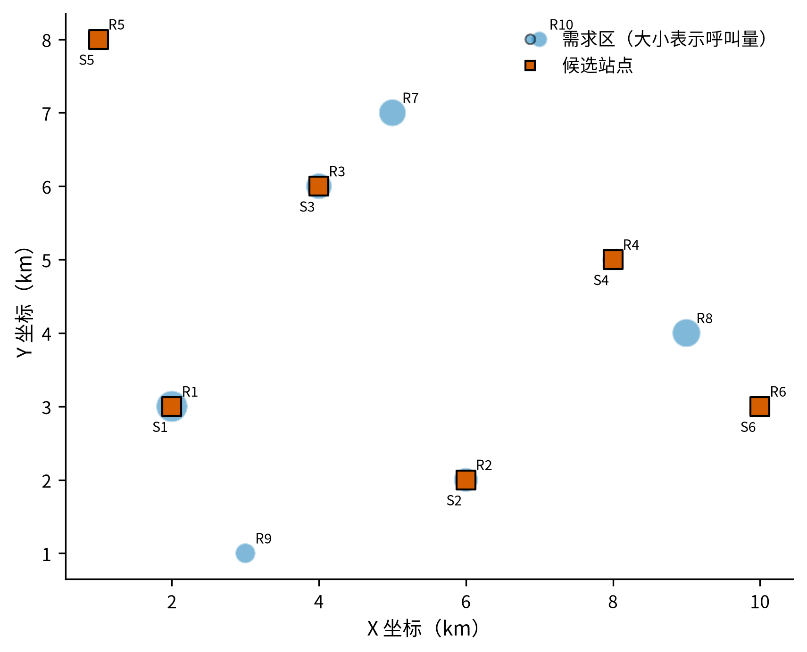
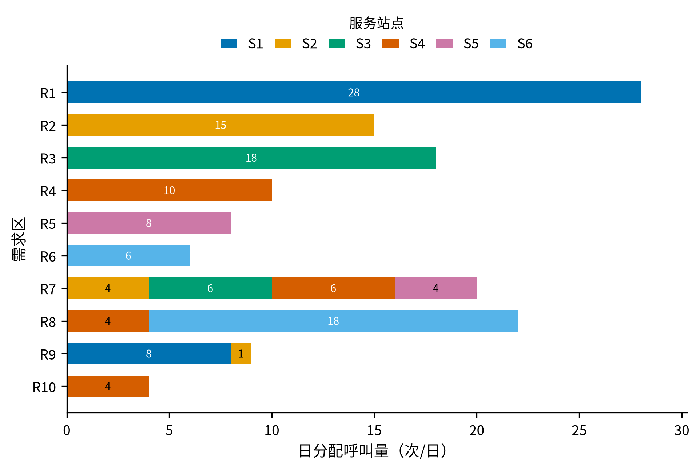
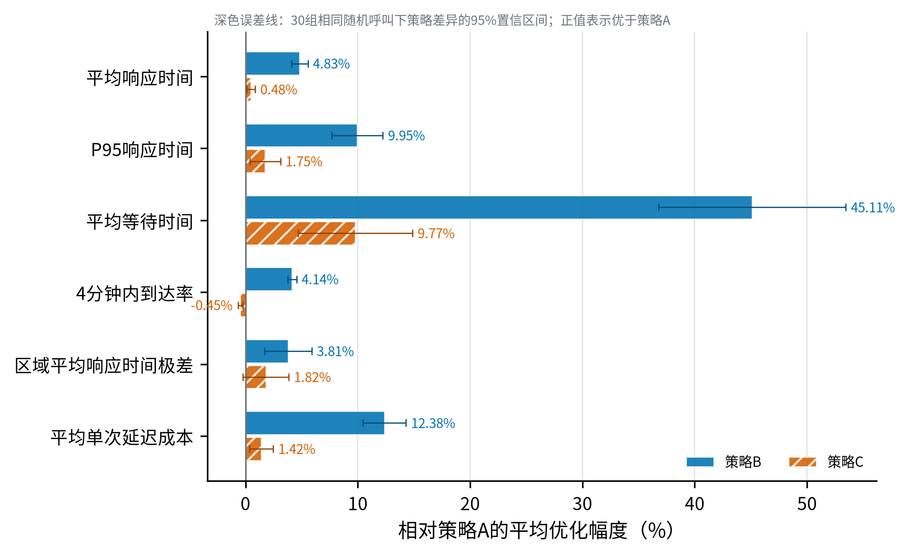
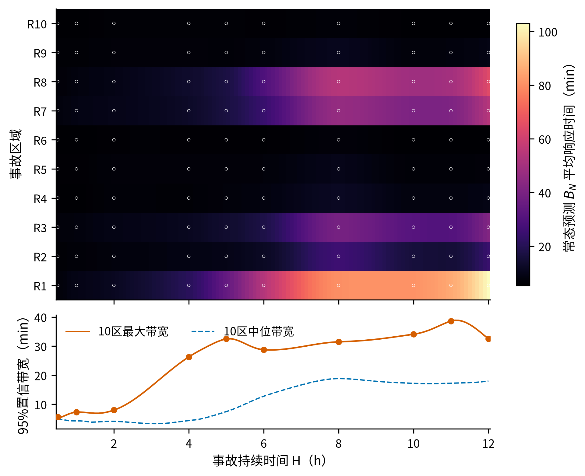
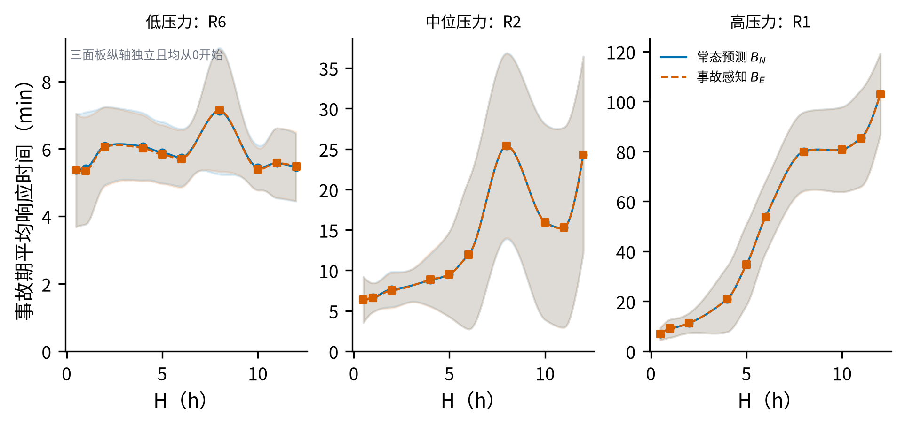
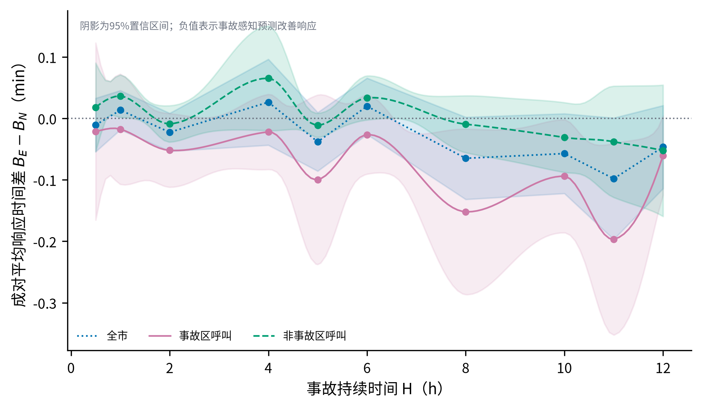
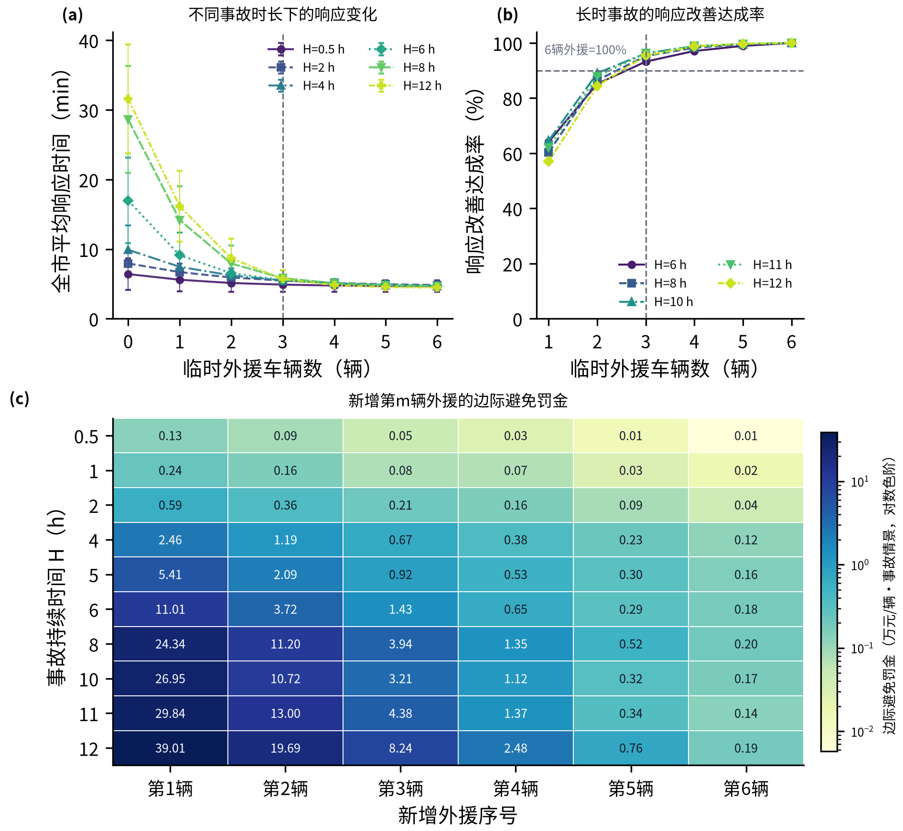

# 基于容量约束运输规划与条件NHPP仿真的急救车辆配置调度优化

## 摘 要

针对某城市10个需求区域、6个候选站点和12辆救护车的配置、日常调度与事故响应问题，本文建立容量约束运输规划和连续多日随机仿真模型。

**针对任务一**，由日均140次需求、单车日服务上限12次及六站总容量12辆，证明全部站点必须启用，唯一配车为（3，2，2，2，1，2）。词典序运输规划以加权出车距离为第一目标，并在距离最优解集合内提高3 km覆盖量，得到平均出车距离0.941569 km和规划覆盖率86.429%；距站点3 km内的可达比例为97.143%。求解器状态为最优，需求残差和容量超限均为0。

**针对任务二**，用周期双高斯密度生成每日固定140次呼叫的条件非齐次Poisson过程，连续模拟30天预热、跨午夜状态和单车日12次上限。比较全局就近派车A、45 min前瞻保护性派车B及S3固定1辆备用车、7 min释放的策略C。30个样本外复制中，三者平均响应时间为5.6142、5.3432、5.5872 min。B较A减少0.2711 min，95%置信区间为[-0.3116，-0.2305] min；P95响应时间降至9.9006 min，日均延迟总成本减少7089.22元/日。推荐B作为日常主策略，C作为独立备用保障方案。

**针对任务三**，分别设置10个区域单独发生事故，令持续时间在0.5～12 h内连续变化，并由10个自适应节点构造PCHIP响应面。固定12辆车时，事故感知预测的全市平均响应时间差在各节点均不显著，仅在持续8、10和11 h时使事故区平均响应时间分别减少0.1519、0.0941和0.1965 min。进一步将0～6辆临时外援部署至事故区最近站点，并在共同呼叫流下完成7000行情景实验。10个时长节点上，第1辆外援的单位车辆收益均为最高；在6、8、10、11和12 h五个长时节点，3辆方案以一半车辆实现6辆方案93.23%～96.30%的响应改善，综合性价比最高；5辆使10个时长节点的全市等权平均响应时间均低于5 min。由此形成1、3、5辆的分层增援方案。

模型通过需求守恒、容量边界、唯一派车、先到先服务和跨午夜连续性检查，策略比较采用共同随机数和成对置信区间。其适用边界为聚合需求、固定45 min任务占用和平均速度情景，实际应用时需重新标定路网行程时间、逐时呼叫和任务时长。

**关键词：** 急救车辆配置；运输型线性规划；条件非齐次Poisson过程；离散事件仿真；应急响应；PCHIP响应面

## 一、问题重述

某城市划分为10个急救需求区域。题目给出各区域中心坐标、面积、人口、日均呼叫量、距最近医院距离，以及6个候选急救站点的位置、最大停车容量和建设成本。全市最多配置12辆救护车，每辆车每天最多执行12次任务，单次任务平均占用45 min。车辆接到派车指令前需要3 min准备，平均行驶速度为45 km/h，黄金响应时限为4 min。

任务一要求确定站点启用、车辆配置和区域服务分配，使日均140次呼叫全部得到覆盖，并兼顾出车距离和规划服务覆盖。任务二要求利用历史需求信息构造24 h呼叫过程，设计就近派车和备用车辆配置，计算优化后的平均响应时间。任务三研究某一区域呼叫强度临时升至正常5倍时的系统响应，先评价现有12辆车的事故感知派车，再给出临时外援车辆配置方案。

## 二、问题分析

### 2.1 任务一分析

车辆总数、单车日服务上限和站点停车容量共同决定任务一的可行域。容量分析表明，覆盖日均140次需求需要12辆车和6个站点全部投入使用，站点启用与车辆配置由此唯一确定。后续优化对象是140次日均呼叫在6个站点间的长期服务分配量，以连续变量$x_{ij}$表示。

平均出车距离与时限覆盖率分别衡量运行效率和空间可达性，二者的量纲及优化方向不同，以覆盖率或响应时间为目标时可能得到不同的站点配置^\[2\]^。本文采用词典序目标：加权出车距离居首，在距离最优解集合内比较3 km规划服务覆盖率。

### 2.2 任务二分析

题目仅给出区域日均呼叫量，未提供逐时到达记录。考虑到EMS呼叫率具有时变特征，本文采用时变计数到达过程描述呼叫流^\[1\]^，并以周期双高斯函数构造上午、傍晚双峰的日内强度情景。每日呼叫总数固定为140次，随机性体现在日内到达时刻和区域标记。车辆任务可能跨越午夜，故仿真采用连续多日结构。每日24:00仅重置新日接单计数，队列、车辆忙闲状态及前一日未完成任务均连续继承。

单纯就近派车未考虑关键车辆离站对后续需求的影响，而对固定车辆实施无条件保护可能增加当前呼叫的响应时间。策略B以未来45 min期望累计响应损失度量车辆离站的空间机会成本，并限制当前呼叫的额外响应时间。为满足备用车辆配置要求，策略C赋予指定车辆固定备用角色；当常规车辆预计响应超过释放阈值且备用车响应更快时，解除备用保护。策略B用于日常保护性派车，策略C用于评价显式备用配置，两者分别建模和比较。

### 2.3 任务三分析

任务三以策略B和任务一确定的12辆车配置为常态基线。10个需求区域分别作为单区域事故地点，彼此构成独立情景。事故确认后，调度中心将事故区未来45 min预测强度调整为日常值的5倍，在额外行驶时间不超过2 min的候选车辆中滚动计算事故感知评分；暂无合法空闲车辆时，呼叫按FCFS留队等待。

事故持续时间$H$取连续区间$[0.5,12]$ h，有限仿真节点用于构造数值响应面。常态预测模式$B_N$与事故感知模式$B_E$共享随机呼叫流，并在同一种子内计算成对差。现有车队的结果用于识别容量边界，随后将0～6辆临时外援配置到事故区最近的现有站点，比较响应改善、延迟罚金与边际增援价值。各持续时间独立评价，以保留持续时间条件结果。

{width=82%}

图1 需求区域与候选急救站点的空间分布

## 三、模型假设

1. 区域中心作为题目指定的聚合代表点，区域日均需求集中于该点计算距离；区内呼叫位置的离散性归入空间近似误差。
2. 站点与区域之间采用欧氏距离，车辆平均速度恒为45 km/h，不考虑路网拥堵和方向差异。
3. 响应时间定义为呼叫到达系统至救护车到达现场，等于等待、3 min准备和行驶时间之和，不含现场处置与送医。
4. 车辆接受任务后连续占用45 min，任务结束后返回所属站点；该占用时长已统一表示准备、去程、现场处置和返程过程。
5. 未派呼叫进入全市统一FCFS队列，并严格按照到达顺序获得派车服务。
6. 每辆车在每个日历日最多接受12次任务；计数按接受派车时刻归属，车辆忙闲和队列跨日继承。
7. 最近医院距离用于构造理想行驶链条指标，不计入站点至现场的出车距离和派车目标函数。
8. 双高斯日内强度根据日均呼叫量和双峰假设构造，作为日内变化的情景输入。
9. 任务三事故区在事故期的总强度为日常值5倍，其他区域保持日常强度；事故被视为在开始时即可识别。
10. 任务三以事故期到达呼叫为评价样本；事故结束时尚未派出的呼叫继续仿真至获得服务，事故后的新呼叫归入恢复阶段。
11. 临时外援在事故开始时已到达事故区最近的现有站点，到站延迟记为0；其准备时间、行驶速度、任务占用、日接单上限和任务后回站规则与普通车辆相同，临时停车不占永久站点容量。

## 四、符号说明

论文中的主要符号见表1。

表1 主要符号及含义

| 符号 | 含义 | 单位 |
|:---:|---|:---:|
| $i,j$ | 需求区域、候选站点索引 | - |
| $q_i$ | 区域$i$日均呼叫量 | 次/日 |
| $d_{ij}$ | 区域$i$代表点至站点$j$的欧氏距离 | km |
| $x_{ij}$ | 区域$i$由站点$j$长期承担的日均呼叫量 | 次/日 |
| $v_j,y_j$ | 站点$j$配车数、是否启用 | 辆，0/1 |
| $R_s$ | 3 km规划服务半径 | km |
| $T_e^{\mathrm{wait}},T_e^{\mathrm{resp}}$ | 呼叫$e$等待时间、响应时间 | min |
| $f(t),\lambda_i(t)$ | 归一化日内密度、区域时变强度 | 1/h，次/h |
| $C_a(t)$ | 派出车辆$a$造成的未来45 min期望累计响应损失 | min |
| $\beta,\delta$ | 日负荷惩罚权重、当前额外响应阈值 | min |
| $r_j,\tau$ | 站点$j$固定备用数、备用释放阈值 | 辆，min |
| $H,t^{\ast}(H)$ | 事故持续时间、持续时间相关最不利起点 | h |
| $B_N,B_E$ | 常态预测模式、事故感知预测模式 | - |
| $\mathcal H$ | 自适应随机仿真时长节点集合 | h |
| $m,T_m(H),P_m(H)$ | 临时外援车辆数、全市平均响应时间、事故窗口延迟罚金 | 辆，min，元 |
| $\Delta P_m(H)$ | 新增第$m$辆外援所避免的延迟罚金 | 元/辆·事故情景 |

## 五、任务一：容量约束站点与服务分配

### 5.1 距离与覆盖口径

任务一需要比较各站点服务不同区域时的空间代价。题目指定区域中心作为需求区域的代表点，因此用区域中心$(x_i,y_i)$至站点$(X_j,Y_j)$的欧氏距离表示一次出车的名义行驶距离：

$$
d_{ij}=\sqrt{(x_i-X_j)^2+(y_i-Y_j)^2}.
$$

任务一将4 min折算为名义行驶时间。按45 km/h计算得到3 km规划服务半径，用于判断站点与区域中心之间的空间覆盖关系。

题目给出的各区域日均呼叫量$q_i$已直接描述需求规模，人口和面积仅作为区域背景。六站全部启用后，各可行服务分配对应相同的建设成本总额，任务一的分流优化由出车距离和站点容量决定。最近医院距离的处理见6.6。

### 5.2 混合整数线性规划

设$x_{ij}\ge0$为区域$i$由站点$j$承担的日均呼叫量，$v_j\in\mathbb Z_+$为站点$j$配车数，$y_j\in\{0,1\}$表示站点是否启用。模型结构见表2，其中$x_{ij}$表示长期平均服务流量，允许连续取值。

表2 任务一混合整数线性规划模型

| 模型组成 | 数学表达 | 含义 |
|---|---|---|
| 目标函数 | $\min D=\sum_{i=1}^{10}\sum_{j=1}^{6}d_{ij}x_{ij}$ | 最小化日均加权出车距离 |
| 需求守恒 | $\sum_{j=1}^{6}x_{ij}=q_i$ | 每个区域的日均呼叫量全部得到服务 |
| 服务能力 | $\sum_{i=1}^{10}x_{ij}\le12v_j$ | 站点负荷不超过其配车形成的日服务上限 |
| 启用与容量 | $y_j\le v_j\le\bar v_jy_j$ | 配车数不超过停车容量，配车与启用状态联动 |
| 车辆总量 | $\sum_{j=1}^{6}v_j\le12$ | 全市救护车总数不超过12辆 |
| 变量域 | $x_{ij}\ge0,\ v_j\in\mathbb Z_+,\ y_j\in\{0,1\}$ | 服务流量连续，车辆数为整数，启用变量为0-1变量 |

### 5.3 六站满配的必要性

枚举全部非空站点子集并统计最大运力：建设1—5个站点时，最多可配置3、5、7、9、11辆车，对应日服务能力上限为36、60、84、108、132次，均低于140次/日的需求；只有6个站点全建时可配置12辆车，形成144次/日的服务能力，如表3所示。因此候选站点必须全建，车辆配置唯一为$(3,2,2,2,1,2)$，后续优化重点转向区域服务分配。

表3 各建站规模运力可行性

| 建站数量 | 1 | 2 | 3 | 4 | 5 | 6 |
|:---:|---:|---:|---:|---:|---:|---:|
| 最大配车/辆 | 3 | 5 | 7 | 9 | 11 | 12 |
| 最大服务能力/（次/日） | 36 | 60 | 84 | 108 | 132 | 144 |

### 5.4 运输型线性规划与词典序覆盖

固定配车后，站点日容量为$(36,24,24,24,12,24)$，模型约化为容量约束运输型线性规划。第一层先在满足全部需求和站点容量的前提下求得最小加权出车距离$D^{\ast}$。第二层只在距离已经达到最优的方案之间比较3 km规划覆盖量：若站点$j$位于区域$i$代表点3 km内，则令

$$
g_{ij}^{s}=\mathbf 1(d_{ij}\le3),
$$

再在约束$D\le D^{\ast}+\varepsilon$下求解

$$
\max C_s=\sum_{i,j}g_{ij}^{s}x_{ij}.
$$

$\varepsilon$用于吸收求解器的浮点误差。该约束把第二层限制在距离最优解集合内，并从中选择3 km规划服务覆盖量最大的分配方案。最终服务分配见图2。

{width=88%}

图2 距离最优解中的区域服务分配组成

图2以水平堆叠条形图呈现各区域的需求总量、主服务站点和跨站分流量，条内数字为相应站点承担的日均呼叫量。

### 5.5 算法设计

任务一采用“容量判定—词典序运输规划—结果核验”的确定性求解流程，具体步骤见表4。

表4 任务一算法步骤

| 步骤 | 具体内容 |
|:---:|---|
| Step 1：构造距离与覆盖矩阵 | 根据区域中心与候选站点坐标计算$d_{ij}$，生成3 km规划覆盖指示矩阵。 |
| Step 2：检验配车可行性 | 汇总日均需求、单车日服务上限和站点停车容量，由需求守恒与容量约束确定全市最低车辆数，并检查各站容量组合。 |
| Step 3：固定站点与车辆配置 | 由可行性结论设置$y_j=1$和$v=(3,2,2,2,1,2)$，将混合整数模型约化为连续运输规划。 |
| Step 4：求解第一层距离目标 | 在需求守恒和站点服务能力约束下最小化$D=\sum_{i,j}d_{ij}x_{ij}$，得到最优值$D^{\ast}$。 |
| Step 5：求解第二层覆盖目标 | 增加$D\le D^{\ast}+\varepsilon$约束，在距离最优解集合内最大化3 km规划服务覆盖量，获得$x_{ij}^{\ast}$。 |
| Step 6：核验并输出结果 | 检查需求残差、容量超限、车辆总数和站点负荷，计算平均出车距离及3 km规划服务覆盖率，输出配车与非零服务分配。 |

### 5.6 求解结果

唯一车辆配置和优化后的站点负荷见表5。S2保留4次/日余量，其余站点达到日服务能力上限。

表5 站点车辆配置与日服务负荷

| 站点 | 最大停车数 | 配车数 | 日服务能力 | 分配负荷 | 容量余量 |
|:---:|---:|---:|---:|---:|---:|
| S1 | 3 | 3 | 36 | 36 | 0 |
| S2 | 2 | 2 | 24 | 20 | 4 |
| S3 | 2 | 2 | 24 | 24 | 0 |
| S4 | 2 | 2 | 24 | 24 | 0 |
| S5 | 1 | 1 | 12 | 12 | 0 |
| S6 | 2 | 2 | 24 | 24 | 0 |

图2给出全部非零服务分配。其中区域7由S2、S3、S4和S5共同承担，区域8由S4和S6承担，区域9由S1和S2承担，体现了容量约束下优先就近服务并允许跨站分流的运输结构。

求解器三阶段状态均为最优，需求最大残差和容量最大超限均为0。最优日均加权出车距离为131.819720 km·次/日，平均出车距离为0.941569 km。运输分配对应的静态平均响应下界为4.255426 min，其中包含3 min准备时间和名义行驶时间。

### 5.7 覆盖率解释

实际运输分配中有121次/日由3 km内的站点承担，因此3 km规划服务覆盖率为86.429%。该指标同时考虑空间距离、站点容量和最终服务分配，是任务一方案的主要覆盖评价指标。仅按站点距离考察时，3 km内可达比例为97.143%；规划覆盖率较低的部分来自容量约束下的跨站分流。

任务一的最终方案为：启用全部6个站点，配车方案为$(3,2,2,2,1,2)$，并按图2进行长期服务分流；平均出车距离为0.941569 km，3 km规划服务覆盖率为86.429%。

## 六、任务二：连续多日随机呼叫与车辆调度

### 6.1 给定日总量的条件NHPP

题目只给出各区域日均呼叫量，没有逐小时历史记录。为了在保持140次/日总需求不变的同时描述早晚高峰，本文先用24 h周期密度$f(t)$刻画一次呼叫在日内各时刻出现的相对可能性。区域$i$的参考强度写为

$$
\lambda_i(t)=q_if(t\%24),\qquad
\int_0^{24}f(t)\,dt=1.
$$

式中积分为1，保证区域$i$全天的期望呼叫量仍为$q_i$。为严格保持题目给定的140次/日需求规模，对每日总事件数施加条件$N_d=140$。给定事件数后，当天140个时刻独立服从$f(t)$，区域标签按$P(I=i)=q_i/140$抽取。区域日计数因此服从多项分布；每日总量固定为140，随机性来自呼叫时刻和区域分布。

日内密度需要同时表现上午和傍晚两个高峰。为避免高斯曲线在0时与24时边界处断开，先定义周期高斯核

$$
G(t;\mu,\sigma)=\sum_{k\in\mathbb Z}
\mathrm e^{-\frac{(t-\mu+24k)^2}{2\sigma^2}},
$$

在一个常态基线$b$上叠加两个周期高斯峰，得到未归一化曲线$g(t)$；再除以其全天积分得到概率密度$f(t)$：

$$
g(t)=b+a_1G(t;\mu_1,\sigma_1)+a_2G(t;\mu_2,\sigma_2),
$$

$$
f(t)=\frac{g(t)}{\int_0^{24}g(s)\,ds}.
$$

采用$b=1$，$(a_1,\mu_1,\sigma_1)=(0.8,9,2)$，$(a_2,\mu_2,\sigma_2)=(1.0,18,2.5)$，形成上午与傍晚双峰。图3给出24 h密度与小时概率。这组参数用于构造日内变化情景，实际应用时可由逐时呼叫记录重新估计。

{width=86%}

图3 周期双高斯条件NHPP日内强度

### 6.2 连续多日离散事件系统

12辆车固定归属六站。每辆车记录所属站、下一次可用时刻、当日已接受任务数及备用身份。离散事件仿真适合在静态常驻配置下同时刻画随机需求、车辆忙闲和排队过程^\[3\]^。呼叫按到达时间进入全市FCFS队列，只有队首拥有派车权。

一条呼叫的响应时间从其到达系统开始计算：若当时没有合法空闲车辆，先产生排队等待；车辆接单后还需3 min准备，再按站点至区域代表点的距离计算行驶时间。因此，车辆$a$为呼叫$e$服务时有

$$
T_e^{\mathrm{resp}}=T_e^{\mathrm{wait}}+3+\frac{60d_{i(e),j(a)}}{45},
$$

式中$T_e^{\mathrm{wait}}$为呼叫到达至获得车辆的等待时间，后两项分别为准备时间和名义行驶时间。车辆在时刻$s_e$接单后至$s_e+45$ min之间不可再次派出，任务结束后返回所属站。

同一时刻依次处理午夜计数切换、车辆任务完成、呼叫到达和FCFS派车。24:00仅重置新日接受任务计数，车辆忙闲状态、剩余占用时间和队列均连续继承。统计期末停止生成新呼叫，并继续处理已到达呼叫，直至全部样本获得完整响应时间。

每个复制固定预热30天。预热期不计入评价指标，车辆和队列状态连续演化；第30天末状态作为第31天的初始状态。参数筛选采用3个复制、每个统计7天；最终评价采用30个新复制、每个统计30天。筛选种子与最终评价种子互不重叠，同一复制中的A、B、C采用相同的呼叫流。

### 6.3 策略A：全局就近派车

策略A采用全局就近派车。对FCFS队首呼叫，在当前空闲且接单后不超过每日12次上限的车辆中，选择所属站点距呼叫区域最近的车辆。同距离时，依次选择当日接单数较少、站点编号较小和车辆编号较小者。该策略允许跨站支援，车辆完成任务后仍返回所属站点。其派车依据是当前呼叫的行驶距离，作为后续两种保护策略的比较基准。

### 6.4 策略B：45 min前瞻保护性派车

全局就近派车只比较车辆到当前呼叫点的距离，可能把某一区域附近唯一可用的车辆派往其他区域。若该区域随后出现新呼叫，便需要等待较远车辆支援。策略B在当前响应可接受的候选车中，进一步比较车辆对未来服务的价值。

具体而言，如果两辆车到达当前呼叫点的时间相近，优先派出离站后对未来全市服务影响较小的车辆。各区域未来45 min的呼叫强度用于估计候选车离站后可能增加的累计响应时间，由此衡量车辆的未来服务价值。

对当前呼叫$e$，记$\Delta T_{ea}^{\mathrm{now}}$为派出候选车$a$相对派出最近车辆增加的响应时间。只有满足$\Delta T_{ea}^{\mathrm{now}}\le\delta$的车辆才进入下一步比较，从而限制车辆保护给当前呼叫带来的额外延迟。随后，记$\Delta R_{r,a}(u)$为派出车辆$a$后，未来时刻$u$在区域$r$出现新呼叫时预计增加的响应时间；计算该增量时同时考虑各车剩余忙碌时间、空间位置和每日12次上限。车辆$a$离站造成的未来45 min期望累计损失为

$$
C_a(t)=\int_t^{t+0.75}\sum_{r=1}^{10}\lambda_r(u)
\Delta R_{r,a}(u)\,du.
$$

呼叫强度越高、该车辆离站造成的响应增量越大，$C_a(t)$就越高，该车辆越应受到保护。此外，以车辆当日接单数$n_{a,d}$衡量其剩余服务额度，使每日12次接单机会在车队内保持相对均衡。最终评分为

$$
J_{ea}=\Delta T_{ea}^{\mathrm{now}}+C_a(t)
+\beta\frac{n_{a,d}+1}{12},
\qquad \Delta T_{ea}^{\mathrm{now}}\le\delta.
$$

三个分量均换算为min，依次表示当前呼叫的额外响应、未来45 min的覆盖损失和车辆当日负荷。阈值$\delta$限定当前呼叫可接受的额外延迟，满足阈值的候选车辆按$J_{ea}$最小原则派出，使当前响应和未来保障共同进入决策。参数筛选在$\beta\in\{0,0.5,1,2,4\}$和$\delta\in\{0.5,1,1.5,2\}$上进行粗网格搜索，并在优胜区域细化，最终选取$(\beta,\delta)=(4,2)$。图4显示筛选过程。

{width=82%}

图4 策略B参数筛选结果

### 6.5 策略C：固定备用车辆配置

题目还要求给出明确的备用车辆配置。策略C预先指定若干车辆承担备用角色，常态调用常规车辆，达到释放条件时启用备用车。固定保护会压缩日常可用车辆数量，因此需要联合确定备用位置和释放阈值。

任务一的站点配车为$(3,2,2,2,1,2)$。为保证每站至少保留一辆常规车，各站备用数取0至本站配车数减1，并排除全零配置，共得到47种非零备用向量。释放阈值$\tau$取4、5、6、7、8 min，与备用向量组合后形成235个候选方案。

对FCFS队首呼叫，系统分别估计最快常规车辆的完整响应时间$\widehat T_e^{\mathrm{reg}}$和最快合法备用车辆的响应时间$T_e^R$。前者计入呼叫现有等待、车辆剩余忙碌时间、3 min准备、行驶时间和每日12次上限。只有满足

$$
\widehat T_e^{\mathrm{reg}}>\tau
\qquad\text{且}\qquad
T_e^R<\widehat T_e^{\mathrm{reg}}
$$

时才解除保护，即常规车辆已经超过允许阈值，而且备用车确实能够缩短响应。否则派出最近的合法常规车；若当前没有合法常规车且备用释放条件不成立，呼叫继续停留在FCFS队首，等待下一次车辆状态变化。距离相同时，依次按当日接单数、站点编号和车辆编号破同序。备用车完成任务并返回所属站后自动恢复备用身份。

235个候选使用3个共享呼叫流的复制进行筛选。排序采用严格词典序，平均响应时间差为第一指标；前一指标相同时，再依次比较4分钟内到达率、P95响应时间和区域平均响应时间极差。图5中每个点对应一个备用向量与释放阈值，横轴为相对A的平均响应时间差，纵轴为4分钟内到达率。零差虚线表示两者平均响应时间相同，绿色点为进入样本外评价的候选。

筛选得到备用向量$\boldsymbol r^{\ast}=(0,0,1,0,0,0)$、释放阈值$\tau^{\ast}=7$ min，即S3的两辆车中固定一辆承担备用角色。该参数的最优性限于所设筛选样本，后续再通过独立样本评价其运行表现。

{width=84%}

图5 策略C的235个备用配置候选筛选

### 6.6 评价指标与统计方法

主指标采用平均响应时间，用于衡量一条呼叫从到达系统到救护车抵达现场的总体效率。平均值可能掩盖少量严重延迟，因此同时报告P90/P95响应时间、平均等待时间、等待发生率和最大排队呼叫数；4分钟内到达率反映时限保障，区域平均响应时间极差反映不同区域之间的服务差异。

题目规定超过4 min后，每延迟1 min产生200元惩罚。因而一条呼叫在4 min内到达时成本为0，超过部分按分钟线性累加：

$$
C_e=200\max(T_e^{\mathrm{resp}}-4,0)\quad\mathrm{(元)}.
$$

每个指标先在一个独立复制内汇总，再对30个复制计算均值和95% t置信区间。A、B、C在同一复制中共享完全相同的呼叫流，复制内的随机需求保持一致。策略比较在每个复制内进行，例如第$m$个复制中B相对A的指标差定义为

$$
\Delta_m^{B-A}=M_{B,m}-M_{A,m}.
$$

时间或成本类指标的差值为负表示B有所改善；4分钟内到达率的差值为正表示改善。由于A和B使用同一复制中的同一批呼叫，这种逐复制比较能够削弱呼叫时刻和区域构成差异造成的随机波动。30个复制的差值用于计算95%置信区间。

多指标比较覆盖效率、尾部风险、排队、时限保障、区域公平和经济成本，分别选取平均响应时间、P95响应时间、平均等待时间、4分钟内到达率、区域平均响应时间极差和平均单次延迟成本。时间、差异和成本类指标采用$(A-\text{待评策略})/A$，4分钟内到达率采用$(\text{待评策略}-A)/A$，因而正值均表示改善。误差线为30个复制内同向优化量的95%置信区间；区间跨越0表示改善方向尚不稳定。

医院相对区域的位置固定，呼叫点至医院的距离与派车站点无关；在需求守恒下，该项对任务一各方案贡献相同的常数$\sum_iq_ih_i$。本文将最近医院距离$h_i$用于描述后续转运路程，并定义理想行驶链条指标

$$
T_e^{\mathrm{chain}}=T_e^{\mathrm{resp}}+\frac{60h_{i(e)}}{45},
$$

该指标由响应时间和区域代表点至最近医院的名义行驶时间组成，用于方案评价。其统计范围截至车辆到达最近医院，现场处置、患者交接及院内救治时间均在指标范围之外。

### 6.7 算法设计

任务二采用连续多日离散事件仿真，在共同呼叫流下完成参数筛选和策略比较，具体步骤见表6。

表6 任务二算法步骤

| 步骤 | 具体内容 |
|:---:|---|
| Step 1：生成条件NHPP呼叫流 | 每个仿真日固定生成140次呼叫，依据周期双高斯密度抽取到达时刻，并按$q_i/140$抽取区域标记。 |
| Step 2：初始化并预热系统 | 按任务一配车方案建立12辆车的所属站、可用时刻、日接单计数和备用身份，连续运行30天预热并保留跨午夜状态。 |
| Step 3：推进离散事件 | 按时间顺序处理日界切换、车辆任务完成、呼叫到达和FCFS派车；忙车、队列及未完成任务跨日继承。 |
| Step 4：执行候选派车规则 | 筛选满足空闲和日12次上限的车辆；A按距离选择，B最小化$J_{ea}$，C按阈值决定是否释放固定备用车。 |
| Step 5：筛选策略参数 | 使用3个独立复制进行粗、细两级参数搜索；B先按平均响应时间筛选统计等价候选，再依次比较4分钟内到达率、P95响应时间和区域平均响应时间极差，C按相对A的平均响应时间差及辅助指标排序。 |
| Step 6：开展样本外评价 | 在30个新复制中令A、B、C共享呼叫流，统计响应时间、等待时间、排队呼叫数、区域公平性和延迟成本，并计算相对A的优化幅度及成对差的95%置信区间。 |
| Step 7：核验运行约束 | 检查呼叫量、唯一派车、单车日接单上限、任务不重叠、FCFS顺序和跨午夜状态连续性，输出最终调度方案。 |

### 6.8 最终结果与方案选择

30个样本外复制的主要结果见表7；每个复制在30天预热后统计30天，共4200次呼叫。

表7 三种调度策略的样本外评价

| 指标 | A：全局就近 | B：前瞻保护 | C：固定备用 |
|---|---:|---:|---:|
| 平均响应时间/min | 5.6142 [5.5577, 5.6708] | **5.3432 [5.3111, 5.3753]** | 5.5872 [5.5400, 5.6343] |
| 4分钟内到达率/% | 43.13 | **44.92** | 42.94 |
| P95响应时间/min | 10.9949 | **9.9006** | 10.8021 |
| 平均等待时间/min | 0.4053 | **0.2225** | 0.3657 |
| 等待发生率/% | 3.51 | **2.47** | 3.32 |
| 最大排队呼叫数/次 | 5.4333 | **4.7333** | 5.4667 |
| 区域平均响应时间极差/min | 4.1578 | **3.9994** | 4.0822 |
| 平均单次延迟成本/(元/次) | 409.08 | **358.44** | 403.27 |
| 日均延迟总成本/(元/日) | 57271.05 | **50181.83** | 56458.12 |

B相对A的平均响应时间减少0.2711 min，成对95%置信区间为$[-0.3116,-0.2305]$ min；同时P95响应时间、平均等待时间和最大排队呼叫数均下降。这组结果表明，策略B的改善同时覆盖平均响应时间、尾部响应时间和排队指标。C相对A的平均响应时间减少0.0271 min，区间为$[-0.0487,-0.0055]$ min。C承担固定备用配置功能，本文进一步检验其平均响应时间相对A的变化。为此，以复制级成对差$D_m=\overline T_{C,m}-\overline T_{A,m}$计算单侧95%上置信限

$$
U_{0.95}=\overline D+t_{0.95,n-1}\frac{s_D}{\sqrt n}.
$$

其中$\overline D$和$s_D$分别为30个成对差的样本均值和样本标准差。所得$U_{0.95}=-0.0091$ min，支持C的总体平均响应时间低于A。

如图6所示，B、C相对A的六项核心指标平均优化幅度及95%置信区间被合并展示。B在六项指标上均为正向变化，其中平均等待时间降幅最大，为45.11%；平均单次延迟成本、P95响应时间、平均响应时间、4分钟内到达率和区域平均响应时间极差分别优化12.38%、9.95%、4.83%、4.14%和3.81%，六项区间均高于0。C在平均等待时间上的优化幅度为9.77%，平均响应时间、P95响应时间和平均单次延迟成本的改善幅度均较小；区域平均响应时间极差的区间跨越0，4分钟内到达率则相对A下降0.45%。

{width=82%}

图6 策略B、C相对A的多指标平均优化幅度与95%置信区间（30组共享相同呼叫流的随机复制）

相较于策略A，策略B使平均响应时间降低4.83%、P95响应时间降低9.95%、平均等待时间降低45.11%，平均单次延迟成本和日均延迟总成本分别减少50.64元/次和7089.22元/日，同时减小区域平均响应时间极差。因此，策略B被选为日常主方案。时空随机需求下的车辆配置与调度可通过仿真优化框架比较^\[4\]^。本研究的车辆数量、服务能力和任务占用取自题目条件，日内强度与策略参数分别按6.1节的情景设定和6.4节的筛选结果取值。

策略C在S3配置1辆固定备用车，其平均响应时间接近策略A，但4分钟内到达率略低于A。这与固定备用机制的运行方式一致：备用车在常态下受保护，常规响应预计超过7 min且备用车更快时解除保护。C由此为严重延迟情景保留一辆明确可调用的车辆，日常即时可用车数量相应减少。综合指标仍由策略B占优，因此B承担日常主运行，C作为单独备用保障方案。

最终可执行规则汇总于表8。

表8 任务二最终调度方案

| 运行场景 | 采用规则 | 关键参数 | 执行说明 |
|---|---|---|---|
| 日常主运行 | 策略B | $\beta=4$ min，$\delta=2$ min | 在当前额外响应不超过2 min的候选中最小化45 min前瞻评分 |
| 显式备用保障 | 策略C | S3固定1辆备用，$\tau=7$ min | 常规车预计响应超过7 min且备用车更快时解除保护 |
| 无优化基准 | 策略A | 无 | 全市合法车辆中选择最近者，用于效果比较 |

### 6.9 约束与复现核验

程序逐复制检查每日呼叫量、唯一派车、单车日接单上限、车辆任务不重叠、FCFS队列顺序、45 min任务占用及跨午夜状态连续性。任务一的三个求解阶段均达到最优状态，需求残差和容量超限均为0。任务二最终评价包含30个复制，种子为400000至400029；每种策略在各复制中均统计4200次呼叫。复现入口及证据文件列于附录A。

## 七、任务三：连续事故时长下的应急调度与效果评估

### 7.1 事故需求与最不利窗口

任务三将10个需求区域依次设为事故区，每次仿真只发生一个单区域事故，因此得到10类相互独立的空间情景。事故持续时间$H$在$[0.5,12]$ h内连续变化，其他9个区域始终保持日常强度。

事故期间，事故区总呼叫强度升至日常值的5倍。实现时保留任务二的日常呼叫流，并在事故窗口内叠加4倍日常强度的独立NHPP增量。该构造使事故区总强度达到题设水平，并支持不同调度方案复用相同的日常背景和事故新增呼叫。

同一持续时长落在日内低谷或高峰时，系统压力存在差异。本文对每个$H$在24 h周期上按1 min网格搜索累计呼叫概率最大的连续窗口，并将该窗口作为最不利事故时段。将窗口内的日常呼叫概率乘以区域日均需求和4倍增量系数，即得事故期预期新增呼叫量。

由图7可见，R1的日均需求量最大，相同持续时间下其预期新增呼叫最多。图中10个节点承担数值仿真与响应面重构，节点之间通过PCHIP插值描述连续时长下的响应变化。

{width=84%}

图7 连续事故持续时间下的预期新增呼叫与自适应节点

### 7.2 常态预测与事故感知预测

任务三中的响应变化同时受到事故新增需求和调度规则调整的影响。为了单独评价事故信息对派车选择的作用，本文固定车辆数量和实际事故呼叫，仅改变未来45 min需求预测，并设置以下两个模式：

- $B_N$：实际呼叫流包含事故增量，但未来45 min覆盖损失仍按日常预计呼叫强度计算；
- $B_E$：只在事故已经发生的时段内，把已识别事故区未来45 min预计呼叫强度的倍率调整为5，其余评分、约束和参数保持不变。

这里的$B_N$仍包含事故呼叫，只是派车评分尚未利用事故信息；$B_E$则把已识别的事故区域及强度用于评估未来车辆覆盖损失。因此，$B_N$可作为$B_E$在同一事故情景下的对照。

仿真中，两种模式在相同事故区域$k$、持续时间$H$和随机种子$s$下共享事故起点、呼叫数量、到达时刻、需求区域及车辆初始状态，并计算成对差$D_{k,s}(H)=T_{k,s}^{B_E}(H)-T_{k,s}^{B_N}(H)$。共同随机数控制了事故规模、呼叫时刻和初始队列状态造成的波动，使该差值主要反映预计呼叫强度改变后车辆派出顺序的变化。$D_{k,s}(H)<0$表示事故感知派车改善响应；95%置信区间包含0时，现有复制尚未提供稳定的改善证据。

若将$B_E$直接与任务二的常态结果比较，差异会同时包含事故新增需求和派车调整；若与增加外援后的方案比较，又会混入车辆容量变化。采用$B_E-B_N$可以识别事故信息修正的作用，再将外援方案与$B_E$比较，评价扩充运力带来的改善。两类比较分别对应派车顺序调整和车辆数量增加。

具体实现沿用策略B的评分结构和$(\beta,\delta)=(4,2)$。计算未来45 min覆盖损失时，$B_E$仅将事故区与事故时段重叠部分的预计呼叫强度调整为日常值的5倍，其余区域保持不变。若某辆车离站会明显削弱事故区的后续响应，其评分将上升，从而更可能被保留；车辆配置、FCFS规则、45 min占用、日12次上限和任务后回站规则均不改变。

### 7.3 应急响应方案

任务三以日常主策略B为基础，通过事故信息修正派车顺序。六个站点和12辆车保持任务一的配置，车辆完成任务后返回所属站点；调度中心在每次派车时根据最新事故状态重新计算评分。具体执行过程如下。

1. **启动事故模式。** 调度中心确认事故区域$k$和发生时刻$t_0$后，将运行模式由$B_N$切换为$B_E$。事故持续期间，区域$k$的预计呼叫强度倍率设为5，其余区域保持为1；每次评分只对未来45 min内仍处于事故期的部分采用5倍预计呼叫强度。
2. **滚动选择车辆。** 对FCFS队首呼叫，先从当日接单未满12次的空闲车辆中找出行驶时间最短值，再保留比该值至多增加2 min的候选车辆。对候选车辆计算上述事故感知评分，派出评分最小者。该规则允许以有限的当前绕行保留对事故区后续呼叫更重要的车辆。
3. **处理车辆不足。** 当前无合法空闲车辆时，呼叫继续留在全市FCFS队列，待车辆释放或跨日接单计数重置后再按上述规则派出。事故期到达且事故结束时仍在队列中的呼叫继续处理，派车次序保持不变。
4. **退出事故模式。** 调度中心收到事故解除信息后，将事故区预计呼叫强度倍率恢复为1，后续派车回到策略B的日常评分。尚未完成的事故期呼叫继续处理，车辆完成任务后仍返回原所属站点。

事故确认、滚动派车、排队处理和模式退出构成事故期调度流程。7.7节给出现有12辆车下的响应结果及长时事故的容量瓶颈。

### 7.4 事故期评价边界

每个复制均进行30天预热。评价样本按呼叫到达时刻界定：事故区间$[t_0,t_0+H)$内到达的呼叫，即使事故结束时仍在排队，也继续仿真至获得服务，并计入完整响应时间。评价指标包含这些呼叫的全部排队延迟，事故结束后的新呼叫归入恢复阶段。

平均响应时间反映总体效率，P95响应时间和最大事故排队呼叫数反映严重拥堵，4分钟内到达率反映时限保障。对每个区域和模式分别报告这四项指标，记为

$$
\bar T_k(H),\quad P95_k(H),\quad C_{4,k}(H),\quad Q_{\max,k}(H).
$$

对同一呼叫流计算$B_E-B_N$成对差，响应时间差为负表示事故感知模式改善。采用成对比较后，事故呼叫数量和到达时刻的随机波动同时作用于两个模式，差异主要反映预测规则。图8给出10个事故区域的平均响应时间曲面及置信带宽；区域和持续时间共同影响系统压力，置信带宽在长时事故情景下总体增大。

{width=88%}

图8 各事故区域的平均响应时间曲面与不确定性

### 7.5 自适应节点与PCHIP响应面

连续区间由有限仿真节点近似。等间距密集取点会在曲线平缓且结果稳定的区间投入大量计算。本文以0.5、1、2、4、8和12 h为初始节点，新增计算集中在曲线可能转折或统计不确定性较高的区间。

补点时同时观察$B_N$、$B_E$及二者成对差的平均响应时间、P95响应时间、4分钟内到达率和最大事故排队呼叫数。各项指标统一尺度后，每轮分别在曲线转折较明显和置信区间较宽的区间补充一个中点；若没有合适候选，则补充最宽区间的中点。两轮补点结果见表9。

表9 任务三自适应持续时间节点

| 轮次 | 新增时长/h | 搜索区间/h | 选择依据 |
|:---:|---:|:---:|:---:|
| 1 | 6 | [4, 8] | 置信区间较宽 |
| 1 | 10 | [8, 12] | 置信区间较宽 |
| 2 | 5 | [4, 6] | 置信区间较宽 |
| 2 | 11 | [10, 12] | 置信区间较宽 |

最终使用0.5、1、2、4、5、6、8、10、11和12 h共10个持续时间节点。每个节点遍历10个事故区、10个随机种子和两种成对模式，共得到2000行复制结果。

对每个事故区、模式、指标和随机种子，先用PCHIP连接10个节点，再汇总不同随机种子的均值和95%置信带。这样可以保留复制之间的波动，也能减少普通高次多项式在节点间产生振荡的风险。所得曲线仅用于近似连续时长下的响应变化。图9给出R6、R2、R1三个低、中、高压力代表区域的结果。

{width=84%}

图9 低、中、高压力事故区域的平均响应时间曲线

### 7.6 算法设计

任务三采用“最不利窗口搜索—自适应仿真—复制级响应面”的连续事故时长分析流程，具体步骤见表10。

表10 任务三算法步骤

| 步骤 | 具体内容 |
|---|---|
| Step 1：确定事故情景 | 遍历10个事故区域，令$H\in[0.5,12]$ h；事故期叠加4倍日常强度，使事故区总强度达到正常值的5倍。 |
| Step 2：搜索最不利起点 | 对给定$H$在24 h周期上按1 min网格计算强度积分，取积分最大的窗口起点$t^{\ast}(H)$；积分跨越24:00时按周期延拓。 |
| Step 3：构造共同随机呼叫流 | 完成30天预热后生成日常与事故增量呼叫，使$B_N$和$B_E$在同一区域、时长和种子下共享事件流。 |
| Step 4：执行两种预测模式 | $B_N$沿用日常强度计算45 min前瞻损失；$B_E$在已识别事故区和事故时段内将预测强度乘子调整为5。 |
| Step 5：自适应补充时长节点 | 从6个初始节点出发，每轮分别按相邻斜率变化和95%置信半宽选取至多2个区间中点，经两轮补点得到10个仿真节点。 |
| Step 6：构造连续响应面 | 对每个区域、策略、指标和随机种子在节点集上建立PCHIP插值，再跨复制计算均值与95%置信带。 |
| Step 7：评价现有车队 | 汇总全市、事故区和非事故区的平均响应时间、P95响应时间、4分钟内到达率与最大排队呼叫数，计算成对差并识别容量边界。 |
| Step 8：筛选外援层级 | 将0～6辆外援配置到事故区最近站点，在共同呼叫流下计算响应改善和边际避免罚金，以6辆方案的改善为100%，根据单位车辆收益、90%响应改善达成率和5 min服务目标形成分层方案。 |

### 7.7 现有车队的响应效果与容量瓶颈

每个$H$和种子对应10个事故区域情景的等权均值，并据此计算$B_E-B_N$成对差。表11给出节点结果。

表11 全市逐时长平均响应时间与成对效应

| 事故持续时间$H$/h | $B_N$平均响应时间/min | $B_E$平均响应时间/min | 平均响应时间差$B_E-B_N$/min | 95%置信区间/min |
|---:|---:|---:|---:|:---:|
| 0.5 | 6.1706 | 6.1600 | -0.0107 | [-0.0541, 0.0328] |
| 1 | 6.7916 | 6.8050 | 0.0135 | [-0.0185, 0.0454] |
| 2 | 7.9594 | 7.9369 | -0.0226 | [-0.0535, 0.0084] |
| 4 | 9.8666 | 9.8930 | 0.0264 | [-0.0435, 0.0963] |
| 5 | 12.3799 | 12.3419 | -0.0380 | [-0.0857, 0.0097] |
| 6 | 16.9489 | 16.9687 | 0.0198 | [-0.0260, 0.0656] |
| 8 | 28.6680 | 28.6031 | -0.0649 | [-0.1318, 0.0020] |
| 10 | 24.4728 | 24.4155 | -0.0572 | [-0.1221, 0.0077] |
| 11 | 25.0225 | 24.9244 | -0.0981 | [-0.1969, 0.0007] |
| 12 | 31.6386 | 31.5920 | -0.0466 | [-0.1142, 0.0210] |

$B_N$下的全市平均响应时间由$H=0.5$ h时的6.1706 min总体增至$H=12$ h时的31.6386 min。$H=8$ h节点高于10 h和11 h节点，这一局部波动可能与不同持续时间对应的最不利起点及随机队列状态有关。采用事故感知派车后，$B_E$在0.5 h节点的全市平均响应时间仍为6.1600 min，在12 h节点达到31.5920 min，10个节点均超过4 min，表明现有12辆车的事故响应效果较差。10个节点上$B_E-B_N$的全市平均响应时间差介于$[-0.0981,0.0264]$ min，且95%置信区间均包含0，派车顺序修正未能显著降低全市平均响应时间。

这一结果主要受车队容量约束。12辆车按单车日接单上限计算的名义运力为144次/日，而常态需求已达140次/日，余量仅为4次/日，即2.86%。事故区强度升至常态的5倍后，新增呼叫随持续时间增加逐步消耗并突破这部分余量；同时，45 min任务占用使高峰时段的即时可用车辆进一步减少。$B_E$沿用原有12辆车，只改变候选车辆的派出顺序，并未增加可服务的车辆数，因此能够形成局部保护，却难以消除全市排队。

局部保护效果按事故区和非事故区分别统计。在固定$H$、种子和模式内汇总10个事故情景，按呼叫数加权后进行成对比较；零呼叫情景权重为0，每组比较均包含完整10区且两模式呼叫数一致。分域节点结果见表12，负值表示$B_E$改善。

表12 事故区与非事故区平均响应时间的成对效应

| 事故持续时间$H$/h | 事故区响应时间差/min | 事故区95%置信区间/min | 非事故区响应时间差/min | 非事故区95%置信区间/min |
|---:|---:|:---:|---:|:---:|
| 0.5 | -0.0213 | [-0.1654, 0.1229] | 0.0181 | [-0.0540, 0.0902] |
| 1 | -0.0175 | [-0.1072, 0.0722] | 0.0362 | [0.0016, 0.0708] |
| 2 | -0.0520 | [-0.1119, 0.0080] | -0.0088 | [-0.0384, 0.0208] |
| 4 | -0.0219 | [-0.0830, 0.0392] | 0.0653 | [-0.0198, 0.1503] |
| 5 | -0.0997 | [-0.2376, 0.0381] | -0.0112 | [-0.0308, 0.0085] |
| 6 | -0.0265 | [-0.0906, 0.0377] | 0.0334 | [-0.0025, 0.0693] |
| 8 | **-0.1519** | **[-0.2866, -0.0173]** | -0.0094 | [-0.0557, 0.0369] |
| 10 | **-0.0941** | **[-0.1860, -0.0021]** | -0.0309 | [-0.0877, 0.0258] |
| 11 | **-0.1965** | **[-0.3523, -0.0407]** | -0.0380 | [-0.1286, 0.0526] |
| 12 | -0.0604 | [-0.1249, 0.0042] | -0.0525 | [-0.1595, 0.0544] |

事故区在$H=8,10,11$ h分别改善0.1519、0.0941、0.1965 min，对应区间均低于0；其余时长证据不足。非事故区仅$H=1$ h出现0.0362 min的小幅恶化且区间高于0，其他节点区间均跨0。

当候选车辆的未来服务价值接近，且评分变化实际改变派车顺序时，事故感知预测才会形成响应差异。分域结果与这种局部保护机制一致；事故区呼叫只占全市呼叫的一部分，因此全市平均指标对局部变化的敏感度较低。图10集中展示全市、事故区和非事故区的成对差及95%置信区间。

{width=84%}

图10 事故感知模式对全市、事故区与非事故区平均响应时间的成对效应

R6、R2和R1分别表示低、中、高压力区域，其中R1的新增呼叫压力最高。事故区的局部改善说明$B_E$可作为事故确认后的即时保护规则，但它不能替代运力扩充。固定12辆车和5倍事故强度下，容量不足是响应恶化的主导原因，需要进一步评价临时外援。

### 7.8 临时外援车辆配置与性价比

7.7节表明，现有12辆车下的事故感知派车只能形成局部改善，容量压力仍占主导。为补充事故期运力，本文进一步考察临时外援车辆的数量、响应收益与资源效率。对每个事故区域和持续时间，设置$m=0,1,\ldots,6$辆临时外援。外援驻扎在事故区代表点最近的现有站点；R8到S4和S6距离相同，车辆按S4、S6交替分配。事故开始时外援已经到达驻点，到站延迟记为0，但每次响应仍计入3 min准备时间和驻点至呼叫点的行驶时间。外援与普通车辆采用相同的45 min任务占用、日12次接单上限和任务后回站规则，并与现有车辆共同执行$B_E$评分。临时停车不占六个站点的永久容量。

正式实验覆盖10个事故区域、10个时长节点、10个随机种子和7种外援数量。同一区域、时长和种子下的7种外援方案共享呼叫流。

为比较响应改善与车辆投入，记$T_m(H)$和$P_m(H)$分别为配置$m$辆外援时，完整种子区组内10个单区域事故情景的全市等权平均响应时间和平均延迟罚金。以6辆外援相对无外援取得的时间下降为100%，即可衡量较少车辆已经实现的响应改善比例。新增第$m$辆外援所避免的延迟罚金记为$\Delta P_m(H)=P_{m-1}(H)-P_m(H)$。仿真中每辆外援具有相同的任务参数，因此$\Delta P_m(H)$越大，表示该辆车的单位投入收益越高。

图11(a)给出代表时长下的外援数量与全市平均响应时间，图11(b)给出长时事故的响应改善达成率，其中6辆外援固定为100%；3辆处的竖线和90%横线用于识别统一的响应折中阈值。图11(c)给出新增第$m$辆外援相对$m-1$辆方案所避免的延迟罚金$\Delta P_m(H)$。由于该指标跨越多个数量级，热力图采用对数色阶，并在单元格内标出以万元/辆·事故情景计的均值。图中$H=0.5$ h的结果基于9个完整种子区组，其余时长基于10个种子。

{width=88%}

图11 临时外援数量的响应收益与边际避免罚金

10个时长节点上，第1辆外援的边际避免罚金均高于后续车辆，因而单位车辆收益最高，适合作为资源有限时的首批增援。在$H=6,8,10,11,12$ h五个长时节点，2辆方案的响应改善达成率为84.42%～89.03%，3辆方案达到93.23%～96.30%。因此，3辆是90%响应改善达成率规则下的最小统一外援数；该方案仅使用6辆方案一半的车辆，是长时事故下兼顾响应效果和车辆投入的最优折中。若管理目标是使10个时长节点的全市等权平均响应时间均低于5 min，则4辆方案的最差节点仍为5.13 min，5辆方案的最差节点降至4.94 min，5辆是满足该目标的最小统一数量。该结论适用于10个区域情景的全市等权平均值，分区与单次随机情景仍按原始结果分别判断。

图11(c)还表明，各时长下新增车辆的边际避免罚金均随外援序号增加而下降。以12 h事故为例，第1～6辆外援的$\Delta P_m$依次为39.01、19.69、8.24、2.48、0.76和0.19万元/辆·事故情景，第4辆以后的单位收益已明显降低。综合来看，1辆方案的单位车辆收益最高，3辆方案在长时事故下综合性价比最高，5辆方案则用于满足平均响应时间低于5 min的服务目标。

## 八、模型评价

### 8.1 模型优点

任务一将可行性判定与服务分配分开处理：容量分析给出唯一可行配车，运输规划在该配置下优化区域分流。需求残差和容量超限均为0，验证了最终分配的硬约束；词典序目标明确了距离与覆盖的优先关系。

任务二以逐呼叫仿真描述车辆忙闲、排队和跨午夜状态，30天预热降低初始空系统的影响。共同随机数使A、B、C在相同呼叫流下成对比较，置信区间主要反映调度规则差异。策略B和策略C分别对应日常保护性派车与固定备用配置，使“动态保护”和“显式备用”两个要求能够独立评价。方案评价同时覆盖平均响应时间、P95响应时间、等待时间、排队呼叫数、区域公平性和延迟成本。

任务三以有限节点近似连续事故时长，并在复制层级构造PCHIP曲线，随机复制之间的差异得以保留并形成置信带。现有车队的事故感知效应与临时外援的容量收益分别评价，前者说明派车顺序修正的局部作用，后者结合单位车辆收益、响应改善达成率和5 min服务目标，给出1、3、5辆的分层资源阈值。外援汇总按指标记录实际有效样本数，并以完整10区域种子区组计算全市结果。

### 8.2 模型局限

区域中心表示聚合需求，无法刻画区内真实呼叫位置；欧氏距离也未包含道路拓扑、拥堵和信号灯影响。因此，任务一的平均距离和任务二的行驶时间更适合作为统一口径下的方案比较值，不能直接替代实际道路导航时间。若道路迂回或高峰拥堵具有明显区域差异，欧氏距离还可能改变候选车辆的先后顺序。

双高斯强度是日内变化的情景设定，缺少逐时历史数据使高峰位置和峰宽无法校准，任务二的绝对响应时间只适用于本文情景。单次任务固定占用45 min，忽略了现场处置和返程时间的随机性，可能低估队列尾部的波动。固定备用方案由有限复制筛选得到，其最优性限于所设样本，S3备用配置不应在需求空间分布改变后直接沿用。

任务三假定事故开始时即可识别，因而$B_E$对应无识别滞后条件下的预测修正效果；现实中的信息延迟会缩短可用前瞻时间。事故强度统一设为日常值的5倍，伤情分级和事故规模差异尚待数据支持。PCHIP响应面由10个仿真节点构造，其分辨率受节点间距限制。临时外援按事故开始时已到最近站点处理，尚未计入外援到达城市的时间、车辆调配价格和跨机构协调成本。10个事故区域情景用于考察空间差异，题目未提供各区域事故发生概率和持续时间分布，因此结果按区域和$H$分别报告。

### 8.3 推广方向

逐条历史呼叫可用于按区域和时段校准到达强度，路网数据可将欧氏距离替换为导航行程时间，任务记录则可用于拟合随机占用时间分布。上述数据可直接接入现有运输规划和离散事件仿真，需求守恒、车辆容量和FCFS等基本约束继续适用。输入更新后，$\beta$、$\delta$和备用位置需重新筛选并开展样本外评价。

进一步获得事故识别时间、强度等级和持续时间分布后，可在仿真中显式加入识别滞后，并按事故发生概率对条件响应面进行滚动风险评价。若补充外援到达时间、调配价格和临时驻点条件，可将最近站点规则扩展为“外援数量—驻点—到达时刻”的联合优化，并重新计算逐辆外援的边际避免罚金和增援边界。

## 参考文献

[1] Matteson D S, McLean M W, Woodard D B, Henderson S G. Forecasting emergency medical service call arrival rates[J]. The Annals of Applied Statistics, 2011, 5(2B). DOI: 10.1214/10-AOAS442.

[2] Jánošíková Ľ, Jankovič P, Kvet M, Zajacová F. Coverage versus response time objectives in ambulance location[J]. International Journal of Health Geographics, 2021, 20: 32. DOI: 10.1186/s12942-021-00285-x.

[3] Wu C H, Hwang K P. Using a discrete-event simulation to balance ambulance availability and demand in static deployment systems[J]. Academic Emergency Medicine, 2009, 16(12): 1359-1366. DOI: 10.1111/j.1553-2712.2009.00583.x.

[4] Yang W, Su Q, Huang S H, Wang Q, Zhu Y, Zhou M. Simulation modeling and optimization for ambulance allocation considering spatiotemporal stochastic demand[J]. Journal of Management Science and Engineering, 2019, 4(4): 252-265. DOI: 10.1016/j.jmse.2020.01.004.

## 附录A 复现与证据文件

三问结果文件分别位于`results/task-1/`、`results/task-2/`和`results/task-3/`，任务三临时外援的复制级结果、成对收益和三级汇总位于`results/task-3/external-support/`。复核命令为`python src/reproduce_all.py --project-root . --mode verify --scope all`。该命令重新计算任务一可行性与运输分配校验，复核任务二汇总，并从任务三复制级结果重建逐时长表、连续响应面和外援结果。图1至图11均由`src/generate_figures.py`基于上述结果生成。
